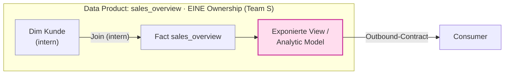
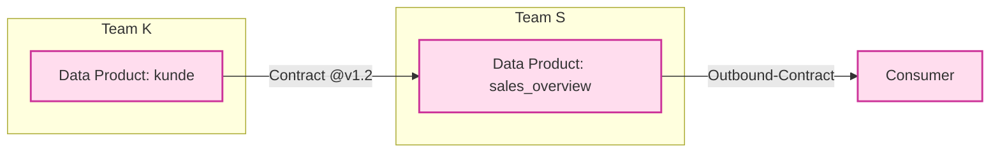
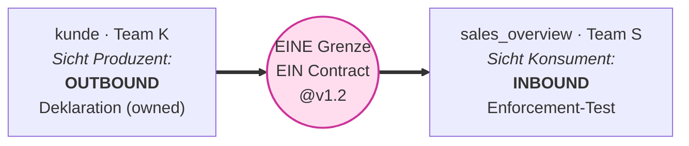

# ADR-0001 — Trennung interner Quality Gates von Contracts

**Adressat:** Beratung, Plattform-Team, Governance, Entwicklung · **Stand:** 2026-06-16
**Status:** *Umgesetzt* (implemented) — über Batch 1–5 ausgeliefert (Kurzfassung siehe §12).
**Zweck:** Festhalten der Architektur-Entscheidung, ob und wie Signal **interne Data-Quality-Checks** von der **Contract-/Governance-Ebene** getrennt modelliert — als Reaktion auf das Konzeptpapier *„Data Contracts für ein Fact-View-Datenprodukt in SAP Datasphere / BDC"*.

> Verwandte Dokumente: `Betriebsmodi_Lite_und_Full.md` (Lite/Full auf einem Unterbau) · `Zusatz_ContractLifecycle_ORDBDCIntegration.md` (ORD/ODCS-Seam) · `HANDOVER.md` (Workstreams, Gates) · `Konzept_DQ_Observability_Cockpit.md` (fachliches Konzept).

---

## 0 — Kernaussage

Das Konzeptpapier formuliert eine harte Trennung: **„Checks gibt es überall, Contracts nur an den zwei Parteigrenzen."** Ein Contract ist ein Versprechen, dem eine **Gegenpartei zugestimmt** hat; er existiert nur dort, wo Verantwortung den Owner wechselt (Inbound: Source ↔ Raw, Outbound: Data Product ↔ Consumer). Ein interner DQ-Check im Integrated Core ist **kein** Contract, sondern ein **Quality Gate** — ihn als Contract zu benennen ist eine *Kategorienverwechslung* (Konzept §6).

Signal modelliert heute **alles als Contract**. Diese ADR schlägt vor, die beiden Kategorien semantisch zu trennen — **auf geteilter Enforcement-Substanz**, nicht durch zwei Engines oder zwei Stores. Leitsatz aus Konzept §5: **„Gleiche Regel, zwei Artefakte"** — Wohnort und Lifecycle unterscheiden sich, der Test nicht.

---

## 1 — Kontext: Was Signal heute tut

Das Datenmodell (`packages/dq_core/contract/model.py`) kennt:

```
Contract: product, dataset, owned_by, owners, version, lifecycle, guarantees
Guarantee: type, params, severity, owned_by
```

Es gibt **keine Dimension für Grenze/Gegenpartei**: kein `inbound`/`outbound`, kein `consumer`/`recipient`, keinen Port-Begriff (verifiziert per Suche über `packages/dq_core/contract/`). Folgen:

- Ein rein interner Sanity-Check auf einer Core-Tabelle wird als **Contract-YAML** geführt — mit `compliance`-Ampel und (im Full-Modus) SemVer/Approval/Breaking-Schutz. Das ist genau die vom Konzept gewarnte Kategorienverwechslung.
- Die **Compliance-Ampel** (`packages/dq_core/contract/compliance.py`) und die **Coverage-Map** vermischen konsumentensichtbare Versprechen mit internen Sanity-Gates. „Rot" kann beides heißen: gebrochene Kundenzusage **oder** intern angezogene Schraube.
- `Guarantee.owned_by` (`platform` vs. `product`) spürt die Spannung bereits — ist aber **Ownership**, nicht **Grenzklassifikation**.

Was bereits richtig ist: Engine, Expectation-Grammatik, Compiler und Result-Store sind framework-frei und kategorie-agnostisch (`[ENGINE-FROZEN]`, Gate G7). Sie führen *Tests* aus — und ein Test ist ein Test, egal ob er eine Vertragsklausel oder ein internes Gate erzwingt. **Diese Schicht bleibt unangetastet.**

---

## 2 — Entscheidung

**Wir trennen den Governance-Mantel, nicht die Enforcement-Substanz.**

Eingeführt wird ein **Klassifikations-Diskriminator** auf Check-Set-Ebene:

| `kind` | Bedeutung | Existiert wo |
|---|---|---|
| `internal_gate` | Internes Quality Gate — keine Gegenpartei | Integrated Core, überall im Pipeline-Verlauf |
| `inbound_contract` | Versprechen der Quelle (Source → Raw) | nur wenn Quelle eine echte Gegenpartei ist |
| `outbound_contract` | Versprechen an den Consumer (Product → Consumer) | an der Consumption-/Output-Grenze |

Daraus abgeleitet die kategorienspezifischen Regeln:

| Dimension | `internal_gate` | `*_contract` |
|---|---|---|
| Zustimmung | keine Gegenpartei | Consumer/Source hat zugestimmt |
| Lifecycle | frei änderbar, zeremonielos | SemVer, Approval, Breaking-Schutz (Gate G3) |
| Bei Verletzung | Engineering-Alert (Team-intern) | Consumer-SLA-Breach / Compliance-Ampel |
| Adressat | Plattform-/Produkt-Team | Consumer / Governance |
| Compliance-Ampel | **nicht** governance-relevant | governance-relevant |

**Bewusst NICHT getrennt** (würde „gleiche Regel, zwei Artefakte" verletzen und Drift erzeugen):

- die Engine (`packages/dq_core/engine/`) — `[ENGINE-FROZEN]`,
- die Expectation-Grammatik und der Compiler,
- der Result-Store (`packages/dq_core/store/`) — ein Lauf, ein Ergebnis-Schema,
- die Check-Bibliothek (`packages/dq_core/library/`).

> Anti-Pattern: Signal in „zwei Säulen" (z. B. eigenes Tool/Store für interne Gates) zu spalten. Das dupliziert Regeln, erzeugt Drift und widerspricht dem Konzept selbst.

---

## 3 — Konkreter Schema-Vorschlag

> **Hinweis (nach OP-1, §9):** Der Diskriminator wird voraussichtlich **`boundary`** heißen (Werte `internal | inbound | outbound`) — `kind` kollidiert mit dem ODCS-Feld `kind: "DataContract"`. Die Beispiele unten zeigen noch die ursprüngliche `kind`-Benennung; die Mechanik bleibt identisch.

`kind` wird optionales Feld am Contract-/Set-File. Default = `internal_gate` (siehe §4, ehrlicher Default). `counterparty` ist nur bei `*_contract` zulässig und für die Grenz-Semantik erforderlich.

```yaml
product: DS_SALES_ORDERS
dataset: DS_SALES_ORDERS
kind: outbound_contract          # NEU: internal_gate | inbound_contract | outbound_contract
counterparty:                    # NEU: nur bei *_contract; verboten bei internal_gate
  party: "FIN-Reporting"         #   wer hat zugestimmt (Consumer bzw. Source)
  agreed_at: "2026-06-01"
owned_by: product
lifecycle: active
version: "1.0.0"
guarantees:
  schema: { columns: [...], mode: closed }
  freshness: { column: ORDER_DATE, max_age: PT26H, severity: warn }
```

Validator-Erweiterung (`packages/dq_core/contract/validator.py`):

- `kind` ∈ {`internal_gate`, `inbound_contract`, `outbound_contract`}; fehlt → `internal_gate`.
- `counterparty` **erforderlich** bei `*_contract`, **verboten** bei `internal_gate` (Konzept §2: kein Contract ohne Gegenpartei).
- SemVer-/Approval-/Breaking-Gates (G3) greifen **nur** bei `kind` ≠ `internal_gate`.
- Gates **G1/G2/G6/G7/G8 bleiben für alle `kind` unverändert scharf** (SQL-frei, Schema-Binding zur Laufzeit, sichtbares Gating, Frameworkfreiheit, PII-Gate).

Modell (`model.py`): zwei Felder ergänzen — `kind: str = "internal_gate"`, `counterparty: dict | None = None`. Reine additive Erweiterung der Dataclass.

---

## 4 — Migrationspfad (nicht-brechend)

1. **Default = `internal_gate`.** Alle bestehenden YAMLs ohne `kind` gelten automatisch als interne Gates. Das ist der *ehrliche* Default: Die heutigen „Contracts" sind faktisch überwiegend interne Sanity-Gates ohne zugestimmte Gegenpartei.
2. **Opt-in-Promotion.** Ein Set wird erst zum Contract, wenn jemand `kind: *_contract` **und** `counterparty` setzt — ein bewusster, auditierbarer Governance-Akt (siehe §6).
3. **Keine Datenmigration im Store.** Der Result-Store bleibt schemagleich; `kind` ist Contract-Metadatum (Git = Wahrheit). Optional: `kind` in `contract_index` spiegeln für Cockpit-Filter.
4. **Rückwärtskompatibel.** Bestehende Läufe, Ergebnisse und Tests bleiben gültig; `tests/unit/test_contract_validator.py::test_shipped_contracts_validate_green` muss weiter grün sein (die zwei Beispiel-Contracts bekommen explizit ein `kind`).

---

## 5 — Compliance- & Incident-Semantik (die größte Wirkung)

Heute landet jede Verletzung in **einer** `compliance`-Ampel. Künftig nach `kind` getrennt:

| Ereignis | Heute | Künftig |
|---|---|---|
| `outbound_contract` gebrochen | Ampel rot | **Consumer-SLA-Breach** → Routing an Consumer/Governance, governance-relevante Ampel, Incident |
| `internal_gate` gerissen | Ampel rot | **Engineering-Signal** → Routing an Produkt-/Plattform-Team, **nicht** in der governance-Ampel |

Andockpunkte sind bereits vorhanden — **Erweiterung, kein Rebuild**:

- `owned_by` + Notification-Routing (`services/api/routers/notifications.py`),
- Incident-Lifecycle (`services/api/routers/incidents.py`),
- Compliance-Transition (`packages/dq_core/contract/compliance.py`) — wird `kind`-aware: nur `*_contract` setzt den governance-relevanten `compliant/breached`-Zustand; `internal_gate` erzeugt ein Team-Incident ohne Ampel-Effekt.

Coverage-Map künftig **dreispurig** statt vermischt: „durch Consumer-Versprechen gedeckt" ≠ „intern abgesichert" ≠ „ungeprüft".

---

## 6 — Promotion als Governance-Akt

Eine interne Expectation, die eine **Parteigrenze überschreitet**, wird zur Vertragsklausel *befördert* — ein auditierbares Ereignis (Konzept §2: der Contract entsteht an der Grenze). Das passt nahtlos auf den vorhandenen **Proposal-Miner** (`packages/dq_core/obs/miner.py`):

- heute: schlägt engere Erwartungen aus der History vor;
- künftig: Vorschlagstyp `internal_gate` (Team zieht intern an) **vs.** `contract_clause` (Klausel an einer Grenze, erfordert Gegenpartei + Approval).

Die „Beförderung" `internal_gate → *_contract` ist damit der explizite Moment, in dem aus interner Kontrolle ein Versprechen wird.

---

## 7 — Konsequenzen

**Positiv**

- Konzeptionelle Korrektheit: keine Kategorienverwechslung mehr (Konzept §6).
- Ehrliche Compliance-Ampel: nur boundary-gebundene Zusagen sind governance-relevant.
- Saubere Lifecycle-Politik: SemVer/Approval-Zeremonie nur dort, wo es eine Gegenpartei gibt.
- Passgenaues Alert-Routing: Engineering-Signal ≠ Consumer-SLA-Breach.
- Klare Abbildung auf den ODCS-Seam (`Zusatz_ContractLifecycle_…`): nur `*_contract` werden nach ODCS/ORD exportiert; interne Gates nicht.
- Minimaler Eingriff: additive Metadaten + Policy, Engine/Store unangetastet.

**Negativ / Risiken**

- Im Lite-Berater-Modus ist die Grenze oft unscharf → die in/internal/out-Taxonomie darf nicht zur leeren Pflichtangabe verkommen. **Gegenmittel:** Default `internal_gate`; Grenzklassifikation nur verlangen, wo ein `owners`-/Party-Wechsel real vorliegt.
- Zwei neue Begriffe im UI (Gate vs. Contract) → Onboarding-/Doku-Aufwand; Betriebsmodi-Doku muss nachgezogen werden.
- Compliance-Auswertungen, die heute pauschal über alle Sets gehen, müssen `kind`-aware werden (sonst ändert sich die Ampel-Semantik unbemerkt).

**Neutral**

- Lite/Full (Betriebsmodi) bleibt orthogonal: Lite/Full beschreibt *Prozess-Zeremonie*, `kind` beschreibt *Grenz-Klassifikation*. Ein `outbound_contract` kann im Lite- wie im Full-Modus geführt werden.

---

## 8 — Status & nächste Schritte

Diese ADR ist ein **Vorschlag**. Vor Umsetzung zu klären:

1. Begriff im UI: „Quality Gate" vs. „Internal Check" vs. „Expectation Set" — Wording festlegen. → **Vorschlag OP-1 (§9)**
2. Soll der Diskriminator am Contract-File (ganzes Set) oder feingranular je Garantie liegen? → **Vorschlag OP-2 (§9)**
3. ODCS-Export-Policy (`odcs_export.py`): nur `*_contract` exportieren — bestätigen. → **Vorschlag OP-3 (§9)**
4. Reihenfolge ggü. den offenen Workstreams (O1 Breaking-Diff, O6 HanaStore) priorisieren. → **Vorschlag OP-4 (§9)**

> Faustregel (Konzept §8, übertragen auf Signal): **Checks überall, Contracts nur an den zwei Grenzen. Default ist intern; ein Contract entsteht erst durch Zustimmung einer Gegenpartei.**

---

## 9 — Vorschläge zu den offenen Punkten (§8)

Konkrete, begründete Empfehlungen. Effortschätzung in PT (Personentagen), Stil `HANDOVER.md`. Jeder Punkt hat eine **Empfehlung** (wofür ich votiere) und die **Alternative(n)** mit Begründung.

### OP-1 — Wording **und** Feldname

**Empfehlung Feldname:** Diskriminator **`boundary`** statt `kind`. Werte: **`internal` | `inbound` | `outbound`** (statt `internal_gate`/`inbound_contract`/`outbound_contract`).

*Begründung:* `odcs_export.py:108` belegt `kind` bereits ODCS-seitig (`"kind": "DataContract"`). Ein eigenes Top-Level-`kind` im Contract-YAML kollidiert begrifflich und beim Lesen des Exports. `boundary` trifft zudem die Konzept-Sprache („Parteigrenze", §2) präzise und ist kürzer als das `_gate`/`_contract`-Suffix. Die Kategorie (Gate vs. Contract) ergibt sich eindeutig: `internal` ⇒ Gate, `inbound`/`outbound` ⇒ Contract.

**Empfehlung UI-Begriff:**

| `boundary` | UI-Label (de) | Badge | Kategorie |
|---|---|---|---|
| `internal` | „Internes Quality Gate" | `GATE` | Quality Gate |
| `inbound` | „Inbound-Contract (Source)" | `IN` | Contract |
| `outbound` | „Outbound-Contract (Consumer)" | `OUT` | Contract |

*Verworfen:* **„Expectation Set"** — zu abstrakt, trägt Great-Expectations-Jargon herein und transportiert die Grenz-Aussage nicht; ein Nutzer erkennt nicht, ob eine Gegenpartei beteiligt ist. **„Internal Check"** als Hauptbegriff ist schwächer als „Quality Gate", weil „Check" in Signal bereits die ausführbare Einheit (`CheckDef`) bezeichnet — „Gate" grenzt die *Klassifikation* sauber von der *Ausführungseinheit* ab.

*Aufwand:* trivial (Doku/Schema-Benennung), 0,25 PT.

### OP-2 — Set-Ebene vs. je Garantie

**Empfehlung:** `boundary` **am Set/File-Level** als primärer, verpflichtender Ort. Feingranulare Override **je Garantie** nur als *späteres Opt-in* für den dokumentierten Sonderfall (ein Dataset trägt zugleich konsumentensichtbare und rein interne Garantien — z. B. eine Fact View, die exponiert wird **und** interne Ref-Integritäts-Gates hat).

*Begründung:* Set-Level ist die 80%-Realität und hält Compliance-Auswertung einfach (eine Ampel-Semantik je Set). Feingranular ist strukturell machbar — `Guarantee` trägt bereits `owned_by` je Garantie (`model.py:13`), ein analoges `boundary`-Feld fügt sich ein — erzeugt aber Folgekosten: `compliance.py` müsste je Set die Garantien nach `boundary` gruppieren und **zwei** Compliance-Zustände je Dataset führen (intern vs. governance). Das ist die teure 20%.

*Migrationsregel:* Garantie erbt `boundary` vom Set; fehlt der Override, gilt der Set-Wert. Implementierungsreihenfolge: **Set-Level zuerst** (deckt alle heutigen Contracts), Garantie-Override als nachgelagerter Workstream nur bei realem Bedarf.

*Aufwand:* Set-Level 1–1,5 PT (Modell + Validator + Compile-Durchreichung); Garantie-Override später +1,5 PT (Compliance-Gruppierung).

### OP-3 — ODCS-Export-Policy

**Empfehlung:** **Bestätigt — nur `boundary ∈ {inbound, outbound}` exportieren; `internal` nie.** Guard in `odcs_export.py`: bei `internal` → `ValueError`/Skip statt stiller Leer-Export.

*Begründung:* ODCS ist laut Docstring (`odcs_export.py:1-7`) **Einweg-Interop** für externe Kataloge (Collibra, OpenMetadata, `datacontract-cli`). Ein interner Gate hat **keine Gegenpartei** (Konzept §2) und gehört damit per Definition nicht in eine externe Contract-Registry — ihn zu exportieren wäre dieselbe Kategorienverwechslung, die diese ADR beseitigt.

*Zusatz:* Richtung (`inbound`/`outbound`) in `customProperties` mit aufnehmen (`{"property": "boundary", "value": ...}`), da ODCS selbst beide nur als `kind: DataContract` führt und die Richtung sonst verloren ginge. Das nutzt den im Docstring genannten „lossless escape hatch".

*Aufwand:* 0,25 PT (Guard + customProperty), inkl. Test.

### OP-4 — Reihenfolge ggü. O1 / O6

**Empfehlung:** `boundary`-Klassifikation **vor** O1 (Breaking-Diff Stufe 2); **O6 (HanaStore) orthogonal/parallel** ohne Reihenfolge-Abhängigkeit.

*Begründung O1:* SemVer/Breaking-Schutz ist überhaupt nur für `*_contract` sinnvoll (eine Gegenpartei, die vor Breaking geschützt werden muss). Wird die Klassifikation **zuerst** eingeführt, ist die Diff-Engine (`diff.py`, Stufe 1 existiert, O1=Stufe 2) von Anfang an korrekt **`boundary`-gegated** — Breaking-Diff greift nur bei Contracts, nicht bei internen Gates. Ohne die Klassifikation würde O1 sonst Aufwand auf Sets verschwenden, die gar keine Versionierung brauchen.

*Begründung O6:* Die Klassifikation ist reines **Contract-Metadatum** (Git = Wahrheit); der Result-Store-Schema bleibt unverändert (ADR §4.3). `HanaResultStore` (O6) folgt dem Deployment und ist davon entkoppelt — kann parallel laufen.

**Empfohlene Sequenz:**

| Schritt | Inhalt | Aufwand | Abhängig von |
|---|---|---|---|
| 1 | `boundary`-Diskriminator + Validator + Default-Migration (`internal`) | 1–1,5 PT | — |
| 2 | Compliance-/Incident-Split (`compliance.py` `boundary`-aware, Routing) | 1,5–2 PT | 1 |
| 3 | O1/Breaking-Diff auf `boundary` gegated (nur Contracts) | (O1-Scope) | 1 |
| 4 | ODCS-Export-Guard (OP-3) | 0,25 PT | 1 |
| — | O6 `HanaResultStore` | (O6-Scope) | unabhängig |

*Nicht in dieser ADR:* Garantie-Override (OP-2, Phase 2) und das UI-Rendering der Badges — beides nachgelagert nach Schritt 1–2.

---

## 10 — Komposition & Contract-Richtung über Produktgrenzen

Dieser Abschnitt klärt, wie sich `boundary` auf **mehrschichtige Datenmodelle** und **produktübergreifende Wiederverwendung** anwendet — die häufigste Verständnislücke. Drei Leitsätze, danach durchgespielt.

> **L1 — Layer ≠ Grenze.** Die DWH-Schicht (Staging/Core/Consumption) ist eine *technische* Tatsache; sie erzeugt keinen Contract. Nur eine **Ownership-/Konsumgrenze** tut das.
>
> **L2 — Objekt ≠ Produkt.** Eine konforme Dimension wird nicht dadurch zum Data Product, dass sie im Core liegt — sondern dadurch, dass ein *anderer* Owner sie als zugesagte Lieferung konsumiert.
>
> **L3 — Eine Grenze, ein Vertrag, ein Owner (der Produzent).** „Inbound des einen = Outbound des anderen" ist *ein* Artefakt aus zwei Blickrichtungen, nicht zwei zu synchronisierende Verträge.

### 10.1 — Data Product vs. Contract: zwei Achsen

| Frage | Antwort | Umfang |
|---|---|---|
| „Was besitzen & liefern wir als Einheit?" | **Data Product** | das ganze Pipeline-Stück in *einer* Ownership (Inbound-Raw, Core-Transformation, Views, Output) |
| „Was versprechen wir über eine Grenze?" | **Contract** | nur die Ränder (Output-Port, ggf. Inbound) |

Das Data Product ist das **Ganze**; der Contract beschreibt nur die **Grenzflächen**. Die Raw-Tabelle gehört zur **Inbound**-Seite (nicht zur Outbound-Seite).

### 10.2 — Wann ist eine Dimension ein Foundation Data Product?

Beispiel: 3-Layer-DWH, Dimension `Kunde` im Business Core. Entscheidungstest:

| Test | „nein" | „ja" |
|---|---|---|
| Eigener rechenschaftspflichtiger Owner als *Liefergegenstand*? | interner Baustein | Produkt-Kandidat |
| Konsum über eine **Ownership-Grenze** (anderes Team/Domäne)? | interne konforme Dimension | **Foundation Data Product** |
| Zugestimmtes Versprechen (Schema/SLA) an Konsumenten? | nur internes Quality Gate | Outbound-Contract |
| Eigenständig auffindbar/adressierbar (Katalog, SLA)? | nein | ja |

→ `Kunde` im Core, nur vom eigenen Team genutzt = **interne konforme Dimension**, kein Produkt. Erst die bewusste Veröffentlichung über eine Parteigrenze macht es zum Foundation Product. Diese Erhebung ist eine **organisatorische Entscheidung** (lohnt der Governance-Aufwand?), keine technische Zwangsläufigkeit.

### 10.3 — Fall A: `Kunde` und `sales_overview` im selben Team

Der Join ist eine **interne Komposition** — **kein** neuer Contract.



- `Kunde` bleibt interne Dimension → `boundary: internal`.
- Ref-Integrität Fact→Dim = internes Quality Gate.
- Kunden-Attribute, die in der exponierten View landen, werden Teil von **`sales_overview`s eigenem Outbound-Contract** — kein „Re-Export" eines Kunde-Contracts.

### 10.4 — Fall B: `Kunde` ist ein Foundation Product eines anderen Teams

Der Join **kreuzt eine Ownership-Grenze** → **gekettete Contracts**. Ein Produkt ist gleichzeitig Consumer (stromaufwärts) und Producer (stromabwärts).



Contracts **vererben/mergen nicht**. Bricht `kunde` sein Versprechen, *kann* `sales_overview` dadurch seinen eigenen brechen — aber es bleiben **zwei getrennte Verträge** mit getrennten Ampeln und Ownern (transitive Abhängigkeit).

### 10.5 — „Inbound des einen = Outbound des anderen"

Eine Kante = **eine Grenze = ein Contract**, aus zwei Blickrichtungen. Es ist **nicht** ein Paar zu synchronisierender Verträge.



Auflösung über Konzept §5 (*Deklaration ≠ Enforcement*) — diesmal **über die Produktgrenze**:

| | Wohnort | Owner |
|---|---|---|
| **Deklaration** (Versprechen) | `kunde`s Outbound-Contract-YAML | Produzent (Team K) |
| **Enforcement** (Test) | Inbound-Contract-*Test* an `sales_overview`s Einlesepunkt | Konsument (Team S) |

Regeln:

1. **Eine kanonische Deklaration, owned vom Produzenten.** Der Konsument *baut nichts nach* (Konzept §3: „nichts nachzubauen").
2. **Inbound = Enforcement, nicht Kopie.** Der Konsument verifiziert die **gepinnte Version** des Produzenten-Contracts am Übergabepunkt.
3. **Mehr-Bedarf ⇒ Verhandlung.** Braucht der Konsument mehr als versprochen, fordert er eine **Erweiterung** des Outbound-Contracts an; der Produzent nimmt sie auf und re-versioniert (SemVer). Eine unilateral strengere „Inbound-Zusage" ohne Zustimmung des Produzenten ist **kein Contract**, sondern nur ein interner Check (Konzept §2).
4. **SemVer lebt beim Produzenten.** Der Konsument **pinnt** (`kunde@1.2`); Breaking Change = Pflicht des Produzenten (Major + Migration) → Andockpunkt für O1/Breaking-Diff.

### 10.6 — Abbildung in Signal

| Szenario | Produkte | Sets |
|---|---|---|
| **Fall A** (ein Team) | 1 Produkt `sales_overview` | `kunde`-Checks `boundary: internal`; Ref-Integrität `internal`; exponierte View `outbound` |
| **Fall B** (zwei Teams) | 2 Produkte `kunde`, `sales_overview` | `kunde`: `boundary: outbound` (owned Team K, Git-versioniert). `sales_overview`: `boundary: inbound`-Set, das auf `kunde@<version>` **referenziert** (Enforcement) **+** eigenes `boundary: outbound`-Set |

Konkret für Fall B:

- **Ein** Contract-Artefakt `kunde` — kein zweites auf der Konsumentenseite.
- `sales_overview`s `inbound`-Set ist ein **Verweis + Enforcement-Checks**, keine Deklaration.
- **Idealfall (kein Doppel-Prüfen):** primär `kunde`s vorhandene Outbound-Runs/Compliance als Single Source of Truth nutzen; einen *dünnen* Konsum-Punkt-Test nur dort ergänzen, wo Transport/Join selbst Schaden anrichten kann (Join-Fanout, Spätlieferung). Was der Produzent bereits garantiert, doppelt zu prüfen, ist Verschwendung.

> **Implikation für `boundary: inbound`:** Das Feld trägt sinnvoll eine Referenz auf das Upstream-Produkt **und** dessen gepinnte Contract-Version (z. B. `depends_on: { product: kunde, version: "1.2.0" }`), damit Signal die Kette auflösen, Compliance transitiv anzeigen und Breaking-Changes upstream sichtbar machen kann. (Schema-Detail für die Umsetzung von Schritt 1/2 der Sequenz in §9.)

### 10.7 — Anti-Pattern

- ❌ **Zwei Verträge je Kante** (Inbound *und* Outbound separat deklarieren) und „synchron halten" → garantierter Drift. Es gibt **einen** Owner und **eine** Deklaration je Grenze.
- ❌ **Layer als Produktgrenze** behandeln → jede Core-Tabelle würde zum „Produkt" mit Vertrags-Zeremonie. Produkt-Status nur bei echter Konsum-Grenze.
- ❌ **Konsumenten-seitige strengere „Inbound-Contracts"** ohne Zustimmung des Produzenten → das sind interne Checks, keine Verträge.

> **Faustregel:** Eine Grenze, ein Vertrag, ein Owner (der Produzent). „Inbound" ist die Enforcement-Sicht auf das Outbound-Versprechen, nicht dessen Kopie. Schicht und Objekttyp erzeugen keine Verträge — nur Grenzen.

---

## 11 — Umgang mit bestehender DSP-Produkt-Taxonomie (Kunden-Realität)

Praxisproblem: Der Kunde katalogisiert in Datasphere/BDC bereits **alle Dimensionen als „Foundation (Data) Product"**. Das kollidiert scheinbar mit §10 (Produkt-Status entsteht an einer Konsum-Grenze, nicht durch Objekttyp/Schicht). Auflösung: **nicht das Label bekämpfen — Produkt-Status und Contract-Aufwand entkoppeln.**

### 11.1 — Zwei Dinge, die hier vermischt werden

| Begriff | Frage | In DSP/BDC |
|---|---|---|
| **Katalog-Produkt** | „Ist es auffindbar & teilbar?" | Marketplace-Eintrag, ORD-Descriptor — *tool-getrieben*, entsteht quasi automatisch |
| **Governter Contract** | „Hat eine Gegenpartei einem Versprechen zugestimmt?" | nur bei echtem, grenzüberschreitendem Konsum |

Dass BDC für jedes Objekt einen ORD-Descriptor erzeugt, macht „alles ist ein Produkt" zur **Werkzeug-Konvention** — nicht zur Aussage „alles braucht einen versionierten Outbound-Contract mit SemVer/Approval". (Vgl. `Zusatz_ContractLifecycle_ORDBDCIntegration.md`: ORD/Catalog *beschreibt & discovered*, erzwingt aber keine Qualität.)

### 11.2 — Lösung: Contract-Aufwand *tiern*, Produkt-Label belassen

Die Katalog-Taxonomie des Kunden bleibt; darüber legt sich eine **proportionale Governance-Stufung** — operationalisiert durch `boundary` (diese ADR) **und** Lite/Full (`Betriebsmodi_Lite_und_Full.md`):

| Tier | Realität | `boundary` | Modus | Aufwand |
|---|---|---|---|---|
| **0** | Katalogisiert, aber nur intern genutzt (kein externer Consumer) | `internal` | — | internes Quality Gate, **keine** Contract-Zeremonie |
| **1** | Veröffentlicht, vereinzelte Konsumenten, geringe Kritikalität | `outbound` | **Lite** | Verbindlichkeit ohne SemVer/Approval |
| **2** | Echtes Cross-Domain-Foundation, mehrere abhängige Produkte | `outbound` | **Full** | SemVer, Approval, Breaking-Schutz |

→ „Foundation Product" im Katalog bleibt; der *governance-relevante* Contract wird auf die wenigen Tier-2-Assets fokussiert.

### 11.3 — Tier-Zuordnung datengetrieben, nicht label-getrieben

Nicht das DSP-Label, sondern der **tatsächliche Konsum** entscheidet über die Stufe (Test aus §10.2): „Gibt es mindestens einen Konsumenten **außerhalb des produzierenden Teams**, der sich auf ein Versprechen verlässt?" Signals **Lineage-/Coverage-Map** liefert die Evidenz, welche „Produkte" real grenzüberschreitend konsumiert werden. Erfahrungswert: von vielen hundert katalogisierten Dimensionen sind es oft nur 10–20.

### 11.4 — Die eigentliche Falle: Over-Governance

Nähme man das Label wörtlich und gäbe **jeder** Dimension einen Full-Contract, entstünde SemVer-/Approval-Overhead für Assets, die niemand extern konsumiert — die Governance erstickt und verwaist. **Over-Governance schadet mehr als ein fehlendes Label.** Tier 0/1 ist keine Degradierung, sondern Richtigdimensionierung.

### 11.5 — Kunden-Framing (wertschätzend, nicht korrigierend)

> „Wir behalten eure Foundation Products im Katalog — alle bleiben auffindbar und teilbar. Wir vergeben die **vertragliche Verbindlichkeit nur dort, wo sie jemand braucht**: governt (Full) für die wenigen Cross-Domain-Assets, schlank (Lite) für vereinzelt genutzte, intern abgesichert für den Rest. So sinkt der Pflegeaufwand, und Governance wirkt da, wo sie zählt."

Das ist der überzeugende Hebel: Du nimmst dem Kunden Arbeit ab, statt sein Produktverständnis zu widerlegen.

> **Faustregel:** Katalog-Produkt ≠ governter Contract. Jedes DSP-„Foundation Product" darf Produkt bleiben — aber nur die grenzüberschreitend konsumierten bekommen einen vollen Contract. Den Tier bestimmt die Lineage, nicht das Label.

---

## 12 — Umsetzung: Batch 1–5 (Kurzfassung)

**Die Entscheidung:** Ein `kind`-Diskriminator (`internal_gate | consumer_contract | provider_contract`) trennt den **Governance-Mantel**, nicht die Enforcement-Substanz. Engine, Compiler und Store bleiben kategorie-agnostisch — „gleiche Regel, zwei Artefakte". Die *Konsequenz* eines fehlgeschlagenen Checks folgt dem `kind`.

| Batch | Was umgesetzt wurde |
|---|---|
| **1** | Navigations-Restrukturierung (Vorarbeit). |
| **2** | `kind`-Diskriminator auf Model/Validator/Compiler/Store; Segment-Control im Objektdetail. |
| **3** | Coverage-Dimension-Switcher (Internal \| Contract \| All), Promotion-Flow (Gate → Contract-Entwurf), Govern-Onboarding. |
| **4** | **Compliance/Incident-Split:** nur `*_contract` färbt die Governance-Ampel & SLA; `internal_gate`-Fehler werden zu Engineering-Signalen (Team-Routing, keine Ampel); ODCS-Export nur für Contracts. |
| **5** | **Kind-gegateter Lifecycle:** SemVer/Approval/Breaking-Schutz (G3) nur für `*_contract`; `internal_gate` bleibt frei änderbar & zeremonielos. |

**Ergebnis:** Checks laufen überall, Contracts existieren nur an den Parteigrenzen. Eine rote Governance-Ampel heißt jetzt eindeutig *gebrochene Zusage an einen Consumer* — nicht *intern angezogene Schraube*.
