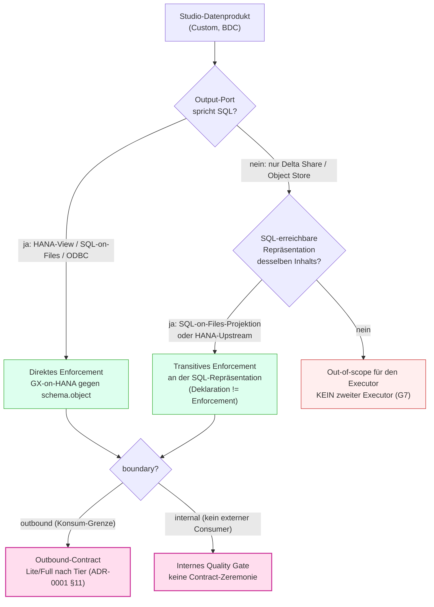

# ADR-0003 — Signal in einem BDC/Datasphere-Setup mit Data-Product-Studio-Datenprodukten

**Adressat:** Beratung, Plattform-Team, Governance, Entwicklung · **Stand:** 2026-06-21
**Status:** *Analyse / Vorschlag* (proposed) — bewertet, wie Signals Konzept mit den kommenden Custom Data Products aus dem **Data Product Studio** (BDC) zusammenspielt; betrachtet beide Auslieferungspfade (HDLF-Spaces und SQL-Output-Port). Keine gesetzten Code-Entscheidungen; technische Verifikationspunkte explizit markiert.
**Zweck:** Festhalten, **wo** Signals konzeptionelle Ebene (boundary × Lite/Full) und Signals **technische** Ebene (GX-on-HANA-Executor) bei BDC-Custom-Datenprodukten greifen — und wo nicht — abhängig davon, ob ein Datenprodukt auf einem **HDLF-Space** (Object Store, Delta/Parquet) oder über einen **SQL-Output-Port** ausgeliefert wird.

> Verwandte Dokumente: `ADR-0001_Quality-Gates_vs_Contracts.md` (boundary-Diskriminator, Komposition §10, DSP-Taxonomie-Tiering §11) · `ADR-0004_DataProduct-als-Komposition.md` (Manifest + aus Lineage abgeleitetes Interieur, `boundary` = Intent ⋈ Reality — **§12 dieser ADR bewertet ADR-0003 unter dieser Linse neu**) · `Zusatz_ContractLifecycle_ORDBDCIntegration.md` (ORD/ODCS-Seam, Port-Topologie, offene Punkte R1/R2/R7) · `Vortrag_Briefing_DataProducts_DataContracts_DSP_BDC.md` (fünf Schichten, Output-Port = Delta Share **oder** exponierte View, §1.5) · `Betriebsmodi_Lite_und_Full.md` (Prozess-Zeremonie) · `Tooldokumentation.md` (Architektur, Executor).
>
> **Nachtrag (Neubewertung):** §0–§11 lesen das Datenprodukt implizit als *eine* SQL-erreichbare Oberfläche (den Output-Port). ADR-0004 modelliert das Produkt als *Komposition über Layer* (dünnes Manifest + abgeleitetes Interieur). **§12** trägt diese Linse nach: Sie bestätigt die Enforcement-Naht, schärft den out-of-scope-Fall (Delta-Share-only ist nicht governance-blind, nur nicht *prüfbar*) und zeigt, dass ADR-0004s Interieur-Ableitung denselben Reachability-Constraint erbt — *derive überall, enforce nur an SQL*.

---

## 0 — Kernaussage

Signals **Konzept-Ebene ist speicher-agnostisch** und überträgt sich **unverändert** auf Data-Product-Studio-Produkte: `boundary` (internal | inbound | outbound) klassifiziert eine *Parteigrenze*, nicht einen *Speicherort*; das Tiering aus ADR-0001 §11 (Tier 0/1/2 × Lite/Full) gilt für ein HDLF-Produkt genauso wie für ein HANA-Produkt.

Signals **Enforcement-Ebene ist dagegen nicht speicher-agnostisch.** Der einzige Executor ist **GX-on-HANA** (`hdbcli`, read-only): jeder Check ist ein SQL-Template gegen `"{schema}"."{dataset}"` (`packages/dq_core/library/check_library.json`). Damit gilt der harte Satz dieser ADR:

> **Signal erzwingt an der SQL-erreichbaren Oberfläche eines Datenprodukts.** Hat das Produkt einen SQL-Output-Port (HANA-Space-Produkt **oder** HDLF-Produkt via SQL-on-Files), wendet der vorhandene Executor **unverändert** an. Ist das Produkt ein *reiner* Object-Store-/Delta-Share-Auslieferung **ohne** SQL-Oberfläche, liegt es **außerhalb** der heutigen Executor-Reichweite — und das soll **nicht** durch einen zweiten Executor geheilt werden (Verstoß gegen das „single executor"-Prinzip und Gate G7).

Die Begriffsunsicherheit des Auftraggebers („SQL-Output-Port — keine Ahnung was das heißt") löst sich genau hier auf: Für Signal kollabieren *„Produkt auf HANA-Space"* und *„HDLF-Produkt via SQL-on-Files konsumierbar"* auf **dieselbe** Sache — eine relationale, per SQL adressierbare Oberfläche = Signals Enforcement-Naht. Nur der dritte Fall (Delta-Share-only, keine SQL-Sicht) ist der harte Fall.

---

## 1 — Kontext: Was sich mit Data Product Studio ändert

**Data Product Studio** (BDC) ist das Werkzeug, mit dem Kunden **eigene** (custom) Datenprodukte bauen — über die von SAP gelieferten Standard-Produkte hinaus. Für Signal sind drei Fakten relevant:

1. **Auslieferungspfad „HDLF-Spaces" ist der erste Weg, den SAP geht.** Die physischen Daten eines solchen Produkts sind **Dateien** in einem Object Store (HANA Data Lake Files, Delta/Parquet) — **keine** HANA-Tabellen. Das ist der für Signal entscheidende Unterschied gegenüber dem klassischen Datasphere-Bild (Fact View / Analytic Model auf HANA), das den Signal-Docs bisher zugrunde liegt.
2. **Ein Datenprodukt kann (auch) einen SQL-Output-Port haben.** Was das genau bedeutet, ist offen (siehe §3). Klar ist nur: Es existiert ein Konsumweg, der **SQL** spricht.
3. **Jedes Studio-Produkt ist ein Katalog-/ORD-Produkt.** Das ändert nichts an ADR-0001 §11: „Katalog-Produkt ≠ governter Contract." Studio erzeugt Produkte tool-getrieben; ob ein *governter Outbound-Contract* nötig ist, bleibt eine Tier-Entscheidung entlang der Lineage.

Die bisherigen Signal-Docs gehen implizit von HANA-erreichbaren Objekten aus: Das Briefing nennt als Output-Port den **Delta Share oder die exponierte Consumption-View** (`Briefing §1.5`), und der Zusatz-Doc fragt bereits in **R1** explizit, ob ein ORD-Port „inline eine Delta-Sharing-/ODBC-/**HDLF**-Quelle tragen" kann, sowie in **R7** nach dem „HDLF-CLI-Permission-Gap". Diese ADR zieht die HDLF-Frage aus dem Anhang in den Vordergrund und entscheidet die Enforcement-Seite.

---

## 2 — Signals technische Realität (der harte Constraint)

| Schicht | Heutige Bindung | Folge für BDC |
|---|---|---|
| Verbindung | `hdbcli.dbapi.connect(...)` (`connect/db_connection.py`) — **nur HANA** | erreicht nur, was über das **HANA-SQL-Interface** sichtbar ist |
| Check-Form | SQL-Template `SELECT … FROM "{schema}"."{dataset}"` (`library/check_library.json`, 20 Checks) | braucht einen **zweiteiligen, SQL-auflösbaren Objektnamen** |
| Bindung | Schema erst zur Laufzeit gebunden (Gate G2, `[SCHEMA-MAP]`) | adressiert über `{schema}`/`{dataset}`, kein Hardcoding |
| Prinzip | **ein** Executor (GX-on-HANA), Engine framework-frei (Gate G7) | ein zweiter (Spark/Delta-)Executor ist explizit unerwünscht (`Zusatz §4/§5`) |

Daraus folgt die Reichweiten-Regel: **Signal sieht ein Datenprodukt genau dann, wenn das HANA-SQL-Interface es als (virtuelle) Relation `schema.dataset` ausliefern kann.** Alles andere ist für den Executor unsichtbar — unabhängig davon, wie gut die Konzept-Ebene passt.

---

## 3 — Auflösung der Begriffsunsicherheit „SQL-Output-Port"

Der Auftraggeber nennt drei Hypothesen. Bewertung jeder einzelnen aus Signal-Sicht:

| # | Hypothese des Auftraggebers | Bewertung | Für Signal heißt das |
|---|---|---|---|
| (a) | Produkte werden **auf HDLF-Spaces** gebaut (SAPs erster Weg) | zutreffend als *Speicher*-Aussage; sagt für sich genommen **nichts** über die Konsum-Schnittstelle | Daten = Dateien; Executor-Reichweite **erst** über eine SQL-Sicht |
| (b) | SQL-Output-Port heißt vielleicht: man kann Produkte **auf HANA-Spaces** bauen | plausibel; ein HANA-Space-Produkt hat naturgemäß eine SQL-Oberfläche | **Happy Path** — Executor greift unverändert |
| (c) | Produkte im HDLF-Space sind vielleicht einfach **per SQL-on-Files** konsumierbar | technisch die wahrscheinlichste Bedeutung des „SQL-Output-Ports" für ein HDLF-Produkt | **Happy Path** — sobald die SQL-on-Files-Relation steht |

**Schlussfolgerung:** (b) und (c) **kollabieren für Signal auf dasselbe** — eine relationale, per SQL adressierbare Oberfläche. Ob diese Oberfläche eine native HANA-Tabelle/-View (b) oder eine SQL-on-Files-Virtual-Table über Parquet/Delta im HDLF (c) ist, ist dem SQL-Template **gleichgültig**, solange ein stabiler zweiteiliger Name `"{schema}"."{dataset}"` auflöst. Der „SQL-Output-Port" ist damit aus Signal-Sicht **die kanonische Enforcement-Naht** — und zugleich exakt der „Output Port" der Briefing-§1.5 / des 1:1:1:1-Prinzips (Data Contract → Output Port → Schema → Read Role).

> **Verifikationspunkt V1 [H]:** SQL-on-Files / HDLF-Virtual-Table — liefert das HANA-SQL-Interface den Produkt-Inhalt unter einem **stabilen, zweiteiligen** Namen (`schema.object`), oder braucht es eine andere Adressierung (Catalog-präfix, Virtual-Table-Wrapper, Remote-Table)? Das entscheidet, ob die Template-Anpassung in §8 *null* oder *gering* ist.

### 3.1 — Entscheidungsbaum: Wo enforced Signal bei einem Studio-Produkt?

Die ganze ADR lässt sich auf **eine** operative Frage je Datenprodukt verdichten: *Gibt es eine SQL-erreichbare Oberfläche desselben Inhalts?* Daran hängt, ob Signal direkt, transitiv oder gar nicht prüft.

Lesehilfe: Die **obere** Hälfte (B/D) ist die **technische** Reichweiten-Entscheidung (Executor-Naht, §4/§5); die **untere** Hälfte (G) ist die **governance**-seitige Klassifikation, die unverändert aus ADR-0001 stammt (§6 dieser ADR). Beide sind orthogonal: Ein out-of-scope-Produkt (F) kann governance-seitig sehr wohl ein Tier-2-Outbound-Contract *sein* — nur kann Signal ihn dann nicht *erzwingen*. Das ist der Punkt, an dem das Kunden-Framing greift: „Tier-2 ⇒ gib dem Produkt einen SQL-Output-Port."

### 3.2 — Durchgespielt: ein HDLF-Custom-Produkt

Beispiel `sales_orders_curated`, im Data Product Studio auf einem **HDLF-Space** als Delta-Tabelle gebaut, von einem anderen Team (FIN-Reporting) konsumiert.

| Schritt | Frage | Ergebnis |
|---|---|---|
| 1 | Output-Port spricht SQL? | Studio exponiert eine **SQL-on-Files-Sicht** `SALES."ORDERS_CURATED"` → **ja** (Zweig C) |
| 2 | boundary? | Konsum durch **anderes Team** über Grenze → `outbound` (Zweig H) |
| 3 | Tier? | mehrere abhängige FIN-Reports → **Tier 2 / Full** (SemVer, Approval) |
| 4 | Enforcement | 20 Bibliotheks-Checks gegen `SALES.ORDERS_CURATED` — `row_count`, `freshness` (über Lade-/Partitionsspalte, V3), `schema`-Closed-Mode, Ref-Integrität — **ohne Engine-Änderung** |
| 5 | Deklaration | Outbound-Contract-YAML (Source of Truth); ORD/CSN als einseitige Derivate (Zusatz §5) |

**Gegenprobe — derselbe Inhalt nur als Delta Share, ohne SQL-Sicht:** Schritt 1 → Zweig D. Existiert eine HANA-Upstream-Tabelle, aus der der Share gespeist wird → transitives Enforcement dort (Zweig E). Existiert sie nicht → Zweig F: governance-seitig bleibt es ein Outbound-Contract, aber Signal kann ihn nicht erzwingen → ehrlich als „nicht überwacht" in der Coverage-Map ausweisen, **nicht** grün vortäuschen.

---

## 4 — Fall 1: Datenprodukt auf HDLF-Space (SAPs erster Weg)

**Physik:** Dateien (Delta/Parquet) im Object Store. **Konzept-Ebene:** vollständig anwendbar — das HDLF-Produkt ist ein Data Product im Sinne von ADR-0001 (das Ganze, in einer Ownership), sein Output-Port ist die Outbound-Grenze, das Tiering (§11) entscheidet über Contract-Aufwand. **Enforcement-Ebene:** hängt allein daran, **ob eine SQL-Sicht existiert**:

| Konsum-Schnittstelle des HDLF-Produkts | Signal-Executor | Vorgehen |
|---|---|---|
| **SQL-on-Files-Sicht** vorhanden (Fall 3c) | ✅ erreichbar | Checks gegen die Virtual-Table wie gegen eine HANA-Tabelle — Happy Path |
| **Delta Share / nur Object-Store-Zugriff**, keine SQL-Sicht | ❌ nicht erreichbar | **transitiv** an der SQL-erreichbaren Upstream-Oberfläche prüfen (s. u.) **oder** out-of-scope |

**Wichtig — Delta Share ist kein SQL-Endpoint.** Ein Delta Share wird von Spark-/Databricks-Clients konsumiert, nicht über SQL. Signal kann einen Delta Share **nicht direkt** testen. Die saubere Auflösung folgt dem schon gesetzten Muster *Deklaration ≠ Enforcement* (ADR-0001 §10.5): Der Delta Share ist die **Deklaration** (Output-Port-Versprechen); das **Enforcement** setzt Signal an der SQL-erreichbaren Repräsentation **desselben** Inhalts an — der SQL-on-Files-Projektion bzw. dem HANA-Objekt, aus dem der Share gespeist wird. Existiert **gar keine** solche Repräsentation, ist das Produkt für den GX-on-HANA-Executor schlicht unsichtbar; dann ist die ehrliche Antwort „out-of-scope für den Executor", **nicht** „wir bauen einen Spark-Executor".

**Datenseitige Feinheiten bei Files (kleinere Param-Anpassung, keine Architektur):**

- `row_count`/`volume_anomaly` = `COUNT(*)` über die Virtual-Table → korrekt, aber bei großen Parquet-Beständen ggf. **teuer** (Full-Scan). Pruning/Partition-Prädikate als Check-Param vorsehen.
- `freshness` erwartet heute eine **Daten-Spalte** (`column: ORDER_DATE`). Bei Files lebt Frische oft in **Partitionspfaden/Datei-Timestamps**, nicht in einer Spalte. Entweder eine konventionelle Lade-/Partitionsspalte verlangen oder Freshness über Datei-/Partitions-Metadaten modellieren (Folge-Workstream, nicht Teil dieser ADR).
- Schema-/Closed-Mode-Checks (Gate G2, Laufzeit-Bindung) funktionieren über die Virtual-Table-Spaltenliste unverändert.

---

## 5 — Fall 2: Datenprodukt mit SQL-Output-Port

Das ist der **empfohlene Integrationszielzustand** und der technisch einfachste Fall — unabhängig davon, ob der SQL-Port ein HANA-Space-Produkt (3b) oder eine SQL-on-Files-Sicht über HDLF (3c) ist:

- Der Executor braucht nur **Verbindungs-Koordinaten** (gibt es) und einen **auflösbaren Objektnamen** (= der Port liefert ihn). `{schema}.{dataset}` bindet auf genau das, was der Output-Port exponiert.
- Alle 20 Bibliotheks-Checks, die Compliance-Ampel, Coverage-/Lineage-Map, Incidents und der Proposal-Miner greifen **ohne Code-Änderung**.
- Der SQL-Output-Port ist 1:1 die **Outbound-Grenze** (`boundary: outbound`). Das 1:1:1:1-Prinzip (Briefing §1.5) wird konkret: **ein** Contract pro Output-Port, gegen das Signal an genau diesem Port enforced.

→ Wo der Kunde die Wahl hat, ist ein **SQL-Output-Port die für Signal-Governance bevorzugte Auslieferung**. Das ist auch das ehrliche Kunden-Framing: „Gib dem Produkt einen SQL-Output-Port, dann ist es ohne Zusatzaufwand contract-überwachbar."

---

## 6 — Konzept-Ebene: überträgt sich unverändert (der Teil, der *nicht* wackelt)

Unabhängig von HDLF vs. SQL-Port bleibt **alles aus ADR-0001 / dem Briefing gültig**, weil `boundary` eine Grenze klassifiziert, keinen Speicher:

| Konzept | Gilt bei BDC-Studio-Produkten? | Begründung |
|---|---|---|
| `boundary` (internal/inbound/outbound) | **ja, 1:1** | Output-Port = Outbound-Grenze; interne Studio-Transformationsschritte = `internal` Gates |
| Data Product = das Ganze, Contract = nur die Ränder | **ja** | Studio-Produkt umfasst Inbound→Transformation→Output; Contract beschreibt nur den/die Port(s) |
| Tiering Tier 0/1/2 (§11) | **ja** | „alle Dims sind Foundation Products" gilt in BDC *erst recht* (ORD je Objekt); Tier datengetrieben aus Lineage |
| Layer ≠ Grenze, Objekt ≠ Produkt | **ja** | ein HDLF-Zwischen-File ist so wenig ein Contract wie eine Core-Tabelle |
| Gekettete Contracts (Fall B, §10.4) | **ja** | Studio-Produkt kann Upstream-Produkt konsumieren → `inbound`-Referenz + eigener `outbound` |
| ORD/ODCS als einseitige Derivate (Zusatz §5) | **ja** | Studio emittiert ORD; YAML-Contract bleibt Source of Truth, ORD/CSN = Derivate |

**Einzige konzeptionelle Schärfung:** Der Begriff „Output Port" wird in BDC **konkreter und potenziell mehrfach** — ein Produkt kann mehrere Ports haben (z. B. Delta Share **und** SQL-on-Files **derselben** Daten). Regel: Pro *governter* Grenze **ein** Outbound-Contract; mehrere physische Ports auf **denselben** Inhalt sind verschiedene *Transporte* einer Zusage, nicht mehrere Verträge. Signal enforced an dem Port, der SQL spricht; die Zusage gilt für alle Ports desselben Inhalts (Transport-Äquivalenz).

---

## 7 — Entscheidung

1. **Konzept-Ebene unverändert übernehmen.** `boundary` × Lite/Full und das §11-Tiering gelten für BDC-Studio-Produkte ohne Anpassung. Kein Schema-, kein Modell-Eingriff auf der Governance-Seite.
2. **Den SQL-Output-Port als Signals kanonische Enforcement-Naht festlegen.** Signal erzwingt an der SQL-erreichbaren Oberfläche des Output-Ports. „HANA-Space-Produkt" und „HDLF-Produkt via SQL-on-Files" werden vom Executor **identisch** behandelt.
3. **Fall 2 (SQL-Output-Port) ist der unterstützte Happy Path** und der empfohlene Auslieferungs-Zielzustand für contract-governte Produkte — voraussichtlich **null bis triviale** Code-Änderung (abhängig von V1).
4. **Fall 1 (HDLF-Space) wird unterstützt, *sofern* eine SQL-on-Files-Sicht existiert.** Ohne SQL-Sicht: **transitive** Prüfung an der Upstream-SQL-Oberfläche; existiert auch die nicht, ist das Produkt **explizit out-of-scope** für den Executor.
5. **Keinen zweiten Executor bauen.** Ein Spark-/Delta-/Object-Store-Executor wird **abgelehnt** — er bricht „single executor", dupliziert Regeln und verletzt G7 (Frameworkfreiheit der Engine). Die Engine bleibt `[ENGINE-FROZEN]`.
6. **Eine dünne Adressierungs-Abstraktion vorsehen** (nur falls V1 es verlangt): `{schema}.{dataset}` so kapseln, dass eine SQL-on-Files-/HDLF-Virtual-Table identisch zu einer nativen HANA-Tabelle aufgelöst wird. Erwarteter Aufwand gering (s. §8).

**Bewusst NICHT entschieden** (folgt späterer Verifikation): die genaue ORD-Port-Sub-Schema-Frage für HDLF (R1), die konkrete Datasphere-ORD-Emission (R2), der programmatische Catalog-/Metadaten-Zugriff inkl. HDLF-Permission-Gap (R7) — diese bleiben im Zusatz-Doc verortet und werden durch diese ADR nur **geschärft**, nicht abgeschlossen.

---

## 8 — Lücken & benötigte Anpassungen (technisch, nicht konzeptionell)

| # | Gap | Schwere | Maßnahme | Aufwand (PT) |
|---|---|---|---|---|
| G-1 | Adressierung `{schema}.{dataset}` auf SQL-on-Files-/HDLF-Objekt | gering–mittel | Adressierungs-Abstraktion im Compiler; abhängig von V1 ggf. **0** | 0–1,5 |
| G-2 | `freshness` über Datei-/Partitions-Metadaten statt Daten-Spalte | mittel | optionaler Freshness-Modus „partition/file-timestamp"; Folge-Workstream | 1,5–2 |
| G-3 | `COUNT(*)`-Kosten bei großen Parquet-Beständen | gering | Partition-/Prädikat-Param im Check; Doku „teure Checks" | 0,5 |
| G-4 | Delta-Share-only-Produkte (keine SQL-Sicht) | mittel | Doku-Regel „transitiv prüfen oder out-of-scope"; **kein** Code | 0,25 |
| G-5 | ORD-Port-Topologie für HDLF (R1/R2) verifizieren | hoch (Wissen) | Spec-/Produkt-Verifikation, nicht Code | — |
| G-6 | Catalog-/HDLF-Metadaten programmatisch lesen (R7) | mittel (Wissen) | an bekannte Risiken gekoppelt (DWC_GLOBAL, HDLF-CLI-Permission-Gap) | — |
| G-7 | **Discovery**: Signals Inventar (`data/inventory.json`-Snapshot, Schema-Drift-Check O3) erfasst heute HANA-Kataloge — HDLF-Produkte/Virtual-Tables müssen erst hineinfinden | mittel | Inventar-Extrakt um die SQL-on-Files-/Studio-Objekte erweitern (welche Virtual-Tables sind „Produkte"?); koppelt an V5 | 1–2 |

Kernbotschaft der Tabelle: **Der teuerste Posten ist Wissen (G-5/G-6), nicht Code.** Auf der Code-Seite ist der wahrscheinliche Gesamteingriff klein und additiv — die Engine bleibt unangetastet. G-7 (Discovery) ist die stillste Lücke: Erreichbar zu *sein* genügt nicht, Signal muss das Produkt im Inventar auch *finden*.

---

## 9 — Konsequenzen

**Positiv**

- Signals Governance-Konzept ist **zukunftssicher** gegenüber dem BDC-Speichermodell-Wechsel: die wertvolle Ebene (boundary, Tiering, Komposition) überträgt sich ohne Bruch.
- Klare, ehrliche Reichweiten-Aussage gegenüber Kunde/SAP: „Signal überwacht an SQL-Output-Ports" — kein Versprechen, das der Executor nicht halten kann.
- Der SQL-Output-Port als Naht macht Fall (b) und (c) zu **einem** Integrationspfad statt zweier.
- Keine Architektur-Erosion: „single executor", G2, G7 und `[ENGINE-FROZEN]` bleiben intakt.

**Negativ / Risiken**

- Reine Delta-Share-/Object-Store-Produkte ohne SQL-Sicht sind **nicht** überwachbar — falls SAPs erster Weg (HDLF) in der Praxis *häufig* ohne SQL-on-Files auskommt, schrumpft Signals adressierbare Fläche. **Gegenmittel:** Kunden-Framing „SQL-Output-Port = überwachbar"; Tier-2-Produkte sollten ohnehin einen SQL-Port bekommen.
- V1 (Adressierung) ist noch nicht produktgenau verifiziert; falls SQL-on-Files **keinen** stabilen zweiteiligen Namen liefert, steigt G-1 von „trivial" auf „mittel".
- Frische-/Volumen-Semantik auf Files braucht eine durchdachte Param-Erweiterung, sonst entstehen falsch-grüne oder teure Checks.

**Neutral**

- Lite/Full bleibt orthogonal (ADR-0002): Speicherort und Zeremonie-Tiefe sind unabhängig. Ein HDLF-Produkt kann Tier-2/Full sein, ein HANA-Produkt Tier-0/internal.
- ORD/ODCS-Seam (Zusatz-Doc) bleibt die offene Baustelle; diese ADR verschiebt sie nicht, schärft aber die HDLF-spezifischen Fragen.

---

## 10 — Offene Verifikationspunkte (Schärfung von R1/R2/R7)

> Priorität: **[H]** blockiert die Enforcement-Festlegung · **[M]** mittel · **[L]** später.

- **V1 [H] — SQL-on-Files-Adressierung.** Liefert das HANA-SQL-Interface ein HDLF-Produkt unter stabilem `schema.object`? (entscheidet G-1: 0 vs. 1,5 PT) — verschärft R1.
- **V2 [H] — Output-Port-Typen je Studio-Produkt.** Welche Port-Typen bietet Data Product Studio konkret an (Delta Share, SQL-on-Files, HANA-View, ODBC), und sind sie pro Produkt **wählbar/kombinierbar**? Klärt, wie oft Fall 2 real verfügbar ist — verschärft R2.
- **V3 [M] — Freshness-Quelle bei Files.** Existiert eine konventionelle Lade-/Partitionsspalte, oder muss Frische aus Partitions-/Datei-Metadaten kommen? (entscheidet G-2)
- **V4 [M] — Delta-Share-only-Häufigkeit.** Wie verbreitet sind in SAPs erstem HDLF-Weg Produkte **ohne** SQL-Sicht? Bestimmt das Risiko aus §9.
- **V5 [M] — Metadaten-/Catalog-Zugriff für HDLF.** Programmatischer Lesepfad auf HDLF-Produkt-/ORD-Metadaten inkl. des bekannten HDLF-CLI-Permission-Gaps — verschärft R7.
- **V6 [L] — Multi-Port-Transport-Äquivalenz.** Wenn ein Produkt Delta Share **und** SQL-on-Files auf denselben Inhalt bietet: Garantiert SAP Inhaltsgleichheit, sodass die SQL-seitige Prüfung den Share mit-abdeckt (transitives Enforcement, §4)?

---

## 11 — Faustregeln (als Merksätze)

1. **Konzept transferiert, Executor nicht.** `boundary` × Lite/Full gilt überall; GX-on-HANA erreicht nur SQL-Oberflächen.
2. **Signal erzwingt am SQL-Output-Port.** Der Port ist die Outbound-Grenze und die Enforcement-Naht in einem.
3. **HANA-Space-Produkt = HDLF-via-SQL-on-Files** — für den Executor dasselbe: eine relationale Oberfläche `schema.object`.
4. **Delta Share ist kein SQL-Endpoint.** Direkt nicht prüfbar; transitiv an der SQL-Repräsentation desselben Inhalts enforcen — oder ehrlich out-of-scope.
5. **Kein zweiter Executor.** Object-Store-/Spark-Enforcement wird abgelehnt; single executor, G7, `[ENGINE-FROZEN]` bleiben.
6. **Der teure Posten ist Wissen, nicht Code.** Die Code-Anpassung ist klein und additiv; die Verifikationspunkte V1–V6 sind der eigentliche kritische Pfad.
7. **„SQL-Output-Port = überwachbar."** Das ehrliche Kunden-Framing: Wo Governance zählt (Tier 2), gib dem Produkt einen SQL-Port.

---

## 12 — Neubewertung im Licht von ADR-0004 (Datenprodukt als Komposition)

> Diese Sektion ist nachgetragen. §0–§11 bewerten Signals BDC-Tauglichkeit aus der **Executor-Perspektive**: Ein Datenprodukt ist dort implizit *eine* per SQL adressierbare Oberfläche `schema.object`, an der enforced wird. ADR-0004 führt parallel ein **Kompositions-Modell** ein: Ein Produkt ist *das Ganze über alle Layer* — ein dünnes **Manifest** (`products/<name>.yaml`) deklariert nur Identität, Owner-Hülle und Ports (die Ränder); das **Interieur** (Raw-/Core-/Business-Core-Objekte) wird aus der Lineage abgeleitet; `boundary` wird nicht mehr handgesetzt, sondern aus **Intent ⋈ Reality** abgeleitet. Die Kombination beider ADRs bestätigt drei Aussagen von ADR-0003, schärft zwei und liefert ADR-0003 ausgerechnet den Mechanismus für seinen härtesten Fall.

### 12.0 — Kernaussage der Neubewertung

ADR-0003 und ADR-0004 sind **orthogonal und komplementär**, nicht konkurrierend:

- ADR-0004 beschreibt, **was** ein Produkt *ist* und **wo** seine Grenzen liegen (Read-Side-Aggregat, Deklaration, Reconciliation) — **speicher-agnostisch**, exakt wie ADR-0003 §6 es für die Konzept-Ebene behauptet.
- ADR-0003 beschreibt, **wo** Signal *erzwingen* kann (die SQL-erreichbare Oberfläche) — **nicht** speicher-agnostisch.

> **Der eine Satz, der beide ADRs verbindet:** *Derive überall, enforce nur an SQL.* ADR-0004s Ableitung (Owner-Walk, Reconciliation, Discovery) läuft über **jeden** Lineage-Knoten — auch über HDLF-File-Knoten, sofern sie im Graph stehen. ADR-0003s Executor greift nur dort, wo derselbe Knoten eine SQL-Oberfläche `schema.object` hat. Die Naht aus ADR-0003 §0 (SQL-erreichbar = Enforcement-Grenze) wiederholt sich in ADR-0004 **eine Ebene tiefer**: am Output-Port (ADR-0003) *und* an jedem Interieur-Gate (ADR-0004).

### 12.1 — Was sich bestätigt (ADR-0004 verstärkt ADR-0003)

| ADR-0003-Aussage | ADR-0004-Pendant | Effekt |
|---|---|---|
| „Signal erzwingt am **SQL-Output-Port**" (§5/§7.2) | Manifest deklariert **nur die Ränder** = `output_ports` (§3) | **Deckungsgleich.** Der `output_port` im Manifest *ist* die Enforcement-Naht. ADR-0003s 1:1:1:1 (Contract→Port→Schema→Read-Role) ist genau ADR-0004s „je Port ein Outbound-Contract". |
| „mehrere physische Ports auf denselben Inhalt = verschiedene **Transporte** einer Zusage" (§6, Transport-Äquivalenz) | `output_ports` ist eine **Liste**; Produkt nicht versioniert, SemVer pro Port (§3, §8) | **Bestätigt + operationalisiert.** Delta Share **und** SQL-on-Files derselben Daten = zwei Einträge, ein Outbound-Contract. Signal enforced am SQL-Port, deckt den Share transitiv mit (ADR-0003 V6 = ADR-0004 Manifest-Realität). |
| „Konzept-Ebene überträgt sich unverändert" (§6) | `boundary` × Lite/Full bleibt; Aggregat ist additiv, Read-Side (§0, §11) | **Bestätigt + konkretisiert.** ADR-0003 sagt „das Konzept wackelt nicht"; ADR-0004 gibt ihm ein **Artefakt** (Manifest) statt nur ein handgesetztes `boundary`-Feld. |

### 12.2 — Schärfung 1: Der out-of-scope-Fall (F) ist *nicht* governance-blind

Der härteste Fall in ADR-0003 ist **Zweig F** (§3.1): Delta-Share-/Object-Store-only, **keine** SQL-Sicht → außerhalb der Executor-Reichweite. §3.2/§9 fordern, ihn „ehrlich als nicht überwacht auszuweisen, nicht grün vorzutäuschen" — aber **ohne Mechanismus**, wie dieser Zustand entsteht und gerendert wird.

ADR-0004 liefert genau diesen Mechanismus, und zwar überraschend: **Ein Delta Share ist in ADR-0004 §9 das *stärkste* Discovery-Signal** („Konsum verlässt das Estate"). Daraus folgt die Auflösung der Asymmetrie:

| | ADR-0003 (Enforcement) | ADR-0004 (Deklaration/Discovery) |
|---|---|---|
| Delta-Share-only-Produkt | **unsichtbar** für den Executor (Zweig F) | **maximal sichtbar** — stärkstes Port-/Boundary-Leak-Signal (§9, §6) |

> **Das ist exakt `Deklaration ≠ Enforcement` (ADR-0001 §5/§10.5), jetzt über *beide* ADRs realisiert.** Das Produkt, das ADR-0003 nicht *prüfen* kann, wird von ADR-0004 **deklariert, entdeckt und in der zweistufigen Ampel (§7) geführt** — mit ehrlichem Status „monitored = no". ADR-0003 §9 forderte diesen Zustand; ADR-0004 §6/§7/§9 erzeugt und rendert ihn. **„Out-of-scope für den Executor" heißt nicht „out-of-scope für Governance."** Die Coverage-Map zeigt das Produkt als deklarierten Port ohne Enforcement — nicht als weißen Fleck.

Damit wird ADR-0003 §9s Negativ-Risiko („schrumpft Signals adressierbare Fläche") **abgemildert**: Die *governbare* Fläche (deklarieren, entdecken, Boundary-Leak melden) ist größer als die *erzwingbare* Fläche. Nur Letztere endet an der SQL-Grenze.

### 12.3 — Schärfung 2: ADR-0004s Interieur-Ableitung erbt ADR-0003s Reachability-Constraint

ADR-0004 §4 leitet das Interieur aus der Lineage ab und reicht es an den Miner: *„Alles dazwischen = Interieur → interne Gates."* In einem **HANA-Setup** ist das unkritisch (Core-Objekte sind Tabellen/Views, SQL-erreichbar). In **HDLF** ist das Interieur **Dateien** — kein SQL. Daraus folgt eine Qualifikation, die ADR-0004 (HANA-zentrisch geschrieben) nicht explizit macht:

| ADR-0004-Schritt | speicher-agnostisch? | in HDLF |
|---|---|---|
| Interieur **ableiten** (Owner-Walk §4, Reconciliation §6, zweistufige Ampel §7) | **ja** — braucht nur Graph-Knoten + Owner-Set | funktioniert über File-Knoten, **sofern sie im Lineage-Graph stehen** (→ G-7/V5) |
| Interieur **als Gate prüfen** (§4 „interne Gates", Miner) | **nein** — braucht SQL-Oberfläche (ADR-0003 §2) | **nur** auf SQL-erreichbaren Interieur-Knoten; File-only-Interieur ist *sichtbar, aber nicht gate-prüfbar* |

> **Schärfung von ADR-0004 §4:** „Interieur → interne Gates" gilt uneingeschränkt nur, wo der Interieur-Knoten SQL spricht. In HDLF zerfällt der Schritt in **Ableitung** (immer möglich) und **Enforcement** (nur an SQL). Das ist *dieselbe* Naht wie am Output-Port — ADR-0003s Regel wirkt nicht nur an der Produkt-Grenze, sondern an jedem Interieur-Gate. Ein internes HDLF-File-Gate ist *vorschlagbar* (Miner sieht den Knoten), aber erst *ausführbar*, wenn das File eine SQL-on-Files-Sicht bekommt.

**Praktischer Gewinn trotz dieses Constraints:** Selbst nicht-prüfbares File-Interieur liefert über ADR-0004 §6 echte Befunde **ohne** Executor-Reichweite — z. B. **Boundary-Leak**: ein internes HDLF-File wird heimlich von einem Fremd-Team über einen Share konsumiert → *undeklarierter Outbound-Contract*. Das ist Governance-Wert (eine Query, kein Workshop) genau dort, wo ADR-0003 keinen Check fahren kann.

### 12.4 — Schärfung 3: Der Owner-gegatete Walk hängt in HDLF an ADR-0003s offenen V-Punkten

ADR-0004s Walk (§4) braucht zwei Dinge, die in BDC/HDLF **genau ADR-0003s offene Punkte** sind:

1. **Knoten im Graph (a).** Ohne dass HDLF-Files/Virtual-Tables im Inventar landen, hat der Walk nichts, worüber er läuft. Das ist **ADR-0003 G-7 (Discovery) + V5 (HDLF-Metadaten/Catalog-Zugriff)**. → *ADR-0004s Walk ist in HDLF nur so gut wie ADR-0003s HDLF-Discovery.*
2. **Owner-Attribution (b).** Der Walk stoppt am Port eines *fremden* Owners (§4). ADR-0004 §2 hält fest: Hülle = Owner-Set, **nicht** Space — „Teams schneiden nicht entlang der DSP-Spaces". **BDC ist der Paradefall:** Ein Produkt kann Interieur im **HDLF-Space** und seinen Output-Port als **SQL-on-Files / HANA-Space** haben — die Owner-Hülle schneidet quer durch zwei *physisch verschiedene* Spaces. Genau hier zahlt sich ADR-0004s Entscheidung „Hülle ≠ Space" in der BDC-Realität aus.

### 12.5 — Konvergenz: ADR-0003 G-7 und ADR-0004 §9 sind *derselbe* Discovery-Workstream

ADR-0003 G-7 fordert: HDLF-Produkte müssen erst ins Inventar *finden*. ADR-0004 §9 baut Discovery aus **Konsum-Evidenz**, mit dem stärksten Cold-Start-Signal „**Konsum verlässt das Estate**" (Delta Share, exponierte Share-View). In BDC ist das **identisch**: Der HDLF-Output-Port (Delta Share) *ist* das „Estate-verlassende" Signal. Daraus:

- ADR-0004 liefert ADR-0003 den **Discovery-Mechanismus** (Port-Kandidaten aus Share-/Katalog-Evidenz, §9-Ranking).
- ADR-0003 liefert ADR-0004 den **Reachability-Qualifier** (entdeckt ≠ erzwingbar).
- ADR-0004s Pointe „Discovery und Boundary-Leak = derselbe Mechanismus" (§9) trägt 1:1 in BDC: **vor** Manifest → HDLF-Port-*Vorschlag*; **nach** Manifest → *Boundary-Leak*, wenn ein HDLF-Share grenzüberschreitend konsumiert wird, ohne dass das Manifest einen Port deklariert.

### 12.6 — Beide Fälle neu bewertet durch die Kompositions-Linse

**Fall 1 — HDLF-Space (SAPs erster Weg), neu:**
ADR-0003 sah *ein* HDLF-Produkt, prüfbar gdw. SQL-on-Files-Sicht existiert. ADR-0004 verfeinert: Das HDLF-„Produkt" ist selten *ein* Objekt — es ist **Manifest (Owner + Ports) + abgeleitetes File-Interieur**. Konsequenzen:
- Der/die **SQL-on-Files-Output-Port(s)** = Enforcement-Naht (ADR-0003 unverändert).
- Das **File-Interieur** = sichtbar für Reconciliation (Boundary-Leak, Contested-Interieur, Orphan-Interieur), aber nur an SQL-Knoten gate-prüfbar (§12.3).
- Das **Contested-Interieur** (ADR-0004 §6) bekommt in BDC eine konkrete Gestalt: zwei Custom-Produkte greifen auf dasselbe HDLF-Roh-File → Foundation-Product-Kandidat → erhalte es zu eigenem (idealerweise SQL-)Port (ADR-0001 §10.2). Das ist die auditierbare Promotion, jetzt datengetrieben.

**Fall 2 — SQL-Output-Port, neu:**
ADR-0003 sah den Happy Path. ADR-0004 ergänzt zwei Dinge:
- Der SQL-Port ist *ein* `output_port`-Listeneintrag; **Transport-Äquivalenz** (ADR-0003 §6/V6) wird Manifest-Realität — mehrere Ports, ein Contract, Enforcement am SQL-Port.
- **Zweistufige Ampel** (ADR-0004 §7) wird in BDC besonders relevant: Custom-Produkte aus dem Studio konsumieren typischerweise **SAP-Standard-Produkte** (Fall B, gekettete Contracts, ADR-0001 §10.4). Das BDC-Produkt bekommt damit getrennt: **eigenes Versprechen** (eigene Outbound-Checks am SQL-Port) ⊥ **Upstream-Risiko** (Compliance des gepinnten SAP-Upstream-Produkts). Bricht das SAP-Upstream, wird das Custom-Produkt **nicht automatisch rot** — ehrliche Ampel.

### 12.7 — Neubewertung der ADR-0003-Entscheidungen (§7)

| §7-Entscheidung | bleibt / geschärft | durch ADR-0004 |
|---|---|---|
| 1. Konzept-Ebene unverändert | **bleibt, +konkretisiert** | Konzept bekommt ein **Artefakt** (`products/*.yaml`), `boundary` wird abgeleitet statt handgesetzt |
| 2. SQL-Output-Port = kanonische Enforcement-Naht | **bleibt** | = ADR-0004 `output_ports` (Ränder-Deklaration) |
| 3. Fall 2 = Happy Path | **bleibt, +zweistufige Ampel** | Upstream-Risiko-Spur für gekettete SAP-Upstreams |
| 4. Fall 1 nur mit SQL-Sicht prüfbar | **GESCHÄRFT** | „prüfbar nur mit SQL-Sicht" gilt für **Enforcement**; **Deklaration/Discovery/Reconciliation** greifen auch ohne SQL-Sicht. *out-of-scope für den Executor ≠ out-of-scope für Governance* |
| 5. Kein zweiter Executor | **bleibt, +verstärkt** | ADR-0004 zeigt, dass man File-Interieur **governen kann, ohne es zu prüfen** (Read-Side-Reconciliation) — der Spark-Executor wird damit noch unnötiger |
| 6. dünne Adressierungs-Abstraktion | **bleibt** | unberührt; betrifft die Enforcement-Naht, nicht das Aggregat |
| *(neu)* | **ergänzt** | Das **Manifest** ist der Ort, an dem ADR-0003s „gib dem Produkt einen SQL-Output-Port" konkret wird: `output_ports` listet die SQL-Ports, Discovery (§9) schlägt sie vor, der Mensch bestätigt |

### 12.8 — Ergänzende Verifikationspunkte (zu V1–V6)

- **V7 [H] — Stehen HDLF-File-Objekte/Virtual-Tables im Lineage-Graph?** Liefert `build_lineage_graph` (heute HANA-Katalog-getrieben, `inventory.py`) Knoten für HDLF-Produkt-Objekte, sodass ADR-0004s Owner-Walk überhaupt etwas zu laufen hat? Koppelt **G-7 + V5**. Ohne Knoten kein Aggregat.
- **V8 [M] — Taugt BDC/Datasphere-Ownership als Stopp-Bedingung?** Existiert eine programmatisch lesbare Owner-Attribution für HDLF-/Studio-Objekte, die als „fremder Owner" (ADR-0004 §4) belastbar ist? Sonst bleibt der Walk grob (ADR-0004 §11-Risiko in BDC verschärft).
- **V9 [M] — Delta Share als externer *Konsumenten*-Knoten.** Lässt sich ein Share/exponierte Share-View downstream als externer Knoten darstellen (Analogon zu `sourceScope == "external_system"`, das ADR-0004 §9 für *Upstream*-Quellen bereits erzeugt)? Das ist das stärkste BDC-Discovery-Signal.
- **V10 [L] — Inhaltsgleichheit Share ↔ SQL-on-Files** (= ADR-0003 V6) für transitives Enforcement über die Manifest-Port-Liste (ADR-0004 §3 `output_ports`).

### 12.9 — Faustregeln (Ergänzung zu §11)

8. **Derive überall, enforce nur an SQL.** ADR-0004s Ableitung (Walk, Reconciliation, Discovery) ist speicher-agnostisch; ADR-0003s Executor nicht. Die SQL-Grenze trennt *sichtbar* von *prüfbar* — am Output-Port **und** an jedem Interieur-Gate.
9. **Out-of-scope für den Executor ≠ out-of-scope für Governance.** Das Delta-Share-only-Produkt ist ADR-0003s blinder Fleck *und* ADR-0004s hellstes Discovery-Signal. Deklariert, entdeckt, mit „monitored = no" geführt — nicht weiß.
10. **Das Manifest ist der Ort von „gib ihm einen SQL-Port".** Discovery schlägt Ports vor, der Mensch bestätigt, Enforcement folgt am SQL-Port. ADR-0003s Kunden-Framing wird zum konkreten Authoring-Flow (ADR-0004 §9).
11. **ADR-0004s Walk ist in HDLF nur so gut wie ADR-0003s HDLF-Discovery.** Kein Inventar-Knoten, kein Aggregat. Der teuerste Posten bleibt Wissen (G-7/V5/V7), nicht Code.
