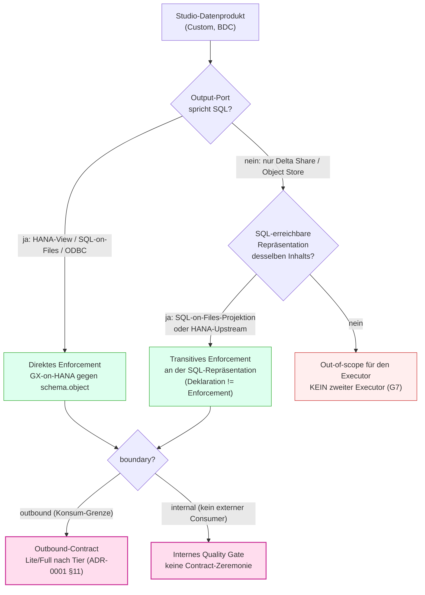
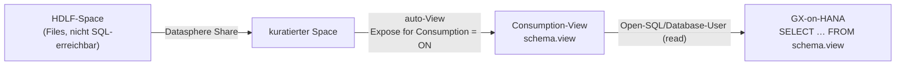

# ADR-0003 — Signal in einem BDC/Datasphere-Setup mit Data-Product-Studio-Datenprodukten

**Adressat:** Beratung, Plattform-Team, Governance, Entwicklung · **Stand:** 2026-06-21
**Status:** *Analyse / Vorschlag* (proposed) — bewertet, wie Signals Konzept mit den kommenden Custom Data Products aus dem **Data Product Studio** (BDC) zusammenspielt; betrachtet beide Auslieferungspfade (HDLF-Spaces und SQL-Output-Port). Keine gesetzten Code-Entscheidungen; technische Verifikationspunkte explizit markiert.
> **Update 2026-06-21:** V1 verifiziert — das HDLF-Objekt ist **teilbar und view-fähig**. Damit ist die HDLF-Auflösung **entschieden**: Share → kuratierter Space → auto-generierte Consumption-View → Lesen durch den Open-SQL-User (neues **§3.3**). Einziges neues Restrisiko: Die Share-Automatisierung läuft über einen **nicht standardmäßig dokumentierten** SAP-Endpunkt (**G-8 / V7**).
**Zweck:** Festhalten, **wo** Signals konzeptionelle Ebene (boundary × Lite/Full) und Signals **technische** Ebene (GX-on-HANA-Executor) bei BDC-Custom-Datenprodukten greifen — und wo nicht — abhängig davon, ob ein Datenprodukt auf einem **HDLF-Space** (Object Store, Delta/Parquet) oder über einen **SQL-Output-Port** ausgeliefert wird.

> Verwandte Dokumente: `ADR-0001_Quality-Gates_vs_Contracts.md` (boundary-Diskriminator, Komposition §10, DSP-Taxonomie-Tiering §11) · `Zusatz_ContractLifecycle_ORDBDCIntegration.md` (ORD/ODCS-Seam, Port-Topologie, offene Punkte R1/R2/R7) · `Vortrag_Briefing_DataProducts_DataContracts_DSP_BDC.md` (fünf Schichten, Output-Port = Delta Share **oder** exponierte View, §1.5) · `Betriebsmodi_Lite_und_Full.md` (Prozess-Zeremonie) · `Tooldokumentation.md` (Architektur, Executor).

---

## 0 — Kernaussage

Signals **Konzept-Ebene ist speicher-agnostisch** und überträgt sich **unverändert** auf Data-Product-Studio-Produkte: `boundary` (internal | inbound | outbound) klassifiziert eine *Parteigrenze*, nicht einen *Speicherort*; das Tiering aus ADR-0001 §11 (Tier 0/1/2 × Lite/Full) gilt für ein HDLF-Produkt genauso wie für ein HANA-Produkt.

Signals **Enforcement-Ebene ist dagegen nicht speicher-agnostisch.** Der einzige Executor ist **GX-on-HANA** (`hdbcli`, read-only): jeder Check ist ein SQL-Template gegen `"{schema}"."{dataset}"` (`packages/dq_core/library/check_library.json`). Damit gilt der harte Satz dieser ADR:

> **Signal erzwingt an der SQL-erreichbaren Oberfläche eines Datenprodukts.** Hat das Produkt einen SQL-Output-Port (HANA-Space-Produkt **oder** HDLF-Produkt via SQL-on-Files), wendet der vorhandene Executor **unverändert** an. Ist das Produkt ein *reiner* Object-Store-/Delta-Share-Auslieferung **ohne** SQL-Oberfläche, liegt es **außerhalb** der heutigen Executor-Reichweite — und das soll **nicht** durch einen zweiten Executor geheilt werden (Verstoß gegen das „single executor"-Prinzip und Gate G7).

Die Begriffsunsicherheit des Auftraggebers („SQL-Output-Port — keine Ahnung was das heißt") löst sich genau hier auf: Für Signal kollabieren *„Produkt auf HANA-Space"* und *„HDLF-Produkt via SQL-on-Files konsumierbar"* auf **dieselbe** Sache — eine relationale, per SQL adressierbare Oberfläche = Signals Enforcement-Naht. Nur der dritte Fall (Delta-Share-only, keine SQL-Sicht) ist der harte Fall.

---

## 1 — Kontext: Was sich mit Data Product Studio ändert

**Data Product Studio** (BDC) ist das Werkzeug, mit dem Kunden **eigene** (custom) Datenprodukte bauen — über die von SAP gelieferten Standard-Produkte hinaus. Für Signal sind drei Fakten relevant:

1. **Auslieferungspfad „HDLF-Spaces" ist der erste Weg, den SAP geht.** Die physischen Daten eines solchen Produkts sind **Dateien** in einem Object Store (HANA Data Lake Files, Delta/Parquet) — **keine** HANA-Tabellen. Das ist der für Signal entscheidende Unterschied gegenüber dem klassischen Datasphere-Bild (Fact View / Analytic Model auf HANA), das den Signal-Docs bisher zugrunde liegt.
2. **Ein Datenprodukt kann (auch) einen SQL-Output-Port haben.** Was das genau bedeutet, ist offen (siehe §3). Klar ist nur: Es existiert ein Konsumweg, der **SQL** spricht.
3. **Jedes Studio-Produkt ist ein Katalog-/ORD-Produkt.** Das ändert nichts an ADR-0001 §11: „Katalog-Produkt ≠ governter Contract." Studio erzeugt Produkte tool-getrieben; ob ein *governter Outbound-Contract* nötig ist, bleibt eine Tier-Entscheidung entlang der Lineage.

Die bisherigen Signal-Docs gehen implizit von HANA-erreichbaren Objekten aus: Das Briefing nennt als Output-Port den **Delta Share oder die exponierte Consumption-View** (`Briefing §1.5`), und der Zusatz-Doc fragt bereits in **R1** explizit, ob ein ORD-Port „inline eine Delta-Sharing-/ODBC-/**HDLF**-Quelle tragen" kann, sowie in **R7** nach dem „HDLF-CLI-Permission-Gap". Diese ADR zieht die HDLF-Frage aus dem Anhang in den Vordergrund und entscheidet die Enforcement-Seite.

---

## 2 — Signals technische Realität (der harte Constraint)

| Schicht | Heutige Bindung | Folge für BDC |
|---|---|---|
| Verbindung | `hdbcli.dbapi.connect(...)` (`connect/db_connection.py`) — **nur HANA** | erreicht nur, was über das **HANA-SQL-Interface** sichtbar ist |
| Check-Form | SQL-Template `SELECT … FROM "{schema}"."{dataset}"` (`library/check_library.json`, 20 Checks) | braucht einen **zweiteiligen, SQL-auflösbaren Objektnamen** |
| Bindung | Schema erst zur Laufzeit gebunden (Gate G2, `[SCHEMA-MAP]`) | adressiert über `{schema}`/`{dataset}`, kein Hardcoding |
| Prinzip | **ein** Executor (GX-on-HANA), Engine framework-frei (Gate G7) | ein zweiter (Spark/Delta-)Executor ist explizit unerwünscht (`Zusatz §4/§5`) |

Daraus folgt die Reichweiten-Regel: **Signal sieht ein Datenprodukt genau dann, wenn das HANA-SQL-Interface es als (virtuelle) Relation `schema.dataset` ausliefern kann.** Alles andere ist für den Executor unsichtbar — unabhängig davon, wie gut die Konzept-Ebene passt.

---

## 3 — Auflösung der Begriffsunsicherheit „SQL-Output-Port"

Der Auftraggeber nennt drei Hypothesen. Bewertung jeder einzelnen aus Signal-Sicht:

| # | Hypothese des Auftraggebers | Bewertung | Für Signal heißt das |
|---|---|---|---|
| (a) | Produkte werden **auf HDLF-Spaces** gebaut (SAPs erster Weg) | zutreffend als *Speicher*-Aussage; sagt für sich genommen **nichts** über die Konsum-Schnittstelle | Daten = Dateien; Executor-Reichweite **erst** über eine SQL-Sicht |
| (b) | SQL-Output-Port heißt vielleicht: man kann Produkte **auf HANA-Spaces** bauen | plausibel; ein HANA-Space-Produkt hat naturgemäß eine SQL-Oberfläche | **Happy Path** — Executor greift unverändert |
| (c) | Produkte im HDLF-Space sind vielleicht einfach **per SQL-on-Files** konsumierbar | technisch die wahrscheinlichste Bedeutung des „SQL-Output-Ports" für ein HDLF-Produkt | **Happy Path** — sobald die SQL-on-Files-Relation steht |

**Schlussfolgerung:** (b) und (c) **kollabieren für Signal auf dasselbe** — eine relationale, per SQL adressierbare Oberfläche. Ob diese Oberfläche eine native HANA-Tabelle/-View (b) oder eine SQL-on-Files-Virtual-Table über Parquet/Delta im HDLF (c) ist, ist dem SQL-Template **gleichgültig**, solange ein stabiler zweiteiliger Name `"{schema}"."{dataset}"` auflöst. Der „SQL-Output-Port" ist damit aus Signal-Sicht **die kanonische Enforcement-Naht** — und zugleich exakt der „Output Port" der Briefing-§1.5 / des 1:1:1:1-Prinzips (Data Contract → Output Port → Schema → Read Role).

> **Verifikationspunkt V1 [H] — ✅ ERLEDIGT (2026-06-21):** SQL-on-Files / HDLF-Virtual-Table — liefert das HANA-SQL-Interface den Produkt-Inhalt unter einem **stabilen, zweiteiligen** Namen (`schema.object`)? **Ja** — über eine consumption-aktivierte View im kuratierten Space (**§3.3**). Die Template-Anpassung in §8 fällt damit auf *null* (G-1 ≈ 0). Die Restabhängigkeit verlagert sich auf die *Automatisierung* der Share-/View-Erzeugung (G-8 / V7).

### 3.1 — Entscheidungsbaum: Wo enforced Signal bei einem Studio-Produkt?

Die ganze ADR lässt sich auf **eine** operative Frage je Datenprodukt verdichten: *Gibt es eine SQL-erreichbare Oberfläche desselben Inhalts?* Daran hängt, ob Signal direkt, transitiv oder gar nicht prüft.

Lesehilfe: Die **obere** Hälfte (B/D) ist die **technische** Reichweiten-Entscheidung (Executor-Naht, §4/§5); die **untere** Hälfte (G) ist die **governance**-seitige Klassifikation, die unverändert aus ADR-0001 stammt (§6 dieser ADR). Beide sind orthogonal: Ein out-of-scope-Produkt (F) kann governance-seitig sehr wohl ein Tier-2-Outbound-Contract *sein* — nur kann Signal ihn dann nicht *erzwingen*. Das ist der Punkt, an dem das Kunden-Framing greift: „Tier-2 ⇒ gib dem Produkt einen SQL-Output-Port."

### 3.2 — Durchgespielt: ein HDLF-Custom-Produkt

Beispiel `sales_orders_curated`, im Data Product Studio auf einem **HDLF-Space** als Delta-Tabelle gebaut, von einem anderen Team (FIN-Reporting) konsumiert.

| Schritt | Frage | Ergebnis |
|---|---|---|
| 1 | Output-Port spricht SQL? | Studio exponiert eine **SQL-on-Files-Sicht** `SALES."ORDERS_CURATED"` → **ja** (Zweig C) |
| 2 | boundary? | Konsum durch **anderes Team** über Grenze → `outbound` (Zweig H) |
| 3 | Tier? | mehrere abhängige FIN-Reports → **Tier 2 / Full** (SemVer, Approval) |
| 4 | Enforcement | 20 Bibliotheks-Checks gegen `SALES.ORDERS_CURATED` — `row_count`, `freshness` (über Lade-/Partitionsspalte, V3), `schema`-Closed-Mode, Ref-Integrität — **ohne Engine-Änderung** |
| 5 | Deklaration | Outbound-Contract-YAML (Source of Truth); ORD/CSN als einseitige Derivate (Zusatz §5) |

**Gegenprobe — derselbe Inhalt nur als Delta Share, ohne SQL-Sicht:** Schritt 1 → Zweig D. Existiert eine HANA-Upstream-Tabelle, aus der der Share gespeist wird → transitives Enforcement dort (Zweig E). Existiert sie nicht → Zweig F: governance-seitig bleibt es ein Outbound-Contract, aber Signal kann ihn nicht erzwingen → ehrlich als „nicht überwacht" in der Coverage-Map ausweisen, **nicht** grün vortäuschen.

### 3.3 — Entschiedene HDLF-Auflösung: Share → kuratierter Space → Consumption-View

Der in §3 als **V1** offene Adressierungs-Pfad ist **verifiziert und entschieden**: Das HDLF-Objekt ist **teilbar und view-fähig** (Stand 2026-06-21 bestätigt). Damit steht der **Datasphere-native** Auflösungsweg fest — die konkrete Realisierung der „SQL-on-Files-Sicht" aus §3/§4:

1. **Share** des HDLF-Objekts aus dem HDLF-Space in einen **dedizierten/kuratierten Space**.
2. Im kuratierten Space **automatisch eine View** auf das geteilte Objekt erzeugen, mit **„Expose for Consumption" = ON**.
3. Die consumption-aktivierte View ist über den **Open-SQL-/Database-User des kuratierten Space** lesbar — `SELECT … FROM "{schema}"."{view}"`.
4. GX-on-HANA greift **unverändert** zu (`[ENGINE-FROZEN]`); die View **ist** der stabile zweiteilige Name, den V1 verlangt — keine Compiler-Adressierungs-Abstraktion nötig (G-1 ≈ 0).

Damit löst sich das **Ursprungsproblem** („Objekte im HDLF-Space sind über den Open-SQL-User *dieses* Space nicht lesbar") nicht durch Lesen am falschen Ort, sondern durch **Verlagerung an eine SQL-erreichbare Oberfläche**: Nicht der HDLF-Space-User liest die Files, sondern der **kuratierte-Space-User** liest die consumption-aktivierte View. Das **Consumption-Flag ist der eigentliche Hebel** — nur exponierte Objekte erscheinen dem Database-User.

**Nebeneffekt — Discovery (G-7) fällt mit ab:** Die Menge der generierten Consumption-Views ist zugleich das **enumerierbare Inventar** „das überwacht Signal". Erreichbar zu *sein* genügt nicht (§8); der kuratierte Space macht die Produkte auch *auffindbar*.

**Restrisiko dieses Pfades — die Share-Automatisierung (G-8 / V7):** Die *programmatische* Erzeugung von Share + View ist über die **dokumentierten** SAP-Standard-APIs nicht durchgängig möglich; ein verifiziert funktionierender Weg läuft über einen **nicht standardmäßig dokumentierten** Endpunkt. Das ist **dieselbe Risikoklasse** wie `DWC_GLOBAL` (Observability-Doc): Nutzung eines nicht öffentlich dokumentierten SAP-Interface. Zwei Risiken sind sauber zu trennen:

- **(a) Bruch (das reale Risiko).** Nicht-dokumentierte / UI-nahe Endpunkte können sich zwischen Datasphere-Releases **ohne Deprecation-Notice** ändern oder verschwinden (dokumentierte APIs bekommen Notice, diese nicht). Über einen 12-Monats-Horizont **mittel–hoch**. → Für das *Verschwinden* des Endpunkts bauen, nicht vor Monitoring fürchten.
- **(b) Vertrag / Supportbarkeit.** Genutzt wird der **eigene** Tenant mit **eigenen, entitleten** Credentials auf **eigene** Daten → **kein** Security-Bypass, schwaches „Missbrauchs"-Framing. Die echte Exposition ist **Supportbarkeit**: SAP-Support kann bei einem nicht-dokumentierten Pfad Hilfe ablehnen — exakt die `DWC_GLOBAL`-Stance des Observability-Docs („kein öffentlich dokumentiertes SAP-Interface; Nutzung kann Support-Vereinbarungen berühren und ist gegenüber dem Kunden explizit zu flaggen"). Telemetrie *existiert* in jeder Managed-SaaS, aber „SAP *kann* es sehen" ≠ „SAP *ahndet* es"; Read-/Share-Calls im eigenen Tenant sind nicht das Profil, das Enforcement auslöst.

**Maßnahmen (G-8):** (1) als **einmaligen Provisioning-Schritt** isolieren, **nicht** im Laufzeit-Hot-Path — ein Bruch stoppt dann das Onboarding, nicht das Monitoring; (2) hinter **einem** kapselnden Adapter (eine swap-bare Stelle, wenn SAP den Endpunkt ändert); (3) **Health-Check + lautes Fehlschlagen** statt still-grün (konsistent mit „nie grün vortäuschen"); (4) Abhängigkeit dem **Kunden explizit flaggen**; (5) **SAP-Bestätigung** einholen, ob der Endpunkt für diesen Zweck unterstützt ist, bevor er load-bearing wird (**V7**).

---

## 4 — Fall 1: Datenprodukt auf HDLF-Space (SAPs erster Weg)

**Physik:** Dateien (Delta/Parquet) im Object Store. **Konzept-Ebene:** vollständig anwendbar — das HDLF-Produkt ist ein Data Product im Sinne von ADR-0001 (das Ganze, in einer Ownership), sein Output-Port ist die Outbound-Grenze, das Tiering (§11) entscheidet über Contract-Aufwand. **Enforcement-Ebene:** hängt allein daran, **ob eine SQL-Sicht existiert**:

| Konsum-Schnittstelle des HDLF-Produkts | Signal-Executor | Vorgehen |
|---|---|---|
| **SQL-on-Files-Sicht** vorhanden (Fall 3c) | ✅ erreichbar | Checks gegen die Virtual-Table wie gegen eine HANA-Tabelle — Happy Path |
| **Delta Share / nur Object-Store-Zugriff**, keine SQL-Sicht | ❌ nicht erreichbar | **transitiv** an der SQL-erreichbaren Upstream-Oberfläche prüfen (s. u.) **oder** out-of-scope |

**Wichtig — Delta Share ist kein SQL-Endpoint.** Ein Delta Share wird von Spark-/Databricks-Clients konsumiert, nicht über SQL. Signal kann einen Delta Share **nicht direkt** testen. Die saubere Auflösung folgt dem schon gesetzten Muster *Deklaration ≠ Enforcement* (ADR-0001 §10.5): Der Delta Share ist die **Deklaration** (Output-Port-Versprechen); das **Enforcement** setzt Signal an der SQL-erreichbaren Repräsentation **desselben** Inhalts an — der SQL-on-Files-Projektion bzw. dem HANA-Objekt, aus dem der Share gespeist wird. Existiert **gar keine** solche Repräsentation, ist das Produkt für den GX-on-HANA-Executor schlicht unsichtbar; dann ist die ehrliche Antwort „out-of-scope für den Executor", **nicht** „wir bauen einen Spark-Executor".

**Datenseitige Feinheiten bei Files (kleinere Param-Anpassung, keine Architektur):**

- `row_count`/`volume_anomaly` = `COUNT(*)` über die Virtual-Table → korrekt, aber bei großen Parquet-Beständen ggf. **teuer** (Full-Scan). Pruning/Partition-Prädikate als Check-Param vorsehen.
- `freshness` erwartet heute eine **Daten-Spalte** (`column: ORDER_DATE`). Bei Files lebt Frische oft in **Partitionspfaden/Datei-Timestamps**, nicht in einer Spalte. Entweder eine konventionelle Lade-/Partitionsspalte verlangen oder Freshness über Datei-/Partitions-Metadaten modellieren (Folge-Workstream, nicht Teil dieser ADR).
- Schema-/Closed-Mode-Checks (Gate G2, Laufzeit-Bindung) funktionieren über die Virtual-Table-Spaltenliste unverändert.

---

## 5 — Fall 2: Datenprodukt mit SQL-Output-Port

Das ist der **empfohlene Integrationszielzustand** und der technisch einfachste Fall — unabhängig davon, ob der SQL-Port ein HANA-Space-Produkt (3b) oder eine SQL-on-Files-Sicht über HDLF (3c) ist:

- Der Executor braucht nur **Verbindungs-Koordinaten** (gibt es) und einen **auflösbaren Objektnamen** (= der Port liefert ihn). `{schema}.{dataset}` bindet auf genau das, was der Output-Port exponiert.
- Alle 20 Bibliotheks-Checks, die Compliance-Ampel, Coverage-/Lineage-Map, Incidents und der Proposal-Miner greifen **ohne Code-Änderung**.
- Der SQL-Output-Port ist 1:1 die **Outbound-Grenze** (`boundary: outbound`). Das 1:1:1:1-Prinzip (Briefing §1.5) wird konkret: **ein** Contract pro Output-Port, gegen das Signal an genau diesem Port enforced.

→ Wo der Kunde die Wahl hat, ist ein **SQL-Output-Port die für Signal-Governance bevorzugte Auslieferung**. Das ist auch das ehrliche Kunden-Framing: „Gib dem Produkt einen SQL-Output-Port, dann ist es ohne Zusatzaufwand contract-überwachbar."

---

## 6 — Konzept-Ebene: überträgt sich unverändert (der Teil, der *nicht* wackelt)

Unabhängig von HDLF vs. SQL-Port bleibt **alles aus ADR-0001 / dem Briefing gültig**, weil `boundary` eine Grenze klassifiziert, keinen Speicher:

| Konzept | Gilt bei BDC-Studio-Produkten? | Begründung |
|---|---|---|
| `boundary` (internal/inbound/outbound) | **ja, 1:1** | Output-Port = Outbound-Grenze; interne Studio-Transformationsschritte = `internal` Gates |
| Data Product = das Ganze, Contract = nur die Ränder | **ja** | Studio-Produkt umfasst Inbound→Transformation→Output; Contract beschreibt nur den/die Port(s) |
| Tiering Tier 0/1/2 (§11) | **ja** | „alle Dims sind Foundation Products" gilt in BDC *erst recht* (ORD je Objekt); Tier datengetrieben aus Lineage |
| Layer ≠ Grenze, Objekt ≠ Produkt | **ja** | ein HDLF-Zwischen-File ist so wenig ein Contract wie eine Core-Tabelle |
| Gekettete Contracts (Fall B, §10.4) | **ja** | Studio-Produkt kann Upstream-Produkt konsumieren → `inbound`-Referenz + eigener `outbound` |
| ORD/ODCS als einseitige Derivate (Zusatz §5) | **ja** | Studio emittiert ORD; YAML-Contract bleibt Source of Truth, ORD/CSN = Derivate |

**Einzige konzeptionelle Schärfung:** Der Begriff „Output Port" wird in BDC **konkreter und potenziell mehrfach** — ein Produkt kann mehrere Ports haben (z. B. Delta Share **und** SQL-on-Files **derselben** Daten). Regel: Pro *governter* Grenze **ein** Outbound-Contract; mehrere physische Ports auf **denselben** Inhalt sind verschiedene *Transporte* einer Zusage, nicht mehrere Verträge. Signal enforced an dem Port, der SQL spricht; die Zusage gilt für alle Ports desselben Inhalts (Transport-Äquivalenz).

---

## 7 — Entscheidung

1. **Konzept-Ebene unverändert übernehmen.** `boundary` × Lite/Full und das §11-Tiering gelten für BDC-Studio-Produkte ohne Anpassung. Kein Schema-, kein Modell-Eingriff auf der Governance-Seite.
2. **Den SQL-Output-Port als Signals kanonische Enforcement-Naht festlegen.** Signal erzwingt an der SQL-erreichbaren Oberfläche des Output-Ports. „HANA-Space-Produkt" und „HDLF-Produkt via SQL-on-Files" werden vom Executor **identisch** behandelt.
3. **Fall 2 (SQL-Output-Port) ist der unterstützte Happy Path** und der empfohlene Auslieferungs-Zielzustand für contract-governte Produkte — voraussichtlich **null bis triviale** Code-Änderung (abhängig von V1).
4. **Fall 1 (HDLF-Space) wird unterstützt, *sofern* eine SQL-on-Files-Sicht existiert.** Ohne SQL-Sicht: **transitive** Prüfung an der Upstream-SQL-Oberfläche; existiert auch die nicht, ist das Produkt **explizit out-of-scope** für den Executor.
5. **Keinen zweiten Executor bauen.** Ein Spark-/Delta-/Object-Store-Executor wird **abgelehnt** — er bricht „single executor", dupliziert Regeln und verletzt G7 (Frameworkfreiheit der Engine). Die Engine bleibt `[ENGINE-FROZEN]`.
6. **Eine dünne Adressierungs-Abstraktion vorsehen** (nur falls V1 es verlangt): `{schema}.{dataset}` so kapseln, dass eine SQL-on-Files-/HDLF-Virtual-Table identisch zu einer nativen HANA-Tabelle aufgelöst wird. — *Mit V1 erledigt (§3.3) entfällt dies: die Consumption-View liefert den nativen zweiteiligen Namen direkt; G-1 ≈ 0.*
7. **HDLF-Auflösung über den kuratierten Space festlegen (§3.3).** Share → dedizierter Space → auto-generierte Consumption-View (`Expose for Consumption = ON`) → Lesen durch den Open-SQL-/Database-User. Das ist die konkrete, Datasphere-native Realisierung von Punkt 2/4 und ersetzt die frühere SQL-on-Files-Andeutung. Die generierten Views doppeln als Discovery-Inventar (G-7). Die einzige Restabhängigkeit ist die *Automatisierung* der Share-/View-Erzeugung über einen nicht-dokumentierten Endpunkt — als Provisioning-Schritt kapseln, Supportbarkeit klären (G-8 / V7).

**Bewusst NICHT entschieden** (folgt späterer Verifikation): die genaue ORD-Port-Sub-Schema-Frage für HDLF (R1), die konkrete Datasphere-ORD-Emission (R2), der programmatische Catalog-/Metadaten-Zugriff inkl. HDLF-Permission-Gap (R7) — diese bleiben im Zusatz-Doc verortet und werden durch diese ADR nur **geschärft**, nicht abgeschlossen.

---

## 8 — Lücken & benötigte Anpassungen (technisch, nicht konzeptionell)

| # | Gap | Schwere | Maßnahme | Aufwand (PT) |
|---|---|---|---|---|
| G-1 | Adressierung `{schema}.{dataset}` auf SQL-on-Files-/HDLF-Objekt | **erledigt (V1, §3.3)** | Adressierung über Consumption-View im kuratierten Space; keine Compiler-Abstraktion nötig | **≈0** |
| G-2 | `freshness` über Datei-/Partitions-Metadaten statt Daten-Spalte | mittel | optionaler Freshness-Modus „partition/file-timestamp"; Folge-Workstream | 1,5–2 |
| G-3 | `COUNT(*)`-Kosten bei großen Parquet-Beständen | gering | Partition-/Prädikat-Param im Check; Doku „teure Checks" | 0,5 |
| G-4 | Delta-Share-only-Produkte (keine SQL-Sicht) | mittel | Doku-Regel „transitiv prüfen oder out-of-scope"; **kein** Code | 0,25 |
| G-5 | ORD-Port-Topologie für HDLF (R1/R2) verifizieren | hoch (Wissen) | Spec-/Produkt-Verifikation, nicht Code | — |
| G-6 | Catalog-/HDLF-Metadaten programmatisch lesen (R7) | mittel (Wissen) | an bekannte Risiken gekoppelt (DWC_GLOBAL, HDLF-CLI-Permission-Gap) | — |
| G-7 | **Discovery**: Signals Inventar (`data/inventory.json`-Snapshot, Schema-Drift-Check O3) erfasst heute HANA-Kataloge — HDLF-Produkte/Virtual-Tables müssen erst hineinfinden | mittel (entschärft) | Inventar-Extrakt um die Consumption-Views des kuratierten Space erweitern; die generierte View-Menge **ist** das Inventar (§3.3) | 1–2 |
| G-8 | **Share + View nur über nicht-dokumentierten SAP-Endpunkt** programmatisch erzeugbar (dokumentierte Standard-APIs reichen nicht; ein Weg ist verifiziert funktionsfähig) | mittel (Wissen + Betrieb) | Als **einmaligen Provisioning-Schritt** (nicht Laufzeit-Hot-Path) hinter **einem** Adapter kapseln; Health-Check + lautes Fehlschlagen; Abhängigkeit dem Kunden flaggen (analog `DWC_GLOBAL`); SAP-Bestätigung der Supportbarkeit einholen (V7) | 0,5–1 |

Kernbotschaft der Tabelle: **Der teuerste Posten ist Wissen (G-5/G-6/G-8), nicht Code.** Auf der Code-Seite ist der wahrscheinliche Gesamteingriff klein und additiv — die Engine bleibt unangetastet. Mit V1 erledigt (§3.3) ist G-1 ≈ 0 und G-7 (Discovery) entschärft (die Consumption-Views *sind* das Inventar); die neue stillste Lücke ist **G-8**: nicht die Erreichbarkeit, sondern die **Haltbarkeit des Automatisierungspfads** für Share + View.

---

## 9 — Konsequenzen

**Positiv**

- Signals Governance-Konzept ist **zukunftssicher** gegenüber dem BDC-Speichermodell-Wechsel: die wertvolle Ebene (boundary, Tiering, Komposition) überträgt sich ohne Bruch.
- Klare, ehrliche Reichweiten-Aussage gegenüber Kunde/SAP: „Signal überwacht an SQL-Output-Ports" — kein Versprechen, das der Executor nicht halten kann.
- Der SQL-Output-Port als Naht macht Fall (b) und (c) zu **einem** Integrationspfad statt zweier.
- Keine Architektur-Erosion: „single executor", G2, G7 und `[ENGINE-FROZEN]` bleiben intakt.

**Negativ / Risiken**

- Reine Delta-Share-/Object-Store-Produkte ohne SQL-Sicht sind **nicht** überwachbar — falls SAPs erster Weg (HDLF) in der Praxis *häufig* ohne SQL-on-Files auskommt, schrumpft Signals adressierbare Fläche. **Gegenmittel:** Kunden-Framing „SQL-Output-Port = überwachbar"; Tier-2-Produkte sollten ohnehin einen SQL-Port bekommen.
- ~~V1 (Adressierung) ist noch nicht produktgenau verifiziert~~ → **erledigt (§3.3):** HDLF-Objekt ist teilbar + view-fähig; Adressierung über die Consumption-View im kuratierten Space, G-1 ≈ 0. Die Restabhängigkeit verlagert sich auf die **Share-Automatisierung** (s. nächster Punkt).
- **Share-Automatisierung hängt an einem nicht-dokumentierten SAP-Endpunkt** (G-8). Zwei zu trennende Risiken: **(a) Bruch** — nicht-dokumentierte / UI-nahe Endpunkte können sich zwischen Datasphere-Releases ohne Deprecation-Notice ändern; das ist das *reale* Risiko (mittel–hoch über 12 Monate). **(b) Supportbarkeit** — Nutzung im *eigenen* Tenant mit *eigenen* entitleten Credentials ist kein Security-Bypass; die echte Exposition ist, dass SAP-Support einen nicht-dokumentierten Pfad nicht stützt (exakt die `DWC_GLOBAL`-Stance). **Gegenmittel:** als einmaligen Provisioning-Schritt isolieren (Bruch stoppt Onboarding, nicht Monitoring), hinter einem Adapter kapseln, dem Kunden flaggen, SAP-Bestätigung einholen (V7). Geringes Risiko, dass SAP es *ahndet*; höheres, dass SAP es *bricht*.
- Frische-/Volumen-Semantik auf Files braucht eine durchdachte Param-Erweiterung, sonst entstehen falsch-grüne oder teure Checks.

**Neutral**

- Lite/Full bleibt orthogonal (ADR-0002): Speicherort und Zeremonie-Tiefe sind unabhängig. Ein HDLF-Produkt kann Tier-2/Full sein, ein HANA-Produkt Tier-0/internal.
- ORD/ODCS-Seam (Zusatz-Doc) bleibt die offene Baustelle; diese ADR verschiebt sie nicht, schärft aber die HDLF-spezifischen Fragen.

---

## 10 — Offene Verifikationspunkte (Schärfung von R1/R2/R7)

> Priorität: **[H]** blockiert die Enforcement-Festlegung · **[M]** mittel · **[L]** später.

- **V1 [H] — SQL-on-Files-Adressierung. ✅ ERLEDIGT (2026-06-21).** HDLF-Objekt ist teilbar + view-fähig → Adressierung über consumption-aktivierte View im kuratierten Space (§3.3). G-1 ≈ 0. Folge-Frage: **V7**.
- **V7 [H] — Supportbarkeit der Share-Automatisierung.** Ist der für die programmatische Share-/View-Erzeugung genutzte (nicht standardmäßig dokumentierte) SAP-Endpunkt für diesen Zweck **unterstützt**? Schriftliche SAP-Bestätigung einholen, bevor der Pfad load-bearing wird (G-8). Bis dahin: Provisioning-Schritt + Adapter + Kunden-Flag + lautes Fehlschlagen.
- **V2 [H] — Output-Port-Typen je Studio-Produkt.** Welche Port-Typen bietet Data Product Studio konkret an (Delta Share, SQL-on-Files, HANA-View, ODBC), und sind sie pro Produkt **wählbar/kombinierbar**? Klärt, wie oft Fall 2 real verfügbar ist — verschärft R2.
- **V3 [M] — Freshness-Quelle bei Files.** Existiert eine konventionelle Lade-/Partitionsspalte, oder muss Frische aus Partitions-/Datei-Metadaten kommen? (entscheidet G-2)
- **V4 [M] — Delta-Share-only-Häufigkeit.** Wie verbreitet sind in SAPs erstem HDLF-Weg Produkte **ohne** SQL-Sicht? Bestimmt das Risiko aus §9.
- **V5 [M] — Metadaten-/Catalog-Zugriff für HDLF.** Programmatischer Lesepfad auf HDLF-Produkt-/ORD-Metadaten inkl. des bekannten HDLF-CLI-Permission-Gaps — verschärft R7.
- **V6 [L] — Multi-Port-Transport-Äquivalenz.** Wenn ein Produkt Delta Share **und** SQL-on-Files auf denselben Inhalt bietet: Garantiert SAP Inhaltsgleichheit, sodass die SQL-seitige Prüfung den Share mit-abdeckt (transitives Enforcement, §4)?

---

## 11 — Faustregeln (als Merksätze)

1. **Konzept transferiert, Executor nicht.** `boundary` × Lite/Full gilt überall; GX-on-HANA erreicht nur SQL-Oberflächen.
2. **Signal erzwingt am SQL-Output-Port.** Der Port ist die Outbound-Grenze und die Enforcement-Naht in einem.
3. **HANA-Space-Produkt = HDLF-via-SQL-on-Files** — für den Executor dasselbe: eine relationale Oberfläche `schema.object`.
4. **Delta Share ist kein SQL-Endpoint.** Direkt nicht prüfbar; transitiv an der SQL-Repräsentation desselben Inhalts enforcen — oder ehrlich out-of-scope.
5. **Kein zweiter Executor.** Object-Store-/Spark-Enforcement wird abgelehnt; single executor, G7, `[ENGINE-FROZEN]` bleiben.
6. **Der teure Posten ist Wissen, nicht Code.** Die Code-Anpassung ist klein und additiv; die Verifikationspunkte V1–V7 sind der eigentliche kritische Pfad.
7. **„SQL-Output-Port = überwachbar."** Das ehrliche Kunden-Framing: Wo Governance zählt (Tier 2), gib dem Produkt einen SQL-Port.
8. **HDLF wird über den kuratierten Space gelesen, nicht am HDLF-Space.** Share → Consumption-View (`Expose = ON`) → Open-SQL-User; das Consumption-Flag ist der Hebel. Die einzige Restabhängigkeit ist die Share-Automatisierung über einen nicht-dokumentierten Endpunkt: für sein *Verschwinden* bauen (Provisioning-Schritt + Adapter), nicht vor SAP-*Monitoring* fürchten.
