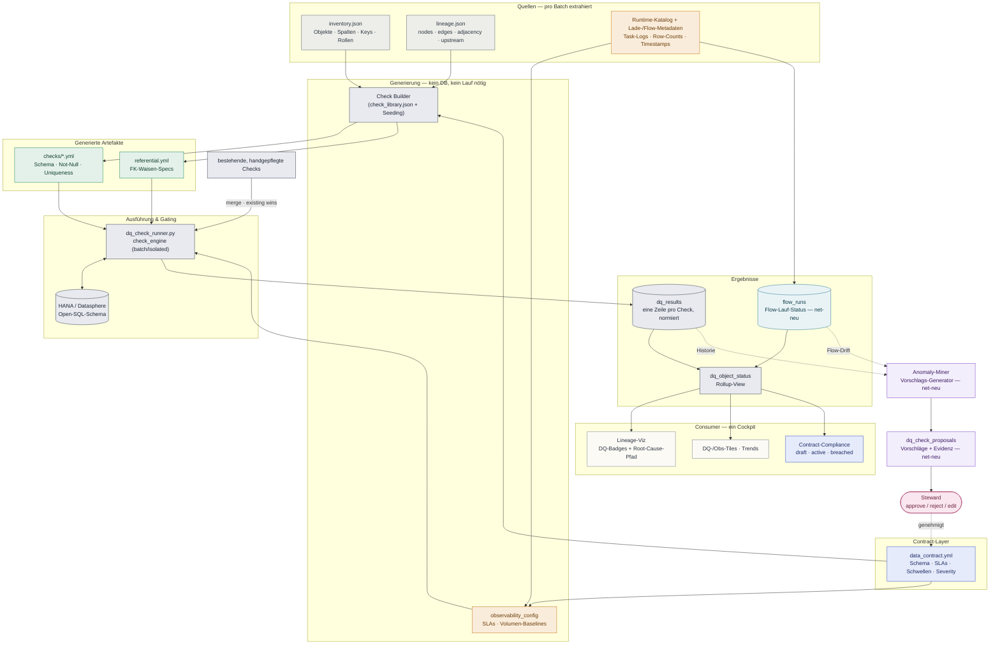
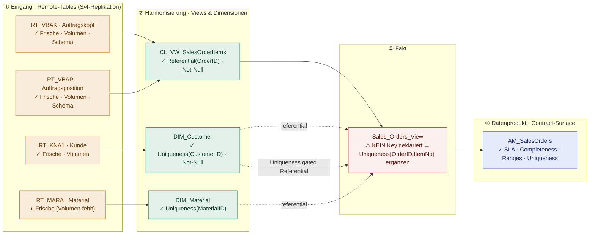
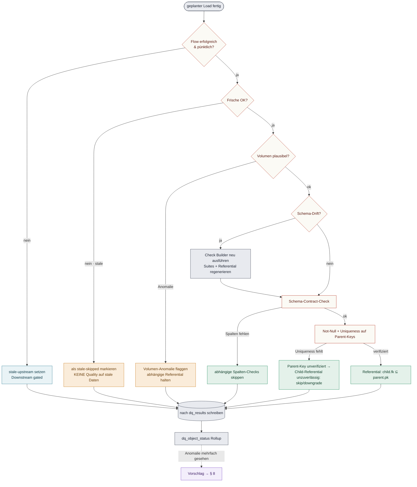
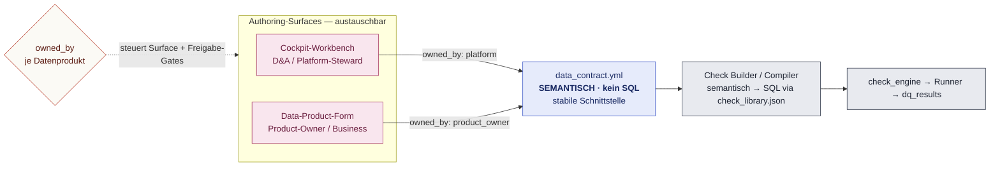
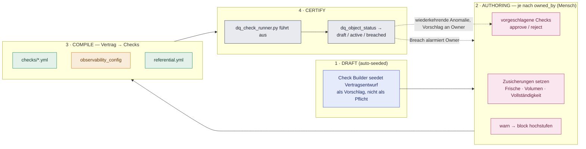
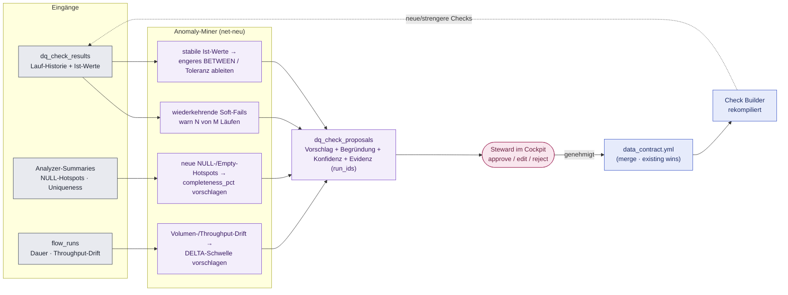
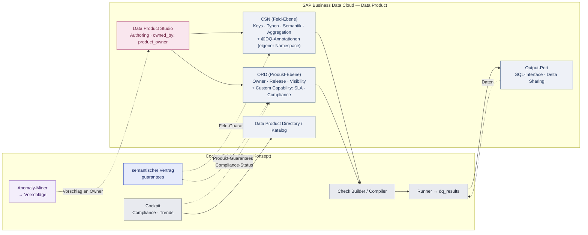

# Holistisches Data-Quality- & Data-Observability-Cockpit — Konzept

**High-Level-Konzept · contract-getriebene Shift-Left-Architektur für SAP Datasphere**

Ein Cockpit, das Datenverträge (Contracts), Flow-Monitoring und Datenqualität in einer
Oberfläche zusammenführt — getragen von **einem** Ergebnisspeicher, verbunden über
**Lineage als Rückgrat**, und geschlossen durch einen **Rückfluss der Erkenntnisse in den
Check Builder**.

- **Bestehende Basis:** `check_engine.py` · `expectation.py` · `check_library.json` · `result_store.py` · `dq_check_runner.py` · `db_connection.py`
- **Metadatenquellen:** `inventory.json` · `lineage.json` (schemaVersion 6)
- **Scope:** SAP Datasphere · geplanter Batch-Betrieb · Open-SQL-Schema via `hdbcli`
- **Status:** Konzept. Verifizierte Komponenten sind als `Monospace` markiert; net-neue Komponenten sind explizit gekennzeichnet.

> **⚠ Grundannahme (aus dem Architektur-Handover übernommen)**
> SAP Datasphere besitzt **kein natives Data-Contract-Feature** (Stand 2026-Releases; nächste
> Analoga: Data Products, Katalog, Task Chains). Der Datenvertrag ist daher ein **Artefakt,
> das wir erzeugen und pflegen**, und „Workbench” ist eine **Autoren-Oberfläche**. Empfehlung
> dieses Konzepts: die Workbench lebt **im Cockpit selbst** (Begründung in § 7). Alternativen
> — Data-Builder-Annotationen oder Data Product — bleiben möglich und sind in § 12 als offener
> Punkt geführt.

**Legende (Farbe = Funktion, nicht Dekoration):** Observability · Quality · Flow-Monitoring ·
Pipeline/Store · Contract · Human-in-the-loop · Feedback/Rückfluss · Quelle/Input.
`Monospace` = reales Artefakt aus der implementierten Pipeline. Gestrichelte Kanten = Feedback/Reuse.

-----

## 1 / Zweck & Abgrenzung

Das Cockpit beantwortet drei Fragen über einen einzigen Pfad und eine einzige Oberfläche:

1. **Kommen die Daten an und in der erwarteten Form?** → Observability (zeitlich/statistisch)
1. **Sind die Daten korrekt gemäß zugesicherter Semantik?** → Quality (regelbasiert)
1. **Laufen die Pipelines, die die Daten erzeugen, und wie weit reicht ein Ausfall?** → Flow-Monitoring (lineage-basiert)

Der Mehrwert gegenüber drei Einzeltools liegt in der **Kopplung**: Ein verspäteter
Replication Flow (Flow-Monitoring) markiert das Zielobjekt als „stale”, was das
Gating verhindert, dass darauf Quality-Checks laufen (Observability gated Quality), und
die Lineage zeigt sofort, welche Consumer betroffen sind (Blast-Radius). Wiederkehrende
Befunde fließen als Vorschläge zurück in den Check Builder (Shift-Left). Genau diese
Querverbindungen sind nur mit einem gemeinsamen Speicher und einem gemeinsamen
Schlüsselraum möglich.

-----

## 2 / Leitprinzipien

- **Ein Speicher als Knotenpunkt.** Observability, Quality und Flow-Status landen im selben
  `dq_results`-Schema. Weil `lineage.node.id = inventory.technicalName = dq_object_status.object_name`,
  joinen alle Consumer ohne Mapping-Schicht.
- **Contract → Checks (nicht nur Checks → Report).** Der freigegebene Vertrag ist die Quelle,
  aus der Suites, Observability-Config und Referential-Specs **kompiliert** werden — nicht nur
  ein Bericht dessen, was die Checks fanden. Das ist Shift-Left operationalisiert.
- **Lineage ist das Rückgrat, nicht ein Add-on.** Gating, Blast-Radius und Root-Cause nutzen
  `adjacency` / `upstream` aus `lineage.json` direkt.
- **Günstige Checks gaten teure.** Frische-/Volumen-/Schema-Prüfungen entscheiden, ob
  Referential-/Aggregat-Prüfungen überhaupt sinnvoll sind.
- **Der Loop schließt sich.** Erkenntnisse aus der Historie werden zu Vorschlägen, ein Steward
  entscheidet, der Check Builder übernimmt — mit `existing-wins`-Präzedenz.
- **Datenschutz durch Aufgabentrennung.** Strukturelle Metadaten verlassen die Plattform;
  tatsächliche Daten bleiben lokal in HANA. Checks geben **skalare** Befunde zurück (Zähler,
  Quoten), keine Datensätze; Diagnostik-Zeilen bleiben im lokalen Result-Store.

-----

## 3 / Gesamtarchitektur

Eine Generierungsstufe macht aus Vertrag + Metadaten Check-Specs; eine Ausführungsstufe
prüft alle Familien gegen HANA und schreibt **einen** Ergebnisspeicher; ein Rollup speist
alle Consumer; eine Feedback-Stufe destilliert die Historie zurück in Vorschläge.



**Kernidee:** Der Speicher ist die einzige Verbindungsstelle. Die einzige Kante, die zurück
zum Vertrag führt (`MINER → PROP → STEW → CONTRACT`), ist der Ort, an dem Shift-Left lebt
(§ 8).

-----

## 4 / Komponenten im Detail

### 4.1 Metadaten-Ingestion *(vorhanden)*

`inventory.json` liefert Objekte, Spalten, deklarierte Keys (`csnProjection.keyColumns`),
`modelingPattern` und `dataCategory`. `lineage.json` liefert `nodes`, `edges`
(`connectionType` u. a. `flow_source`/`flow_target`), `adjacency` und `upstream`.
Der Runtime-Katalog ergänzt Lade-Timestamps, Row-Counts und Flow-Lauf-Status.

> **Abhängigkeit (offen):** `columnEdges` ist aktuell leer (`coverage.ratio = 0.0`), weil die
> Lineage an die SQL-Rekonstruktion gekoppelt ist. Spalten-genaues Root-Cause und
> Expression-abgeleitete Quality-Checks benötigen den **rekursiven CQN-Walker-Fix** —
> dieselbe Abhängigkeit wie im Implementierungsplan. Bis dahin arbeitet das Cockpit
> objekt-granular (das ist vollständig tragfähig für alle Checks der Library).

### 4.2 Contract-Layer *(net-neu, Format YAML)*

Der Vertrag ist ein Superset aus Schema-Manifest + Referential-Specs + Observability-Config +
human-gesetzten SLAs/Schwellen/Severity. Pro Dataset eine `data_contract.yml`, versioniert in
Git. Er ist die **menschenlesbare Wahrheit** und gleichzeitig der **Kompilier-Input**. Aufbau
lehnt sich an das bestehende `dataset`/`schema`/`checks`-Format von `check_engine.load_dataset_config`
an und erweitert es um SLA-/Owner-/Observability-Blöcke (Beispiel in § 9).

### 4.3 Check Builder (Generierung) *(teils vorhanden)*

Erzeugt aus Vertrag + Inventar die ausführbaren Checks — ohne DB-Verbindung, ohne Lauf.
Seeding-Regeln aus der Metadatenlage:

- **Key deklariert** → `duplicate`-Check (Uniqueness) + `missing`-Check (Not-Null) je Key-Spalte.
- **Rolle Dimension/Fact/Text** → Uniqueness ist Pflicht (Datasphere vertraut deklarierten,
  aber nicht erzwungenen Keys — ein deklarierter, nicht-eindeutiger Key ist schlimmer als keiner).
- **Fact → Dimension-Bezug** → `reference_integrity`-Check (FK-Waisen).
- **Measure/Kennzahl** → `value_range` / `aggregate_range` / `distinct_count`.
- **Spaltenbeziehung / Zeitlogik** → `cross_column_compare` / `future_dates`.
- **Quelle ↔ Ziel** → `row_count_match` (Reconciliation).

Die `check_library.json` (24 Templates, 4 Kategorien) bleibt die einzige Quelle der
Check-Typen für Engine **und** UI. Der Builder füllt `{schema}`/`{dataset}` und die
`<PARAM>`-Tokens.

### 4.3a Check-Platzierung entlang der Lineage *(net-neu)*

Ein Business-Core-Datenprodukt führt mehrere Upstreams in ein harmonisiertes Modell zusammen.
Die häufige Fehlannahme: man prüfe nur das fertige Produkt. Dann weiß man, *dass* etwas falsch
ist, aber nicht *wo*. Daher gilt zu trennen:

- Die **Daten** konvergieren — das ist die Build-Pipeline des Produkts.
- Die **Checks** konvergieren **nicht** in eine Abfrage. Sie werden **pro Objekt entlang der
  Lineage** definiert und in *einem orchestrierten, gegateten Lauf* zusammen ausgeführt (der
  Runner kann mehrere Datasets).

**Drei Ebenen, je eigener Zweck:**

1. **Eingang / Landing** (replizierte Remote-Tables) — Frische, Volumen, Schema-Drift,
   Load-Status. Beantwortet „hat die Quelle geliefert?”, ist billig und **gated alles dahinter**.
1. **Harmonisierung** (Views, Dimensionen, Join-/Aggregationspunkte) — Uniqueness auf
   Dimensions-Keys, Referential zwischen Fakt und Dimension, Geschäftsregeln. Hier entstehen
   Fehler und werden lokalisiert.
1. **Veröffentlichtes Datenprodukt** (Contract-Surface) — die Guarantees: Completeness,
   Uniqueness auf deklarierten Keys, Wertebereiche, Freshness-SLA. Das sieht der Consumer.

**An welchen Upstream-Objekten — nicht „allen”:** nur die bedeutsamen Knoten — (a) Eintritts-
punkte, (b) Join-/Aggregationspunkte, (c) Produktgrenze. Welche das sind, sagt die Lineage
(`adjacency`/`upstream`) plus die Inventar-Rollen (Fakt/Dimension/Text).

**Eigentums-Trennung** (passt zu § 7 / § 13): **Contract-Checks** = wenige, an der Produktgrenze,
in CSN/ORD verankert → Product-Owner. **Operational-Checks** = viele, über die Upstreams, für
Frühwarnung und Root-Cause → Platform-Team, *nicht* zwingend im Consumer-Vertrag.

**Lineage-basiertes Auto-Scoping:** Der Builder leitet den Prüfumfang aus der Lineage ab —
**Contract-Scope = Produktknoten; Check-Scope = Produktknoten + relevanter Upstream-Teilgraph.**
Bei einem Breach am Produkt läuft das Cockpit `upstream` und zeigt, welcher beitragende Knoten
zuerst riss (Root-Cause/Blast-Radius).

**Der Check Builder als Lineage-Coverage-Karte** *(net-neu, baut auf der Cytoscape.js/dagre-Viz auf):**
Statt einer Formularliste zeigt der Builder den Lineage-Teilgraph des Produkts und legt je Knoten
ein **Coverage-Flag** an:

- `✓` Checks definiert & grün · `◐` teilweise (Lücken) · `⚠` bekannte Lücke (z. B. Fakt ohne
  Key) · `○` nicht im Scope / `external_raw` ungelöst.

Damit sieht man auf einen Blick, welche Knoten instrumentiert sind und wo blinde Flecken liegen.
Klick auf einen Knoten öffnet den Builder **scoped auf genau diesen Knoten** (Seeding aus dessen
CSN/Inventar). Der Auto-Scope (Produktknoten + Upstream-Teilgraph) wird im Graph hervorgehoben.

#### Konkretes Beispiel — Datenprodukt `AM_SalesOrders` (Vertrieb)



|Objekt                 |Ebene  |Checks (Typ)                                                                                                                                                       |Severity     |Owner            |
|-----------------------|-------|-------------------------------------------------------------------------------------------------------------------------------------------------------------------|-------------|-----------------|
|`RT_VBAK` / `RT_VBAP`  |Eingang|`freshness < 86400` · `row_count > 0` · Volumen `DELTA <= 10%` · Schema-Drift                                                                                      |warn→critical|Platform         |
|`RT_KNA1` / `RT_MARA`  |Eingang|`freshness` · Volumen-Drift                                                                                                                                        |warn         |Platform         |
|`DIM_Customer`         |Harmon.|`duplicate(CustomerID) = 0` · `missing(CustomerID) = 0`                                                                                                            |critical     |Platform         |
|`DIM_Material`         |Harmon.|`duplicate(MaterialID) = 0`                                                                                                                                        |critical     |Platform         |
|`CL_VW_SalesOrderItems`|Harmon.|`reference_integrity(OrderID→VBAK)` · Not-Null(Quantity, NetAmount)                                                                                                |fail         |Platform         |
|`Sales_Orders_View`    |Fakt   |**`duplicate(OrderID,ItemNo) = 0`** (Lücke!) · `reference_integrity(CustomerID→DIM_Customer)` · `reference_integrity(MaterialID→DIM_Material)` · Not-Null(Measures)|critical     |Platform         |
|`AM_SalesOrders`       |Produkt|`freshness sla:PT1H` · `completeness(NetAmount) >= 99.5%` · `uniqueness[OrderID,ItemNo]` · `range(NetAmount >= 0)` · Volumen `DELTA <= 10%`                        |per Vertrag  |**Product-Owner**|

**Gating-Kette in diesem Beispiel:** `RT_*`-Frische → `RT_*`-Volumen → `DIM_Customer`-Uniqueness
→ **erst dann** `Sales_Orders_View`-Referential (ein FK-Check gegen einen nicht-eindeutigen
Kunden-PK wäre wertlos) → Produkt-Guarantees auf `AM_SalesOrders`.

> **Wichtigster Fund:** `Sales_Orders_View` ist ein Fakt **ohne deklarierten Key**. Datasphere
> vertraut deklarierten, aber nicht erzwungenen Keys — ein fehlender oder nicht-eindeutiger Key
> riskiert doppelte/falsche Aggregation im Reporting. Der `duplicate(OrderID,ItemNo)`-Check auf
> der intendierten Granularität ist daher die erste, kritische Ergänzung.

> **Ehrlicher Vorbehalt (aus dem aktuellen Stand):** Das Auto-Scoping setzt **vollständige
> Lineage** voraus. Aktuell haben 29 von 32 Local Tables keinen Upstream (fehlende
> Replication-Flow-Objekte im Extract) und 30 Kanten ungelösten `external_raw`-Scope. Bis der
> CQN-Walker-/Replication-Flow-Fix die Lineage schließt, setzt man die Eingangs-Checks **manuell
> an den bekannten Eintrittspunkten**; die Coverage-Karte zeigt diese Knoten als `○`.

### 4.4 Execution & Gating-Runner *(Engine vorhanden, Gating net-neu)*

`check_engine.run_checks` führt Checks als HANA-Batch (`UNION ALL` über `DUMMY`) oder isoliert
(mit Diagnostik-Zeilen) aus. **Net-neu** ist die Gating-Orchestrierung (§ 6): Reihenfolge
Frische → Volumen → Schema-Drift → Schema-Contract → Keys → Referential, mit explizit
gespeicherten Skip-/Downgrade-Zuständen statt stillem Weglassen.

> **Performance:** Sequenzielle Ausführung skaliert schlecht (15 Checks × 60 s = 15 min
> Worst Case). Der in `SCOPE-parallel-execution.md` skizzierte `ThreadPoolExecutor(max_workers=3)`
> ist die vorgesehene Ausbaustufe — **Voraussetzung:** der Tenant erlaubt parallele Sessions
> pro User (bei HANA Cloud meist ja, vorab mit Tenant-Admin klären).

### 4.5 Results Store & Rollup *(Store vorhanden, Rollup net-neu)*

`result_store.py` (SQLite: `dq_runs`, `dq_check_results`, `dq_diagnostics`) persistiert jeden
Lauf inkl. Historie und liefert über `get_previous_actuals` den Vorwert für `DELTA`-Trends.
**Net-neu:** ein `dq_object_status`-Rollup (je Objekt der schlechteste aktive Befund über alle
Familien) als Join-Ziel für alle Consumer.

### 4.6 Observability-Familie *(net-neu)*

Temporal/statistisch, läuft bei jedem Load. Vier Checks, die GX/regelbasierte Logik
strukturell nicht sieht:

- **Freshness / Load-SLA** — `freshness`-Template, Erwartung z. B. `< 86400`.
- **Volume vs. Baseline** — Row-Count gegen rollende Baseline; ausgedrückt über `DELTA <op> N%`
  (bereits in `expectation.py` implementiert) oder `BETWEEN`. Für Spalten-Wertebereiche emittiert
  der Check ein **Summenstatistik-Tupel** (min/max/p01/p99/mean/stddev) statt eines einzelnen
  Skalars — weiterhin datenschutzsicher, da keine Datensätze zurückfließen.
- **Schema-Drift** — Diff zweier aufeinanderfolgender `inventory.json`-Snapshots (nahezu gratis,
  da pro Lauf ohnehin erzeugt).
- **Load-/Task-Chain-Status** — aus `flow_runs` (§ 4.7).

Benötigt eine kleine **Zustandstabelle** (`obs_baselines`, § 9) für rollende Baselines je
Objekt/Metrik — net-neu gegenüber Builder/Runner. Wichtig: **robuste** Statistik (Perzentile/MAD
statt `mean ± stddev`) und ein **Warm-up** über N saubere Läufe, bevor abgeleitete Bänder
greifen, damit nicht schlechte Anfangsdaten als „normal” zementiert werden.

### 4.7 Flow-Monitoring *(net-neu, lineage-gekoppelt)*

Überwacht die Pipeline-Objekte selbst — Replication Flows, Transformation Flows, Task Chains
(im Inventar als eigene `objectType`s vorhanden, in der Lineage über `flow_source`/`flow_target`
verknüpft). Erfasst je Lauf: Status, Dauer, Row-Throughput (in/out). Tabelle `flow_runs`.

Die Kopplung an die Lineage macht den Unterschied: Ein fehlgeschlagener/verspäteter Flow
propagiert über `adjacency`/`upstream` einen **„stale-upstream”-Status** auf alle Downstream-
Consumer. Das ist gleichzeitig **Blast-Radius** (wer ist betroffen?) und Gating-Input (worauf
darf jetzt kein Quality-Check laufen?).

### 4.8 Cockpit (Single Pane of Glass) *(net-neu, Viz teils vorhanden)*

Drei Sichten auf denselben Rollup:

- **Lineage-Viz** (Cytoscape.js + dagre, bereits gebaut) mit `node.dq`-Badges und
  Root-Cause-Pfad-Highlighting — angereichert aus `dq_object_status`.
- **Tiles & Trends** — Status je Domäne/Layer, Verlauf der Ist-Werte (Historie liegt vor).
- **Contract-Compliance** — je Vertrag `draft / active / breached`, plus Diff zwischen
  zugesichertem und beobachtetem Zustand.

### 4.9 Feedback-Loop / Anomaly-Miner → Check Builder *(net-neu — der Kern dieses Konzepts)*

Siehe § 8 für die vollständige Mechanik. Kurz: ein Miner liest die Historie und erzeugt
**Vorschläge** (`dq_check_proposals`), der Steward entscheidet, genehmigte Vorschläge fließen
in den Vertrag und werden neu kompiliert.

### 4.10 Alerting & CI-Integration *(teils vorhanden)*

`dq_check_runner.py` mappt die schlechteste Severity auf einen Exit-Code (`--severity-threshold`)
— damit ist ein **Hard-Gate** in GitLab-CI / Scheduler bereits möglich. Ergänzend: Webhook bei
`critical`/`breached`, optional Push der Ergebnisse in eine Datasphere-Local-Table für SAC
(Muster aus `dq-integration-patterns.md`).

-----

## 5 / Observability-Säulen — Anspruch vs. Machbarkeit

Bewusst an den etablierten fünf Observability-Säulen orientiert, mit ehrlicher
Machbarkeits-Einordnung für den aktuellen Stand:

|Säule           |Umsetzung hier                                      |Status                                                         |
|----------------|----------------------------------------------------|---------------------------------------------------------------|
|**Freshness**   |`freshness`-Check + Load-SLA aus `flow_runs`        |machbar, vorhanden/net-neu                                     |
|**Volume**      |Row-Count gegen rollende Baseline via `DELTA %`     |machbar (Baseline-Tabelle net-neu)                             |
|**Schema**      |Diff aufeinanderfolgender `inventory.json`-Snapshots|machbar, fast gratis                                           |
|**Lineage**     |`adjacency`/`upstream` für Blast-Radius & Root-Cause|objekt-granular machbar; spalten-genau erst nach CQN-Walker-Fix|
|**Distribution**|`aggregate_range` + `value_range`; Drift via `DELTA`|machbar; ML-basierte Anomalie ist spätere Ausbaustufe          |


> **Ehrliche Grenze:** Statistische/ML-basierte Anomalieerkennung über die einfache
> z-Score-/Delta-Logik hinaus ist **nicht** Teil der Erstausbaustufe. Sie ist sinnvoll erst,
> wenn genügend Lauf-Historie vorliegt, und ist als optionaler Miner-Baustein (§ 8) vorgesehen.

-----

## 6 / Datenfluss & Gating — frühere Checks entscheiden über spätere



**Vier konkrete Reuses:** Flow-Status gated Frische; Frische gated, ob Quality überhaupt läuft;
ein Drift-Befund triggert Regenerierung, damit Checks zur neuen Form passen; und das
Parent-Key-Uniqueness-Ergebnis entscheidet, ob der Child-Referential-Check überhaupt
aussagekräftig ist — ein FK-Check gegen einen nicht-eindeutigen PK lässt Daten durch, die ein
korrekter Check zurückweisen würde.

-----

## 7 / Contract-Lifecycle — ein Vertrag, zwei Eigentümer-Modelle

Die zentrale Designentscheidung: Der Vertrag ist eine **semantische, stabile Schnittstelle**.
Er trägt **kein SQL**, sondern Zusicherungen (Frische-SLA, Uniqueness, Vollständigkeit,
Referenzen, Wertebereiche). Genau das erlaubt es, **zwei Eigentümer-Modelle parallel** zu
bedienen, ohne die Architektur zu forken — denn beide Modelle unterscheiden sich nur am
**Autoren-Rand**; alles dahinter (Compiler, Engine, Gating, Store, Cockpit, Miner) ist identisch.



Derselbe Lebenszyklus läuft in beiden Modellen — nur **wer** an der Workbench sitzt und
**welche Freigabe-Gates** greifen, hängt von `owned_by` ab:



**Die entscheidende Richtung bleibt Vertrag → Checks.** Wer eine SLA verschärft oder ein
`warn` zu `block` hochstuft, ändert, was der nächste Lauf erzwingt — gleich, ob das ein
Platform-Steward oder ein Product-Owner tut.

- **`owned_by: platform`** (D&A-zentrisch) — Autoren-Heimat ist die Cockpit-Workbench. Schneller
  Start; das Team kennt die Technik und sitzt am selben Ort wie Befunde und Miner-Vorschläge.
- **`owned_by: product_owner`** (business-zentrisch) — Autoren-Heimat ist die Data-Product-Form;
  der Vertrag hängt am Datenprodukt, das der Owner ohnehin verantwortet. Das Cockpit bleibt das
  Betriebs- und Beobachtungswerkzeug des D&A-Teams, nicht der Authoring-Ort.

**Graduierter Rollout statt globaler Entscheidung.** Weil `owned_by` **pro Datenprodukt** gilt,
muss man sich nicht global festlegen: alle starten `platform`-owned, und reife Produkte mit
aktivem Business-Owner werden **einzeln** auf `product_owner` umgestellt — die übliche
Data-Mesh-Reifekurve. Diese Migration fällt gratis an, sobald der Vertrag die semantische,
stabile Schnittstelle ist (§ 9).

> **Voraussetzung (nicht aufschiebbar):** Der Vertrag muss **semantisch** sein. Schreibt man
> SQL in den Vertrag (die D&A-Abkürzung), lässt er sich später nicht ans Business übergeben,
> ohne ihn neu zu schreiben — dann ist der Fork eingebaut. Der echte Zusatzaufwand der
> Dual-Fähigkeit ist nur **additiv**: (a) die zweite, business-taugliche Authoring-UI und (b)
> das Governance-/Gate-Modell für den Business-Pfad. Beides kann später kommen; der Kern läuft
> vorher.

-----

## 8 / Feedback-Loop im Detail — Rückfluss in den Check Builder

Der Kern der Anforderung. Der Loop verwandelt **gelaufene Historie** in **bessere Checks**,
ohne dass ein Mensch die Schwellen rät.



**Vier konkrete Vorschlagsregeln (alle auf vorhandener Infrastruktur):**

1. **Soft-Fail-Verfestigung** — feuert ein `warn` in N von M letzten Läufen, schlägt der Miner
   `warn → block` vor (nutzt Historie + Severity-Felder).
1. **Baseline-Verengung** — ist ein Ist-Wert über N Läufe stabil, leitet der Miner ein engeres
   `BETWEEN`/`= x +- t` ab (nutzt `actual_value`-Historie). Zwei Fälle:
- *Metrik selbst* (row_count, null_pct, freshness): ein Skalar pro Lauf genügt — die Historie
  der `actual_value`-Spalte ist die Zeitreihe.
- *Spalten-Wertebereich* (z. B. „Amount liegt normal zwischen p01 und p99”): ein einzelner
  Skalar reicht nicht. Der Check emittiert dann ein kleines **Summenstatistik-Tupel**
  (min/max/p01/p99/mean/stddev) statt einer Zahl — weiterhin skalar und datenschutzsicher
  (keine Datensätze), nur mehrere Kennzahlen. Erst daraus leitet der Miner das Band ab.
   
   **Ableitung muss robust und nicht-zementierend sein:**
- **Robuste Statistik** (Perzentile / MAD) statt `mean ± stddev`, sonst verzerren einzelne
  Ausreißer das Band.
- **Warm-up:** erst nach N *sauberen* Läufen vorschlagen — sonst lernt das System schlechte
  Daten als „normal”.
- **Rollend statt eingefroren:** ein festes `BETWEEN` veraltet (Row-Counts wachsen mit dem
  Geschäft, es gibt Saisonalität). Bevorzugt relatives `DELTA` gegen eine rollende Baseline,
  und periodisch neu vorschlagen — nicht eine Grenze für immer festschreiben.
- **Steward bestätigt, nie Auto-Apply:** der Vorschlag liefert das beobachtete Band als
  Evidenz; der Owner entscheidet.
1. **Vollständigkeits-Vorschlag** — taucht in den Analyzer-Summaries eine neue NULL-/Empty-
   Hotspot-Spalte auf (`_null_column_count` / `_empty_string_hotspots` existieren bereits),
   schlägt der Miner einen `completeness_pct`-Check vor.
1. **Drift-Wächter** — driftet Row-Count/Throughput, schlägt der Miner einen `DELTA <op> N%`-
   Check vor (Grammatik in `expectation.py` vorhanden).

**Warum „Vorschlag”, nicht „Auto-Apply”:** Verträge sind Zusicherungen gegenüber Consumern.
Eine automatisch verschärfte Schwelle, die nachts bricht, ist ein Vertrauensbruch. Der Steward
bleibt im Loop; der Miner liefert Evidenz (welche `run_ids`, welche Konfidenz), damit die
Entscheidung sekundenschnell ist. `existing-wins`-Merge stellt sicher, dass handgepflegte
Checks nie überschrieben werden.

-----

## 9 / Datenmodell-Erweiterungen (net-neu)

Minimal-invasiv gegenüber dem vorhandenen `result_store.py`-Schema:

- **`dq_object_status`** — Rollup-View/Tabelle: je Objekt der schlechteste aktive Befund über
  alle Familien (Join-Ziel der Consumer).
- **`obs_baselines`** — rollende, **robuste** Statistik je Objekt/Metrik (Perzentile/MAD plus
  letzte N Werte; für Spalten zusätzlich min/max/p01/p99) für Volumen-/Distribution-Checks.
- **`flow_runs`** — je Flow-Lauf: `flow_name`, `started_at`, `finished_at`, `status`,
  `rows_in`, `rows_out`.
- **`dq_check_proposals`** — Miner-Output: `proposal_type`, `object_name`, `proposed_expect`,
  `current_expect`, `rationale`, `confidence`, `evidence_run_ids`, `state`. Die Freigabe-Route
  (Platform-Steward vs. Product-Owner) richtet sich nach `owned_by` des Datenprodukts.
- **`data_contract.yml`** — der Vertrag selbst (Git-versioniert), **semantisch, ohne SQL**.
  Der Owner deklariert Zusicherungen; der Check Builder kompiliert daraus die ausführbaren
  Checks über `check_library.json`. Beispielskelett:

```yaml
dataset: gl_account_line_item_view
schema: CENTRAL
owner: finance-team
owned_by: product_owner          # platform | product_owner — steuert Authoring-Surface & Freigabe-Gates
contract_version: "1.2.0"
guarantees:                      # SEMANTISCH — Zusicherungen, kein SQL
  freshness:    { sla: PT1H, severity: warn }
  volume:       { metric: row_count, drift: "<= 10%", severity: warn }
  uniqueness:   [DocumentNumber]
  completeness:
    - { column: Amount, min_pct: 99.5, severity: warn }
  referential:
    - { fk: CustomerID, references: dim_customer.CustomerID, severity: critical }
  ranges:
    - { column: Amount, min: 0, severity: fail }
```

**Trennung der Ebenen:** Der Vertrag ist die **semantische Schnittstelle** (oben). Der Check
Builder kompiliert ihn in die **ausführbaren** `checks/*.yml` — und genau dieses Compiler-
*Output*-Format ist das, was `load_dataset_config` bereits liest (SQL + `expect` + `severity`).
SQL erscheint also nur im kompilierten Output, nie im Vertrag. Damit bleibt der Vertrag für
Platform **und** Business autorierbar, ohne dass jemand SQL schreibt; bestehende
hand-gepflegte `checks/*.yml` bleiben am Output-Rand gültig (`existing-wins`-Merge).

-----

## 10 / State-of-the-Art-Einordnung

Bewusst schlank, aber funktional vergleichbar mit den etablierten Mustern am Markt:

- **Contracts-as-Code / Shift-Left** wie bei dbt-Contracts/Soda — hier YAML in Git, kompiliert
  zu ausführbaren Checks.
- **Observability-Säulen** wie bei Monte Carlo / Observe — hier auf die fünf Säulen reduziert
  und gegen reale DSP-Machbarkeit geerdet (§ 5).
- **Gating / Result-Reuse** wie in modernen Orchestratoren — hier explizit lineage-gekoppelt.
- **Anomalie-getriebene Check-Vorschläge** — der Markttrend „auto-generated monitors”; hier
  bewusst als **Vorschlag mit Human-in-the-loop**, nicht als Auto-Apply.

**Bewusste Vereinfachungen:** keine eigene Streaming-Engine (Batch genügt für DSP), keine
schwergewichtige ML-Plattform (z-Score/Delta zuerst, ML optional), kein zusätzlicher
Metadaten-Katalog (Inventory/Lineage genügen als Schlüsselraum).

-----

## 11 / Roadmap / Ausbaustufen

1. **Fundament (größtenteils vorhanden):** Check Builder + Engine + Result-Store + Runner +
   Severity-Gate. Erste Verträge für die kritischen Objekte.
1. **Observability + Flow-Monitoring:** `obs_baselines`, `flow_runs`, die vier Obs-Checks,
   Lineage-gekoppelter stale-upstream-Status.
1. **Gating-Orchestrierung:** Skip-/Downgrade-Zustände explizit in `dq_results`; optional
   parallele Ausführung (Tenant-Freigabe vorab).
1. **Cockpit:** Rollup + Lineage-Viz-Badges + Tiles/Trends + Contract-Compliance.
1. **Feedback-Loop:** Anomaly-Miner + `dq_check_proposals` + Steward-Workbench. Der Loop
   schließt sich.
1. **Optional:** ML-Anomalie, Push nach SAC, Webhook-Alerting.

-----

## 12 / Offene Punkte & Annahmen (mit Konfidenz)

- **Eigentümer-Modell / Workbench-Heimat** *(aufgelöst als Policy)* — kein globaler Fork:
  `owned_by` je Datenprodukt (`platform` → Cockpit-Workbench, `product_owner` → Data-Product-Form,
  § 7). Offen bleibt nur das **Governance-Modell für den Business-Pfad** (wer darf `warn → block`?)
  und der Bau der zweiten Authoring-UI — beides additiv.
- **Contract-Serialisierung** *(hoch, dass YAML passt)* — semantisches YAML, kompiliert zu den
  ausführbaren `checks/*.yml` (§ 9). Voraussetzung der Dual-Fähigkeit: **kein SQL im Vertrag**.
- **CQN-Walker-Abhängigkeit** *(verifiziert)* — spalten-genaues Root-Cause und Expression-
  abgeleitete Checks erst nach dem Parser-Fix; objekt-granular ist alles tragfähig.
- **Parallele Ausführung** *(offen)* — Tenant muss parallele Sessions pro User erlauben (siehe
  `SCOPE-parallel-execution.md`).
- **Flow-Lauf-Metadaten** *(zu verifizieren)* — exakte Quelle für `flow_runs` (Task-Logs /
  Monitoring-Views) ist DSP-spezifisch und vor dem Bau gegen den konkreten Tenant zu prüfen.
- **`DWC_GLOBAL`/`SYS`-Monitoring** *(Risiko)* — kein öffentlich dokumentiertes SAP-Interface;
  Nutzung kann Support-Vereinbarungen berühren und ist gegenüber dem Kunden explizit zu flaggen.

-----

## 13 / Einordnung in SAP Business Data Cloud (BDC)

Diese Architektur ist **komplementär** zu BDC, nicht konkurrierend. BDC definiert, *was* ein
Data Product ist und *wie* es beschrieben wird — über zwei offene, erweiterbare Standards:
**ORD** (Open Resource Discovery) für die Produkt-Ebene und **CSN / CSN Interop** für die
Feld-/Modell-Ebene. Was BDC **nicht** mitbringt, ist eine ausführbare DQ-/SLA-Durchsetzung mit
Runner, Gating und Rückfluss — genau die Schicht, die dieses Konzept liefert. Der semantische
Vertrag (§ 9) wird dadurch nicht ersetzt, sondern findet seine **native Heimat**: er hört auf,
ein Sidecar zu sein, und wird zu Annotationen am Data Product selbst.



### 13.1 Wohin welche Zusicherung gehört

Beide Standards sind erweiterbar — aber für unterschiedliche Ebenen:

- **Feld-/Struktur-Guarantees → CSN-Annotationen.** Uniqueness, Completeness, Wertebereiche
  hängen als `@`-Annotationen in einem **eigenen Namespace** am jeweiligen Element. Präzedenz
  besteht: CSN Interop kennt bereits Extension-Vokabulare wie `@PersonalData` (datenschutz-
  bezogenes Verhalten) und `@EntityRelationship`. Formal ist jede `@`-Annotation erlaubt; für
  SAP-interne Standardisierung existiert ein Beitragsprozess (genutzt u. a. von S/4HANA und
  Datasphere). Vorteil hier: das Cockpit parst CSN ohnehin schon (`CL_VW_SalesOrderItems.json`
  ist ein CSN-Dokument), und Keys/Typen/Semantik/Aggregationsregeln liefern direkt den
  Seeding-Input — `inventory.json` wird für Data Products durch CSN ersetzt.
- **Produkt-Guarantees → ORD Custom Capability / Labels.** Freshness-SLA, Owner und
  Compliance-Status gehören auf Produkt-Ebene. ORD ist über Labels, Custom Types und
  Spec-Extensions erweiterbar (ohne vorherige Abstimmung); der sauberste Haken ist eine
  **Custom Capability** am Data Product, ergänzt um Labels für den vom Cockpit
  zurückgeschriebenen Compliance-Status. Das Data-Product-Objekt trägt dafür bereits Felder
  wie `extensible`, `labels`, `releaseStatus`, `visibility`.

### 13.2 Anbindung der Ausführung

Der Runner zielt nicht mehr nur auf das HANA-Open-SQL-Schema, sondern auf den **Output-Port**
des Data Products (SQL-Interface-View oder Delta Sharing). Der Katalog (Data Product Directory)
dient als Discovery — welche Produkte, welche Owner — und als Rückkanal für den
Compliance-Status. `owned_by: product_owner` (§ 7) mappt damit 1:1 auf das **Data Product
Studio** als Authoring-Heimat; Miner-Vorschläge routen an den Product-Owner dort.

> **⚠ Zentraler Vorbehalt — die DQ-Annotation ist nicht erzwungen.** ORD-Custom-Types/-Labels
> haben ausdrücklich *keine vereinbarte Semantik*, und CSN-Annotationen sind nur durch einen
> Konsumenten interpretierbar, der das Vokabular kennt. SAP **erzwingt** den Vertrag also nicht;
> das Cockpit bleibt die durchsetzende Instanz. ORD/CSN werden nur die SAP-native, katalog-
> sichtbare **Heimat** der Spezifikation. Das ist die saubere Einordnung — aber es bedeutet:
> ohne deine Schicht ist die Zusicherung reine Beschreibung.

### 13.3 Offene Nahtstellen (vor Umsetzung gegen den Tenant zu prüfen)

- **Object-Store-Grenze** *(zu verifizieren)* — lokale Tabellen/Views aus SAP Datasphere können
  aktuell **nicht** in den Object Store geladen werden; S/4HANA via Replication Flows,
  BW/4HANA via Data Product Generator. Heutige Checks laufen gegen das CENTRAL-Open-SQL-Schema;
  bei Object-Store-Data-Products liegt die Connectivity über SQL-Interface/Delta Sharing
  (Delta/Parquet im Data Lake) — ein anderer Pfad.
- **Kosten** *(Risiko)* — der Object Store erfordert eine Mindestkapazität (Stand: 4150 CU),
  was gerade für Entwicklungssysteme groß ist. Klärt, ob Custom Data Products beim Kunden
  überhaupt im Spiel sind.
- **Read-only-Quellen** *(verifiziert)* — SAP-managed Data Products sind read-only (Copy &
  Extend). DQ ist dort nur beobachtend/gatend; Fixes nur im konsumierenden Custom Product.
- **Timing** *(zu beobachten)* — das Data Product Studio ist für H1 2026 (GA) bzw. MVP Q2/Q3
  2026 angekündigt; Teile dieser Einordnung sind nahe Zukunft, nicht voll GA.
- **CSN-`x-`-Mechanismus** *(in-flight)* — custom/überschreibbare Annotationen (`x-…`) sind in
  der CSN-Interop-Spec teils noch in Entwurf (offene PRs Ende 2025). Bis zur Standardisierung
  trägt nur das allgemein erlaubte `@`-Annotationsmuster.

### 13.4 Portable Alternative

Ist SAP-nativ kein Muss, bleibt die **Open Data Product Specification (ODPS)** als
vendor-neutrale Option — sie besitzt *native* `SLA`- und `dataQuality`-Objekte mit
`$ref`-Referenzierung und `x-`-Erweiterungen. Preis: der Vertrag lebt dann außerhalb des
SAP-Katalogs. Faustregel: **ODPS, wenn Portabilität zählt; ORD/CSN, wenn Katalog-Sichtbarkeit
und SAP-Nativität zählen.**

-----

*Companion: `dq_architecture.md` (verifizierter Komponentenstand, 4 Diagramme),
`dq-integration-patterns.md` (native DSP-Einbindungsmuster), `check_library.json`
(Check-Typen). Diagramme in Mermaid — Blöcke zum Erweitern forkbar.*