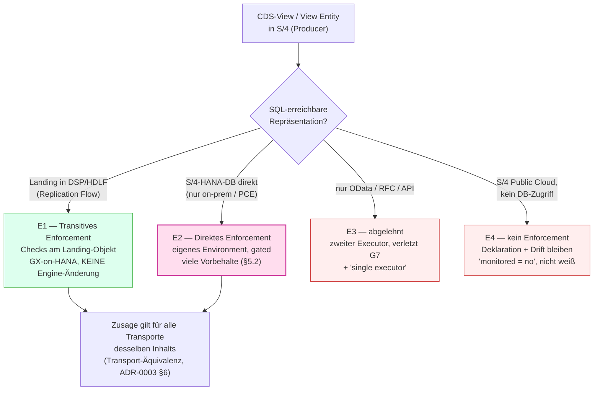

# Konzept — Shift-Left nach S/4HANA: CDS-Views als contract-governte Datenprodukte

**Adressat:** Beratung, Plattform-Team, Governance, Entwicklung · **Stand:** 2026-08-03
**Status:** *Konzept* — keine gesetzten Entscheidungen; Verifikationspunkte (VS1–VS9) markiert.
**Zweck:** Beantworten, ob und wie Signal den Shift-Left-Ansatz von Datasphere/BDC **eine Schicht
nach links** ziehen kann — bis zu den **S/4HANA-Teams**, die CDS-Views besitzen: Können sie
*dort* Datenprodukte definieren und mit Data Contracts versehen, die anschließend in
BDC/Datasphere konsumiert werden? Und **kollidiert** das mit SAPs eigenem Tooling für die
Datenprodukt-Erstellung in S/4?

> Verwandte Dokumente:
> [`ADR-0003_BDC-Datasphere-DataProductStudio.md`](ADR-0003_BDC-Datasphere-DataProductStudio.md)
> (SQL-Output-Port als Enforcement-Naht, „derive überall, enforce nur an SQL") ·
> [`ADR-0004_DataProduct-als-Komposition.md`](ADR-0004_DataProduct-als-Komposition.md)
> (Manifest + abgeleitetes Interieur, Owner-Hülle als Stopp-Bedingung) ·
> [`ADR-0001_Quality-Gates_vs_Contracts.md`](ADR-0001_Quality-Gates_vs_Contracts.md)
> (`kind`/`boundary`, Tiering) ·
> [`Konzept_ShiftLeft_DataDiff_v1.md`](Konzept_ShiftLeft_DataDiff_v1.md)
> (Schema-Drift-Detektor — **die tragende Vorleistung dieses Konzepts**) ·
> [`Konzept_MultiPlattform_Executor_BDC.md`](Konzept_MultiPlattform_Executor_BDC.md)
> (Backend-/Dialekt-Abstraktion, `CatalogSource`) ·
> [`Vortrag_Briefing_DataProducts_DataContracts_DSP_BDC.md`](Vortrag_Briefing_DataProducts_DataContracts_DSP_BDC.md)
> (§1.4 zwei Contracts pro Produkt, §1.5 fünf Schichten) ·
> [`Zusatz_ContractLifecycle_ORDBDCIntegration.md`](Zusatz_ContractLifecycle_ORDBDCIntegration.md)
> (ORD/ODCS-Seam).

---

## 0 — Kernaussage

**Ja, machbar — aber „Shift-Left" ist kein Schalter, sondern drei getrennte Achsen, die
unterschiedlich weit nach links reichen.**

| Achse | Was nach links wandert | Wie weit reicht sie realistisch? | Aufwand |
|---|---|---|---|
| **A — Deklaration** | Wer *schreibt* die Zusage (Schema, Keys, Frische, Volumen) | **Bis ins S/4-Team.** Ohne Engine-Eingriff, ohne DSP-Zugang für den Producer | klein |
| **B — Metadaten/Drift** | Wo wird ein **Bruch entdeckt** | **Bis an die CDS-Metadaten der Quelle** — vor der Replikation, vor dem ersten roten Lauf | mittel |
| **C — Enforcement** | Wo **laufen die Checks** | **Nur bis zur nächsten SQL-erreichbaren Oberfläche.** In S/4 Public Cloud gar nicht, in on-prem/PCE nur optional und mit Vorbehalten | groß / bedingt |

Die entscheidende Ehrlichkeit: **A und B sind der Wert, C ist die Versuchung.** Ein
S/4-CDS-View ist für Signals Executor genau dann erreichbar, wenn er über eine relationale
SQL-Oberfläche adressierbar ist — und die entsteht in der BDC-Standardtopologie erst **im
Landing** (Replikation nach Datasphere/HDLF). ADR-0003 hat diesen Fall schon entschieden:
*Deklaration ≠ Enforcement* — die Zusage gehört dem Producer, geprüft wird an der SQL-Naht
(**transitives Enforcement**, ADR-0003 §4).

**Und zur Kollisionsfrage:** Es kollidiert **nicht** — solange Signal keinen zweiten
Datenprodukt-Editor für S/4 baut. SAPs Tooling löst **Identität, Schema, Transport, Auslieferung
und Katalog** (CDS-Annotationen, Release-Contract, Replication Flow, ORD-Descriptor). Was es
**nicht** löst, ist exakt Signals Fläche: eine **verhandelte, versionierte, prüfbare
Qualitätszusage** mit Lifecycle, Breaking-Change-Gate und konsumentengerichteter Ampel. Die
Regel bleibt die schon gesetzte (Zusatz-Doc §5): **YAML = Source of Truth für die Zusage, ORD/CSN
= einseitige Derivate für Identität und Schema.**

> **Merksatz:** *SAP baut das Produkt. Signal verhandelt die Zusage. Niemand schreibt nach S/4
> zurück.*

---

## 1 — Warum das überhaupt gefragt ist: der halbe Shift-Left von heute

Signal implementiert Shift-Left heute **nach innen** (`Konzept_ShiftLeft_DataDiff_v1.md` Teil A):
Der Drift-Detektor vergleicht das aus `data/inventory.json` extrahierte **materialisierte
Datasphere-Schema** gegen die `schema`-Garantie des aktiven Contracts. Das ist ein echter
Shift-Left — aber er beginnt **nach** der Replikation.

Die Kette ist heute:

```
S/4-Team ändert CDS-View  →  Transport  →  Replication Flow  →  DSP-Landing  →  Signal merkt es
   (Tag 0)                                                          (Tag n)      (Tag n + Extrakt)
```

Alles zwischen Tag 0 und Tag n ist blind. Wer den Bruch verursacht hat (das S/4-Team), erfährt
ihn zuletzt; wer ihn zuerst spürt (das DSP-/Konsumenten-Team), kann ihn nicht beheben. Genau diese
Inversion ist es, die Shift-Left auflösen soll — und sie ist ein **Ownership**-Problem, kein
Check-Problem. Deshalb ist Achse A (wer deklariert) wichtiger als Achse C (wo läuft der Check).

---

## 2 — Die S/4-Seite heute: was SAP bereits liefert

Für eine ehrliche Abgrenzung muss der Status quo der SAP-Werkzeugkette benannt sein. Stand der
öffentlichen Dokumentation/Community (2026-08; Details je Release **VS1**):

| Baustein | Was es tut | Wo es lebt |
|---|---|---|
| **ABAP CDS View / View Entity** | Definiert die semantische Sicht über die S/4-Tabellen | ADT (Eclipse), Transport/gCTS |
| **`@Analytics.dataExtraction.enabled: true`** (+ CDC-/Delta-Annotationen) | Markiert eine View als **extraktionsfähig** — Producer-Intent, maschinenlesbar | CDS-Quelle, Transport |
| **Release-Contract C0–C3** (`C1` intern stabil, `C2` remote) | SAPs eigener **API-Stabilitäts-Vertrag** für das Repository-Objekt | ADT (Objekt-Eigenschaft) |
| **`I_DataExtractionEnabledView`** (released CDS View) | Katalog der extraktionsfähigen Views | S/4, lesbar über CDS/OData |
| **Replication Flow** (`CDS_EXTRACTION`-Container) | Bewegt die CDS-Daten nach Datasphere/HDLF (Initial + Delta/CDC) | Datasphere/BDC |
| **Customer-Managed Data Product** | Kuratiert in SAP Datasphere; Daten + **ORD-JSON** im Objektspeicher; Publikation im BDC-Katalog | Datasphere/BDC |
| **ORD (Open Resource Discovery)** | Beschreibt/exponiert das Produkt (Identität, Ports, Schema-Verweise) | BDC-Katalog |
| **Data Product Studio** | Angekündigte zentrale Erfahrung fürs Produzieren (custom & derived) | BDC |

**Was in dieser Kette *nicht* vorkommt:**

- keine **Qualitätsklauseln** (Null-Quoten, Wertebereiche, referenzielle Integrität, Duplikate);
- keine **SLA-/Frische-Zusage** mit Fenster und Severity;
- kein **Breaking-Change-Gate mit SemVer** über der fachlichen Zusage (der Release-Contract
  C0–C3 schützt die **API-Form** des Repository-Objekts, nicht das inhaltliche Versprechen);
- kein **Approval-/Draft-Active-Deprecated-Lifecycle** über eine verhandelte Vereinbarung;
- keine **konsumentengerichtete Ampel** mit Incident-Historie.

Das ist deckungsgleich mit dem, was das Briefing (§1.5) für DSP/BDC schon festgehalten hat:
Schicht 5 (Quality/SLA) hat **keinen deklarativen Ort** — sie ist nur implementiert. Auf der
S/4-Seite gilt dasselbe eine Etage weiter links.

> **Deshalb ist der Satz aus dem Briefing (§1.4) — „S/4HANA via BDC → das gelieferte Data Product
> *ist* bereits der Inbound-Contract. Nichts nachzubauen." — nur zur *Hälfte* richtig.** Es ist
> bereits der **Schema-/Identitäts**-Contract. Es ist **kein** Qualitäts-Contract. Dieses Konzept
> präzisiert genau diese Hälfte.

---

## 3 — Kollidiert das mit SAPs Tooling?

### 3.1 — Die Abgrenzung

| Ebene | SAP (S/4 + BDC) | Signal | Kollision? |
|---|---|---|---|
| Identität des Produkts | ORD-ID, Katalog-Eintrag | referenziert die ORD-ID | **nein**, wenn Signal keine zweite ID erfindet |
| Schema/Struktur | CDS-Metadaten, CSN, ORD | importiert (einseitig), deklariert Teilmenge als Zusage | **nein** — Einbahn |
| Auslieferung/Port | Replication Flow, Delta Share, Objektspeicher | prüft an der SQL-Repräsentation | **nein** — orthogonal |
| Berechtigungen | DCL, Read-Rollen, Space-Privilegien | read-only Tech-User, kein Write | **nein** |
| Transport/Lifecycle des *Objekts* | Transport, Release-Contract C0–C3 | rührt nichts an | **nein** |
| **Qualitätszusage & SLA** | — (Lücke) | `guarantees:` + Compliance-Ampel | **nein — Signal füllt eine Lücke** |
| **Lifecycle der *Vereinbarung*** | — (Lücke) | draft/active/deprecated, SemVer, Approval, G3 | **nein — Lücke** |

### 3.2 — Wo eine Kollision *entstehen könnte* (und die Gegenregel)

| Risiko | Wie es entsteht | Gegenregel |
|---|---|---|
| **Doppelte Identität** | Signal-Produktname ≠ ORD-ID → zwei Kataloge, zwei Wahrheiten | ORD-ID als **Fremdschlüssel** im Manifest (`source.ord_id`); Signal-Name bleibt der lokale Schlüssel, nie eine konkurrierende Publikation |
| **Doppelte Schema-Wahrheit** | Contract listet Spalten, CDS ändert sich → Drift zwischen zwei Handpflegen | Contract-`schema` ist **Zusage-Teilmenge**, nicht Schema-Kopie; die Quelle bleibt CDS/ORD; Abweichung ist ein **Befund**, kein Pflegefehler (§6) |
| **Doppelte Versionierung** | SAP-Produktversion vs. Signal-SemVer laufen auseinander | Signal-SemVer versioniert die **Zusage**, nicht das Objekt; die SAP-Version wird **gepinnt mitgeführt** (`source.product_version`), nie überschrieben — exakt das `depends_on`-Muster aus ADR-0004 §3 |
| **Zweiter Produkt-Editor** | Signal baut ein „Datenprodukt anlegen"-UI für S/4 | **Explizit abgelehnt.** Signal legt keine CDS-Views an, keine Replication Flows, keine ORD-Descriptoren. Erstellung bleibt ADT/Datasphere/Data Product Studio |
| **Schreibpfad nach S/4** | „Signal könnte doch die Annotation setzen" | **Abgelehnt.** Read-only ist Posture, nicht Bequemlichkeit (ADR-0002, `Datenfluesse_Quelle_vs_Signal.md`) |

### 3.3 — Positionierung in einem Satz

> Signal stellt sich **nicht neben** das SAP-Tooling (zweiter Editor), sondern **darüber** — als
> Governance-Plane, die das native Artefakt (CDS-Annotation, Release-Contract, ORD) **konsumiert**
> und um die fehlende Ebene ergänzt. Das ist dasselbe Muster wie gegenüber Databricks-nativer DQ
> (`Konzept_MultiPlattform_Executor_BDC.md` §13.3), nur eine Plattform weiter links.

---

## 4 — Signals technische Realität gegenüber S/4 (die harten Constraints)

Bevor irgendein Design steht, die code-belegten Grenzen — sie bestimmen, was billig und was teuer ist:

| # | Constraint | Beleg | Folge |
|---|---|---|---|
| C-1 | Executor spricht **nur HANA-SQL** über `hdbcli` | `connect/db_connection.py` | ein CDS-View ist nur prüfbar, wenn er als `"{schema}"."{objekt}"` auflöst |
| C-2 | **`dataset` ist ein Bezeichner** `^[A-Za-z_]\w*$` | `contract/validator.py:13` | `S4:ZCDS_SALES` ist **kein** gültiger `dataset`-Wert — die CDS-Entität kann nie direkt Contract-Ziel sein |
| C-3 | Contract-Schema ist **geschlossen** (`additionalProperties: false`) | `contract/validator.py` (CONTRACT_SCHEMA) | jedes neue Feld (z. B. `source:`) braucht eine bewusste Validator-Erweiterung — genau so ist G1 gemeint |
| C-4 | S/4-Knoten existieren heute nur als **Stummel** | `lineage/_semantics.py:416` — `S4:`-Präfix → `sourceScope: external_system`, `confidence 0.9`, **keine Spalten** | Discovery kennt „da kommt was aus S/4", weiß aber nicht **was** |
| C-5 | Der Produkt-Walk **stoppt** an S/4-Knoten | `product/walk.py:36` `looks_external` (`S4:`-Präfix) | genau die richtige Stelle, um ein S/4-**Produkt** als Fall-B-Dependency einzuhängen (ADR-0004 §4) |
| C-6 | Extraktion filtert auf **5 Objekttypen**, ohne Replication Flows | `services/api/extraction.py` (`OBJECT_TYPES`), ADR-0003 §12.5 | die Zuordnung *CDS-Entität → Landing-Objekt* ist heute **nicht** extrahierbar (→ §8.2) |
| C-7 | Drift-Detektor ist bereits **quellenagnostisch gebaut** | `contract/schema_drift.py::detect_schema_drift(source_columns, …)` | er braucht nur eine Spaltenliste — **woher** sie kommt, ist ihm egal. **Das ist der Hebel.** |

**Befund:** Achse B (Drift an der Quelle) ist billig, weil C-7 gilt — der Analyzer nimmt jede
Spaltenliste. Achse A ist billig, weil Contracts ohnehin über die API + Git-Writer geschrieben
werden. Achse C ist teuer bis unmöglich, weil C-1/C-2 gelten.

---

## 5 — Enforcement: wo darf Signal einen S/4-CDS-View wirklich prüfen?



### 5.1 — E1 ist der Default (und heute schon gebaut)

Das Landing-Objekt in Datasphere/HDLF ist eine ganz normale SQL-Oberfläche. Alle 22
Bibliotheks-Checks (`library/check_library.json`, v6) greifen **unverändert**. Der einzige
Unterschied zu heute ist **semantisch, nicht technisch**: Der Contract trägt `kind:
provider_contract`, die Owner-Liste zeigt auf das **S/4-Team**, und die Verletzung routet dorthin
statt ins DSP-Team. Das ist Shift-Left der **Verantwortung** bei unverändertem Executor — die
billigste und wertvollste Hälfte.

> **Achtung, ehrliche Einschränkung:** Am Landing gemessen misst man **Quelle + Transportstrecke**.
> Bricht die Replikation, sieht der Check dasselbe wie ein Datenfehler in S/4. Das ist kein
> Widerspruch, sondern eine **Attributionslücke**: sie wird durch den Drift-Befund an den
> CDS-Metadaten (Achse B) aufgelöst — dort ist sichtbar, ob die *Quelle* sich geändert hat oder
> nur der *Transport* klemmt. Beide Achsen zusammen ergeben die Aussage; einzeln tun sie es nicht.

### 5.2 — E2 (direkter DB-Zugriff auf S/4) — nur mit offenen Karten

Technisch denkbar in on-prem/Private-Cloud-Landschaften: ein read-only DB-User auf der
S/4-HANA-DB, ein Environment mit `platform: s4-hana`, dieselbe `hdbcli`-Verbindung. Die Kosten
sind aber real:

| Vorbehalt | Wirkung |
|---|---|
| **CDS View Entities haben keinen stabilen SQL-Namen** (anders als klassische DDIC-basierte CDS-Views mit `@AbapCatalog.sqlViewName`) | für moderne Views fällt die Adressierung `schema.objekt` oft **weg** → **VS2 [H]** |
| **Mandantenfähigkeit** (`MANDT`/Client) | jeder Check braucht ein Client-Prädikat, sonst zählt er über alle Mandanten → Check-Parameter, kein Zufall |
| **DCL/ABAP-Berechtigungen werden umgangen** | der DB-User sieht mehr als jeder Fachuser — governance-seitig heikel, PII-Gate (G8) wird **wichtiger**, nicht unwichtiger |
| **Last auf dem OLTP-System** | `COUNT(*)`/Joins gegen produktive S/4-Tabellen sind nicht harmlos |
| **Support-/Lizenzstellung** | direkter DB-Read an der ABAP-Schicht vorbei ist SAP-seitig nicht der vorgesehene Weg → **VS3 [H]**, Kundenentscheidung |
| **S/4 Public Cloud** | kein DB-Zugriff, Punkt. E2 existiert dort nicht |

**Empfehlung:** E2 **nicht** in v1. Es ist eine Environment-Konfiguration (also später additiv
nachrüstbar, `platform`-Feld aus `Konzept_MultiPlattform_Executor_BDC.md` §5), keine Architektur.
Wer es früh baut, kauft sich Vorbehalte ein, ohne den eigentlichen Gewinn (A/B) zu haben.

### 5.3 — E3 wird abgelehnt

Ein OData-/RFC-/ABAP-Executor wäre ein **zweiter Executor**: eigene Prädikat-Semantik, eigene
Paginierung, eigene Fehlerbilder, eigenes Timeout-Modell — und er müsste G6 (sichtbares Gating),
G8 (PII-Gate an der Quelle) und den Determinismus-Hash **nachbauen**. Dieselbe Ablehnung wie für
den Spark-/Delta-Executor in ADR-0003 §7.5. Die Engine bleibt `[ENGINE-FROZEN]` (G7).

---

## 6 — Der eigentliche Gewinn: Drift **an den CDS-Metadaten** (Achse B)

Hier passiert der echte Shift-Left, und er ist erstaunlich billig, weil der Detektor schon steht.

### 6.1 — Der Hebel

`detect_schema_drift(source_columns, contract, …)` (`contract/schema_drift.py`) nimmt eine
Spaltenliste `[{name, type, key, nullable}]` und bewertet sie gegen die `schema`-Garantie inkl.
der optionalen `types:`-Deklaration. **Heute** kommt diese Liste aus `data/inventory.json`
(Datasphere). **Künftig** kann sie ebenso gut aus den **CDS-Metadaten der Quelle** kommen. Kein
neuer Analyzer, kein Engine-Eingriff — nur eine zweite Quelle und eine Herkunfts-Markierung.

```
        ┌── inventory.json (Datasphere-Landing)  ──┐
        │                                          ├──►  detect_schema_drift(...)  ──► Befunde
        └── S/4-CDS-Metadaten (NEU, origin='s4')  ─┘
```

### 6.2 — S/4-spezifische Drift-Kategorien (additiv)

Über die fünf bestehenden Kategorien hinaus (`column_added`, `column_removed`, `type_changed`,
`nullable_relaxed`, `key_changed`) sind an der S/4-Grenze drei **neue** sinnvoll — alle rein
metadatenbasiert:

| Kategorie | Bedeutung | Bewertung |
|---|---|---|
| `extraction_disabled` | `@Analytics.dataExtraction.enabled` von der View entfernt | **breaking** — das Produkt kann gar nicht mehr geliefert werden |
| `release_contract_downgraded` | Release-Contract-Stufe zurückgenommen (z. B. C1 → nicht released) | **breaking** — SAPs eigene Stabilitätszusage ist weg |
| `delta_capability_lost` | CDC-/Delta-Fähigkeit entfallen → Full-Load statt Delta | **warn** — Frische-/Kosten-Implikation, kein Schemabruch |

Severity folgt der bestehenden Regel (`kind`-getrennt, Migration 007-Doktrin):
`provider_contract` + breaking → **Contract-Breach-Incident**; `internal_gate` + breaking →
Engineering-Signal. Kein neuer Mechanismus.

### 6.3 — Auslösepunkte

1. **Geplanter S/4-Metadaten-Snapshot** (Scheduler, ADR-0005): zieht die CDS-Metadaten der
   contracteten Entitäten und lässt den Detektor laufen. Erkennt den Bruch, **bevor** die
   Replikation die geänderte Struktur liefert (bzw. bevor sie daran scheitert).
2. **Pre-Flight im Lauf**: identisch zum bestehenden Muster — breaking Drift an der Quelle setzt
   abhängige Checks auf `skipped_dependency` (G6), statt rot/grün zu rauschen.
3. **Optional: CI-Hook im Producer-Repo.** Wo das S/4-Team CDS-Quellen über abapGit/gCTS in Git
   führt, kann ein CLI-Schritt (`dq_check_runner`-Analog, reiner Metadaten-Diff) den G3-Gedanken
   in die **Transport-Pipeline** ziehen: breaking Änderung ohne Major-Bump des Contracts → rot.
   **Das ist der Gable-Punkt** — aber er setzt eine Git-geführte ABAP-Entwicklung voraus, die
   längst nicht jeder Kunde hat (**VS4 [M]**).

### 6.4 — Wie weit links landet man damit wirklich?

Ehrliche Einordnung — ohne (3) ist es **Poll-basiert**, nicht Transport-basiert:

```
Tag 0: CDS-Änderung  ──(3) CI-Hook: hier, falls abapGit/gCTS ──┐
Transport                                                       │
       ──(1) Metadaten-Snapshot: hier (Stunden statt Tage) ─────┤   Signal meldet
Replication Flow                                                │
DSP-Landing ──(heute) Extrakt-Drift: hier ──────────────────────┘
```

Auch der bescheidenere Fall (1) verschiebt die Entdeckung von „nach dem Landing" auf „nach dem
Transport" — und vor allem **zum Verursacher**. Das ist der Unterschied zwischen einem Ticket ans
DSP-Team und einem Befund beim S/4-Team.

---

## 7 — Artefakte: was sich am Modell ändert (additiv, klein)

### 7.1 — Contract: ein neuer, deklarativer `source:`-Block

Der Contract bleibt **SQL-frei** (G1) und behält `dataset` als **Enforcement-Ziel** (das
Landing-Objekt, C-2). Neu ist ein rein deklarativer Block, der die **Quell-Identität** trägt:

```yaml
product: S4_SALES_ORDER_ITEMS
kind: provider_contract          # der Producer verspricht → S/4-Team ist Autor
dataset: RAW_S4_SALES_ORDER_ITEMS   # Enforcement-Ziel: das SQL-erreichbare Landing (E1)
owned_by: product
owners: [team-s4-sd]             # die Owner-Hülle liegt LINKS, nicht im DSP-Team
lifecycle: active
version: "1.2.0"                 # SemVer der ZUSAGE, nicht des CDS-Objekts

source:                          # NEU — Deklaration der Quelle, kein SQL, kein Enforcement
  system: S4P                    # logisches Quellsystem (Environment-/Inventar-Schlüssel)
  kind: s4_cds                   # s4_cds | dsp_view | external
  entity: ZCDS_SALES_ORDER_ITEMS # CDS-Entität bzw. View-Name
  release_contract: C1           # SAPs eigene Stabilitätszusage, mitgeführt
  ord_id: "sap.s4:dataProduct:ZCDS_SALES_ORDER_ITEMS:v1"   # Fremdschlüssel, nie erfunden
  product_version: "1.0.0"       # gepinnte SAP-Produktversion (falls vorhanden)

guarantees:
  schema:
    columns: [SALESORDER, SALESORDERITEM, MATERIAL, NETAMOUNT, CURRENCY, CREATIONDATE]
    mode: closed
    types:
      SALESORDER:     { type: string, nullable: false, key: true }
      SALESORDERITEM: { type: string, nullable: false, key: true }
      NETAMOUNT:      { type: decimal, nullable: false }
  keys:
    - columns: [SALESORDER, SALESORDERITEM]
      unique: true
      severity: critical
  not_null:
    columns: [SALESORDER, SALESORDERITEM, NETAMOUNT]
    severity: fail
  freshness:
    column: CREATIONDATE
    max_age: PT4H                # Zusage der QUELLE inkl. Extraktionsstrecke
    severity: warn
```

**Warum ein eigener Block und kein neuer `kind`?** `provider_contract` bedeutet bereits „der
Producer verspricht" (`VALID_KINDS`, ADR-0001). Ein `kind: s4_contract` wäre eine
**Speicherort**-Aussage in einem Feld, das eine **Parteigrenze** klassifiziert — genau der Fehler,
den ADR-0003 §0 ausschließt. `source:` ist Metadatum, nicht Diskriminator.

**Validator-Arbeit** (C-3): `source` in `CONTRACT_SCHEMA` aufnehmen, `additionalProperties: false`
auch **innerhalb** des Blocks, `entity`/`system` als freie Strings mit Längenbegrenzung (sie sind
**keine** SQL-Identifier — sie landen nie in einem Template, deshalb kein `SAFE_IDENTIFIER`-Zwang,
aber auch **kein** Weg in den Compiler). Regressionstest: ein `sql:`-Schlüssel unterhalb `source:`
wird abgewiesen (G1 bleibt strukturell).

### 7.2 — Product-Manifest: die S/4-Hülle

```yaml
product: s4_sales_orders
owners: [team-s4-sd]             # S/4-Team als erstklassige Owner-Hülle (ADR-0004 §2)
output_ports:
  - dataset: RAW_S4_SALES_ORDER_ITEMS      # SQL-Naht = Enforcement-Ziel
    source_ref:                             # NEU, optional — Deklaration des echten Ports
      system: S4P
      entity: ZCDS_SALES_ORDER_ITEMS
      ord_id: "sap.s4:dataProduct:ZCDS_SALES_ORDER_ITEMS:v1"
inbound: []
```

Die Konsequenz im Walk ist elegant und **fällt fast von selbst ab**: Heute stoppt
`looks_external` an `S4:*`-Knoten und der Ast endet als „Inbound-Source" (ADR-0004 §4b). Sobald
ein S/4-**Manifest** existiert, stoppt derselbe Walk an einem **fremden Produkt-Port** (§4a) →
der Ast wird zur **Fall-B-Dependency** mit gepinnter Version. Das DSP-Produkt bekommt damit
automatisch die zweistufige Ampel aus ADR-0004 §7: eigenes Versprechen ⊥ **Upstream-Risiko aus
S/4**. Bricht die S/4-Zusage, wird das DSP-Produkt nicht rot — es bekommt ein Upstream-Signal.
Genau das will Shift-Left.

Loader bleibt **lenient** (ADR-0004: struktur-only, referenzielle Lücken sind Findings).

### 7.3 — Store: Migration `020`

```sql
-- 020_source_origin.sql — Herkunft der Schema-Snapshots/Drift-Befunde
ALTER TABLE dq_schema_snapshots ADD COLUMN origin TEXT NOT NULL DEFAULT 'inventory';
ALTER TABLE dq_schema_snapshots ADD COLUMN source_ref TEXT NOT NULL DEFAULT '';
ALTER TABLE dq_schema_drift     ADD COLUMN origin TEXT NOT NULL DEFAULT 'inventory';
CREATE INDEX IF NOT EXISTS ix_schema_snap_origin
  ON dq_schema_snapshots(object_name, origin, captured_at);
```

`origin ∈ {inventory, s4}`; Default hält alle Bestandszeilen korrekt. Bestehende Migrationen
werden **nicht** angefasst (Konvention); der Runner (`sqlite_store.py`, `schema_migrations`) führt
jede Datei genau einmal aus, `ADD COLUMN` ist damit sicher.

### 7.4 — Environments (nur für E2, später)

```yaml
S4P_READONLY:
  platform: s4-hana        # optional; Default bleibt "hana" → keine Regression
  host: …
  schema: SAPHANADB
  password_ref: env:S4_RO_PW
```

Bis E2 entschieden ist, wird dieses Feld **nicht** gebraucht — es ist hier nur verzeichnet, damit
niemand später ein zweites Konzept dafür schreibt.

---

## 8 — Datenbeschaffung: wie die S/4-Metadaten hereinkommen

### 8.1 — `S4CatalogSource` — parallel zu `datasphere_catalog.py`

Das Repo hat das Muster bereits: Beschaffung liegt in `services/api/` (`datasphere_catalog.py`,
`datasphere_cli.py`), die **puren Builder** liegen in `dq_core`. Analog entsteht
`services/api/s4_catalog.py` — und **nichts** davon fasst die Engine an (G7).

| Weg | Liefert | Aufwand | Bewertung |
|---|---|---|---|
| **(a) ORD-Descriptor aus dem BDC-Katalog** | Identität, Ports, Schema-Verweise — **genau die Producer-Zusage** | mittel | **bevorzugt**, wenn das Produkt bereits BDC-publiziert ist; schließt zugleich den ORD-Seam (Zusatz-Doc R1/R2) |
| **(b) OData über released CDS-Views** (`I_DataExtractionEnabledView` & Co.) | extraktionsfähige Views, Felder, Annotationen, Release-Status | mittel | headless, tech-User; setzt **C2-Freigabe/Service-Binding** voraus → **VS5 [H]** |
| **(c) CSN-/Metadaten-Snapshot-Import** (Datei) | dasselbe wie (b), aber manuell/exportiert | klein | **Kaltstart-Pfad** — entkoppelt v1 von der Konnektivitätsfrage. Empfohlen für den ersten Schritt |
| **(d) RFC (`pyrfc`)** | DDIC-Metadaten direkt | groß | zusätzliche native Abhängigkeit, Betriebs- und Lizenzlast → **nicht empfohlen** |

Der Kaltstart über (c) ist bewusst der erste Schritt: Er beweist Achse B **ohne** eine einzige
offene Verbindungsfrage und macht (a)/(b) danach zu reinem Transport-Austausch — dieselbe
Tiering-Logik wie CLI → REST → Snapshot in der bestehenden Extraktion.

### 8.2 — Das eigentliche Problem: die Zuordnung CDS-Entität ↔ Landing-Objekt

Ohne diese Zuordnung hilft die beste Metadatenquelle nichts, denn der Drift muss gegen **den
Contract des Landings** bewertet werden. Drei Wege, absteigend nach Verlässlichkeit:

| # | Weg | Verlässlichkeit | Kosten |
|---|---|---|---|
| 1 | **Deklaration** im Contract (`source.entity`) bzw. Manifest (`source_ref`) | hoch — ein Mensch hat es bestätigt | null (Autorenaufwand) |
| 2 | **Replication-Flow-Metadaten** aus Datasphere extrahieren | hoch — die Maschine weiß es | `OBJECT_TYPES` in `extraction.py` um `replication-flows` erweitern; heute **explizit ausgeschlossen** (C-6) → **VS6 [M]** |
| 3 | **Namensheuristik** (`RAW_S4_*` ↔ `ZCDS_*`, `NamingModel`) | niedrig | klein — taugt als **Vorschlag**, nie als Wahrheit |

**Empfehlung:** (1) als Vertragsbestandteil, (3) als Vorschlagsgenerator im Onboarding, (2) als
spätere Automatisierung — und (2) ist zugleich die Antwort auf einen längst offenen Punkt: die
Replication-Flow-Lücke der Extraktion. Der Weg über (1) ist zudem der einzige, der **auditierbar**
ist; die anderen beiden raten, wenn auch unterschiedlich gut.

### 8.3 — S/4-Objekte im Inventar/Graph

Damit S/4-Entitäten mehr sind als der heutige Stummel (C-4), bekommen sie einen **eigenen
Objekt-Datensatz** mit Spalten — Layer `external`, `sourceSystem: S4`, `objectType: s4_cds`. Die
`build_lineage_graph`/`build_inventory_object`-Builder bleiben **unverändert**: sie hängen nur an
(a) Spalten und (b) Kanten (`Konzept_MultiPlattform_Executor_BDC.md` §9.1). Erst dadurch wird die
Coverage-Map ehrlich: ein S/4-Produkt mit Contract, aber ohne prüfbare Oberfläche, erscheint als
**deklariert + monitored = no** — nicht weiß, nicht grün (ADR-0003 §12.6, Faustregel 9).

---

## 9 — Prozess: wer schreibt, wer prüft, wer genehmigt

Das S/4-Team hat typischerweise **keinen** Datasphere-Zugang — und braucht auch keinen.

| Schritt | Wer | Womit | Vorhanden? |
|---|---|---|---|
| 1. Produkt-Kandidat erkennen | Discovery / Steward | extraktionsfähige CDS-Views ohne Contract (Konsum-Evidenz, ADR-0004 §9) | teils (Discovery = P1) |
| 2. Manifest + Contract-Entwurf | S/4-Team (**owner**) | Cockpit-Editor bzw. `PUT /api/contracts/{product}` | **ja** — Git-Writer schreibt mit dem Aufrufer als Autor (`git_repo.py`) |
| 3. Seeding aus der Quelle | Steward | Contract-Seed aus CDS-Metadaten statt aus dem Profiler | Seed-Pfad vorhanden (`contract/seed.py`), Quelle neu |
| 4. Gegenzeichnung | DSP-/Konsumenten-Team | eigener `consumer_contract` am Landing bzw. Approval | **ja** (Full-Modus: Approval, Batch 5) |
| 5. Breaking-Change | S/4-Team | G3 verlangt Major-Bump — jetzt für die **Quell**-Zusage | **ja**, greift automatisch mit |
| 6. Betrieb | Signal | Checks (E1) + Metadaten-Drift (B) → Incident **beim S/4-Team** | Routing über `owners` vorhanden |

**Rollen (`auth/provider.py`):** Das S/4-Team braucht `owner` **auf seine eigenen Produkte**.
Signals Rollen sind heute global (`viewer|steward|owner|admin`) — für einen echten Multi-Team-
Betrieb über Systemgrenzen hinweg fehlt eine **Scope-Bindung Rolle × Owner-Hülle**. Das ist eine
ehrliche Voraussetzung, keine Nebensache: ohne sie kann jeder `owner` jeden Contract ändern. →
**VS7 [H]**, und es ist der einzige Punkt dieses Konzepts, der eine echte
Autorisierungserweiterung verlangt.

**Lite vs. Full** bleibt orthogonal (ADR-0006): Ein S/4-Team kann in **Lite** starten (Bindung
ohne Zeremonie) und pro Port nach Tier auf **Full** heben. Empfehlung: Achse A zuerst in Lite —
sonst scheitert die Einführung an der Zeremonie, bevor der Nutzen sichtbar ist.

---

## 10 — Gate-Konformität

| Gate | Bewertung |
|---|---|
| **G1** | `source:` ist rein deklarativ; Strings gehen **nie** in ein SQL-Template. `additionalProperties: false` bleibt auch im neuen Block. Regressionstest gegen `sql:` unterhalb `source:` |
| **G2** | Kein Schema-Literal; `dataset` bleibt laufzeitgebunden. E2 (falls je) bindet über Environment, nicht über Konstanten |
| **G3** | Greift **unverändert** und gewinnt Reichweite: ein Bruch der S/4-Zusage ohne Major-Bump fällt im PR-Gate durch |
| **G6** | Neue Drift-Kategorien gaten abhängige Checks als `skipped_dependency`; nie stilles Auslassen. Nicht prüfbare Ports (E4) tragen sichtbar „monitored = no" |
| **G7** | `s4_catalog.py` liegt in `services/api/`; der Drift-Analyzer in `dq_core` bleibt frameworkfrei. **Engine unangetastet** (`[ENGINE-FROZEN]`) |
| **G8** | Metadaten-Pfad liest **keine Nutzdaten** — PII-Risiko null. Falls E2 je kommt, gilt das Gate an der S/4-Quelle **strenger**, weil DCL umgangen wird |
| **S5 / read-only** | Signal schreibt **nie** nach S/4 — keine Annotation, kein Transport, kein ORD-Push |

---

## 11 — Phasenplan

| Phase | Inhalt | Ergebnis | Aufwand (PT) | Risiko |
|---|---|---|---|---|
| **S0 — Deklaration** | `source:` im Contract-Schema + Validator + Tests; `source_ref` im Manifest; Owner-Hülle S/4; Cockpit zeigt Quell-Herkunft | Ein S/4-Team kann **heute** eine Zusage besitzen; Enforcement E1 läuft ohne Änderung | 2–3 | niedrig |
| **S1 — Metadaten-Kaltstart** | CSN-/Metadaten-Snapshot-Import (8.1c) + `origin`-Migration `020` + Drift gegen CDS-Metadaten | **Shift-Left wirkt**: Quellbruch vor dem Landing sichtbar, beim Verursacher | 3–4 | niedrig — Detektor existiert (C-7) |
| **S2 — S/4-Katalog-Anbindung** | `s4_catalog.py` (ORD bevorzugt, OData als Alternative), Scheduler-Job, S/4-Objekte im Inventar mit Spalten | headless, kein Handimport mehr; Coverage-Map ehrlich | 4–6 | mittel — **VS5**, Konnektivität/Freigaben |
| **S3 — Zuordnung automatisieren** | Replication-Flow-Metadaten extrahieren (`OBJECT_TYPES`), Mapping-Vorschläge | CDS ↔ Landing ohne Handpflege; schließt zugleich C-6 | 2–3 | mittel — **VS6** |
| **S4 — Rollen-Scoping** | Rolle × Owner-Hülle in `auth/provider.py` + Routen-Guards | echter Multi-Team-Betrieb über Systemgrenzen | 3–5 | mittel — **VS7**, berührt Auth |
| **S5 — optional: CI-Hook** | Metadaten-Diff als CLI-Schritt für abapGit/gCTS-Pipelines | Shift-Left bis in den Transport | 2–3 | hoch — Kundenvoraussetzung (**VS4**) |
| **SX — optional: E2** | `platform: s4-hana`-Environment, Direktprüfung | nur wo on-prem/PCE **und** gewollt | 3–5 | hoch — **VS2/VS3** |

**S0 + S1 sind der Kern** (≈ 5–7 PT) und liefern beide wertvollen Achsen. Alles danach ist
Komfort, Automatisierung oder Sonderfall. Nichts davon berührt Engine, Compiler oder Executor.

---

## 12 — Offene Verifikationspunkte

> **[H]** blockiert eine Festlegung · **[M]** mittel · **[L]** später.

- **VS1 [M] — Tooling-Stand je Release.** Welche Erstellungswege bietet die Kundenlandschaft
  konkret (S/4-Release, Public vs. Private Cloud vs. on-prem, Data Product Studio verfügbar?)?
  Bestimmt, ob §2 vollständig zutrifft.
- **VS2 [H] — SQL-Adressierbarkeit von CDS View Entities.** Existiert ein stabiler, zweiteiliger
  DB-Name? Entscheidet E2 vollständig (ohne ihn ist E2 für moderne Views tot).
- **VS3 [H] — Support-/Compliance-Stellung des direkten DB-Reads** auf S/4. Kunden- und
  SAP-seitige Freigabe. Gate für SX.
- **VS4 [M] — Git-geführte ABAP-Entwicklung** (abapGit/gCTS + CI) beim Kunden vorhanden?
  Entscheidet, ob S5 real oder Vision ist.
- **VS5 [H] — Metadaten-Lesepfad.** Ist der ORD-Descriptor des S/4-Produkts programmatisch
  lesbar? Falls nicht: sind die benötigten released CDS-Views (z. B.
  `I_DataExtractionEnabledView`) per OData erreichbar (C2/Service-Binding)? Gate für S2.
- **VS6 [M] — Replication-Flow-Metadaten.** Liefert der Datasphere-Katalog die Zuordnung
  Quell-Entität → Ziel-Objekt, und in welcher Form? Gate für S3; schließt zugleich die in
  ADR-0003 §12.5 benannte Typ-Filter-Lücke.
- **VS7 [H] — Rollen-Scoping.** Ist `owner` × Owner-Hülle die richtige Granularität, oder braucht
  es Space-/System-Scopes? Gate für S4 und für jeden echten Multi-Team-Rollout.
- **VS8 [M] — Frische-Semantik über die Extraktionsstrecke.** Was verspricht die Quelle: Alter der
  Fachdaten oder Extraktionsverzug? Hängt am ohnehin offenen Load-Lag-Punkt (ADR-0003 G-2 / V3a).
- **VS9 [L] — Delta/CDC-Semantik.** Bedeutet ein CDC-Strom für `row_count`/`volume` etwas anderes
  als ein Full-Load (Deletes, Kompaktierung)? Kann Check-Parameter beeinflussen.

---

## 13 — Risiken und ehrliche Grenzen

- **Zwei Handpflegen bleiben möglich.** `source.entity` ist deklariert; ändert das S/4-Team die
  Entität, driftet die Deklaration. Gegenmittel: der Drift-Detektor prüft die Existenz mit
  (`dangling source` als Befund analog Dangling-Port, ADR-0004 §6) — **nicht** eine zweite
  Pflegeroutine.
- **Attribution Quelle vs. Transport** ist erst mit beiden Achsen (A/B) sauber; mit E1 allein
  bleibt sie unscharf (§5.1).
- **Ohne Rollen-Scoping (VS7) ist „das S/4-Team besitzt seinen Contract" eine Konvention, keine
  Durchsetzung.** Das darf im Kundengespräch nicht als gebaut dargestellt werden.
- **S/4 Public Cloud** bleibt für Enforcement dauerhaft auf E1/E4 beschränkt — kein Bug, sondern
  Plattformrealität.
- **Der Zugewinn ist Organisation, nicht Technik.** Wenn das S/4-Team die Zusage nicht *besitzen
  will*, erzeugt dieses Konzept nur ein weiteres YAML. Achse A ist ein Ownership-Commitment; ohne
  das bleibt es beim heutigen Stand — und das ist eine ehrlichere Antwort als ein Feature.
- **Kein zweiter Produkt-Editor** — die Versuchung wird mit Sicherheit im Kundengespräch
  auftauchen („könnt ihr nicht gleich das Datenprodukt anlegen?"). Antwort: nein, und der Grund
  ist §3.2, nicht Bequemlichkeit.

---

## 14 — Faustregeln

1. **Shift-Left ist zuerst Ownership, dann Technik.** Wer die Zusage schreibt, ist wichtiger als
   wo der Check läuft.
2. **Deklaration wandert bis nach S/4, Enforcement bis zur nächsten SQL-Naht.** Unverändert die
   ADR-0003-Regel, nur eine Plattform weiter links.
3. **SAP baut das Produkt, Signal verhandelt die Zusage.** ORD/CDS/Release-Contract sind
   **Import**, nie Export. Kein Schreibpfad nach S/4.
4. **Die CDS-Entität ist nie ein `dataset`.** Sie ist eine Deklaration (`source:`); das
   Enforcement-Ziel bleibt ein SQL-auflösbarer Bezeichner.
5. **Der Drift-Detektor ist quellenagnostisch — das ist der billigste Hebel im ganzen Konzept.**
   Zweite Quelle statt zweiter Analyzer.
6. **Kein zweiter Executor, auch nicht über OData.** G7 und `[ENGINE-FROZEN]` gelten unverändert.
7. **Was nicht prüfbar ist, wird sichtbar nicht geprüft.** „monitored = no" statt falsches Grün —
   auch und gerade für S/4-Produkte in der Public Cloud.
8. **Der teuerste Posten ist wieder Wissen, nicht Code** (VS2/VS3/VS5/VS7) — dieselbe Diagnose wie
   in ADR-0003 §8.
