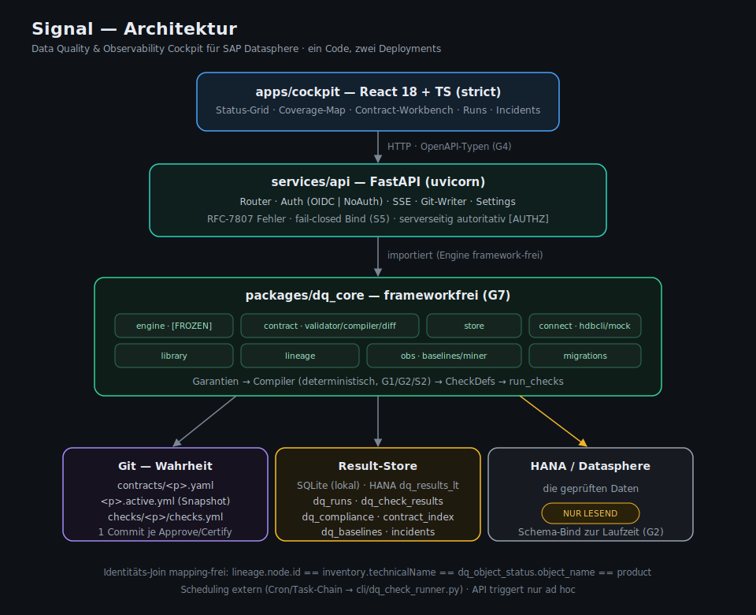

# Signal — Tooldokumentation (vollständige Referenz)

**Stand:** 2026-06-15 · **Komponente:** Data Quality & Observability Cockpit für SAP Datasphere

Diese Datei ist die zusammenhängende technische Referenz. Einstieg und Schnellstart: [`../README.md`](../README.md). Betriebsmodi/Personas: [`Betriebsmodi_Lite_und_Full.md`](Betriebsmodi_Lite_und_Full.md). Fachliches Konzept: [`Konzept_DQ_Observability_Cockpit.md`](Konzept_DQ_Observability_Cockpit.md). Implementierungsplan & Gates: [`HANDOVER.md`](HANDOVER.md).

## Inhalt

1. [Was Signal ist](#1--was-signal-ist)
2. [Architektur](#2--architektur)
3. [Kernkonzepte](#3--kernkonzepte)
4. [Datenmodell & Persistenz](#4--datenmodell--persistenz)
5. [API-Referenz](#5--api-referenz)
6. [Konfiguration (ENV)](#6--konfiguration-env)
7. [CLI](#7--cli)
8. [Frontend (Cockpit)](#8--frontend-cockpit)
9. [Sicherheit & Gates](#9--sicherheit--gates)
10. [Deployment](#10--deployment)
11. [Entwicklung & Tests](#11--entwicklung--tests)
12. [Glossar](#12--glossar)

---

## 1 — Was Signal ist

Signal verwandelt **semantische Garantien** über Datasphere-Objekte in **deterministisch kompilierte, ausführbare Quality-Checks**, fährt sie lesend gegen HANA und macht den Zustand als Cockpit, Compliance-Ampel und Coverage-Map sichtbar.

**Leitprinzipien:**

- **Contracts tragen Garantien, nie SQL** (Gate G1). Der einzige Ort, an dem SQL entsteht, ist der Compiler.
- **Engine ist eingefroren & frameworkfrei** (`dq_core` importiert nie FastAPI). Erweitern statt ändern.
- **Drei Zustands-Achsen sind getrennt**: Lifecycle (Erstellung) · Compliance (Halten der Zusage) · Coverage (Abdeckung).
- **Ein Code, zwei Deployments**: lokal (SQLite/NoAuth) und Kunde (HANA/OIDC) über Auth-/Store-Abstraktion, ohne Code-Zweige.

---

## 2 — Architektur



**Drei getrennte Persistenzorte (HANDOVER §0):**

- **Git** — Contracts (`contracts/<product>.yaml`), zertifizierte Snapshots (`<product>.active.yml`), kompilierte Checks (`checks/<product>/checks.yml`).
- **Result-Store** — Läufe, Check-Ergebnisse, Diagnostics, Baselines, Compliance, Incidents (SQLite lokal / `dq_results_lt` in HANA).
- **HANA/Datasphere** — die geprüften Daten, ausschließlich lesend.

**Identitäts-Join mapping-frei:** `lineage node.id == inventory.technicalName == dq_object_status.object_name == product`.

**`dq_core`-Module:**

| Modul | Inhalt |
|---|---|
| `engine/` | `check_engine.py` (run_checks), `expectation.py` (Grammatik), `models.py` (Dataclasses) — `[ENGINE-FROZEN]` |
| `contract/` | `model.py`, `validator.py` (G1), `compiler.py` (G1/G2/S2), `diff.py` (Breaking), `seed.py`, `odcs_export.py` |
| `store/` | `base.py` (Protocol), `sqlite_store.py`, `hana_store.py`, `migrations/NNN_*.sql` |
| `connect/` | `db_connection.py` (hdbcli + Retry, `MockConnection`) |
| `library/` | `check_library.py` + `check_library.json` (versionierter `sql_template`-Katalog) |
| `lineage/` | Analyzer-Loader, Spalten-Lineage, CSN-Rekonstruktor |
| `obs/` | `baselines.py` (Rolling-Stats), `miner.py` (Proposal-Mining) |

---

## 3 — Kernkonzepte

### 3.1 Contract (Schema v1, SQL-frei)

```yaml
product: DS_SALES_ORDERS         # Identifier, = Dateiname & Join-Key
dataset: DS_SALES_ORDERS         # Datasphere-Objekt; Schema wird NICHT hier gebunden
owned_by: product                # platform | product
owners: ["grp:data-platform"]    # optionale ACL (sub oder grp:)
version: "1.0.0"                 # SemVer
lifecycle: active                # draft | active | deprecated  (NIE compliance!)
guarantees:
  schema:       { columns: [ORDER_ID, CUSTOMER_ID, NET_AMOUNT], mode: closed }
  keys:         [{ columns: [ORDER_ID], unique: true, severity: critical }]
  referential:  [{ fk: [CUSTOMER_ID], parent: Customers_View, parent_key: [CUSTOMER_ID], severity: fail }]
  not_null:     [{ columns: [ORDER_ID, NET_AMOUNT], severity: fail }]
  completeness: [{ column: NET_AMOUNT, min_pct: 99.5, severity: warn }]
  freshness:    { column: ORDER_DATE, max_age: PT26H, severity: warn }
  volume:       { min_rows: 1000, severity: warn }
```

`compliance` und `schema_ref` stehen **nicht** im YAML: Compliance lebt im Store (A1), das Schema wird zur Laufzeit aus dem Environment gebunden (A2/G2).

### 3.2 Garantie-Familien → Checks (Compiler)

| Familie | Template | Expectation | Severity-Default |
|---|---|---|---|
| `schema` (closed/open) | `schema` | `= N` / `>= N` Spalten | critical |
| `keys` | `duplicate` / `duplicate_composite` | `= 0` | critical |
| `referential` | `reference_integrity` | `= 0` Orphans | fail |
| `not_null` | `missing` | `= 0` | fail |
| `completeness` | `completeness_pct` | `<= (100 − min_pct)%` | warn |
| `freshness` | `freshness` | `< max_age` (Sekunden) | warn |
| `volume.min_rows` | `row_count` | `>= min_rows` | warn |

`volume.baseline: rolling` ist Observability-Konfiguration (Baselines), kein kompilierbarer Check. Der Compiler ist **deterministisch**: Header-Hash = f(Contract-Hash, Library-Version); gleicher Input ⇒ byte-identische `checks.yml`. Merge mit handgepflegten Suiten ist **existing-wins**.

### 3.3 Expectation-Grammatik (eingefroren)

`IS NULL` · `IS NOT NULL` · `= != >= <= > < n` · `BETWEEN a AND b` · `= n ±t` · `IN(...)` / `NOT IN(...)` · `DELTA <op> p%` (nutzt `previous_value`) · `MATCHES /regex/`. Neue Operatoren nur über `expectation.py` + `validate_expectation` + Tests.

### 3.4 Lifecycle, Compliance, Coverage

- **Lifecycle** (YAML): `draft → active → deprecated`. PUT erzeugt immer einen Draft; `approve`/`certify` aktivieren.
- **Compliance** (Store): `unknown → compliant | breached`. `breached` bei ≥1 nicht bestandenem Check ≥ `fail` der aktiven Version; Auto-Recovery bei grünem Folgelauf. Übergänge sind Events (`since`, `last_run_id`); Neu-Breach öffnet ein Incident.
- **Coverage** (abgeleitet): `covered` (active + kompilierte Checks) · `partial` (active, keine Checks) · `gap` (Contract, nicht active) · `out_of_scope` (kein Contract).

### 3.5 Lite vs. Full

| | Lite | Full |
|---|---|---|
| Aktivierung | `POST …/certify` (ein Schritt) | `PUT` → `approve` → `compile` |
| Versionierung | keine Pflicht | SemVer, Breaking ⇒ Major (G3) |
| Breaking-Gate | nur für bereits zertifizierte Produkte | immer blockierend |

Vollständig in [`Betriebsmodi_Lite_und_Full.md`](Betriebsmodi_Lite_und_Full.md).

### 3.6 Check-Bibliothek & Familien-Rollup

`packages/dq_core/library/check_library.json` ist die einzige Quelle für Engine-Defaults **und** UI-Picker: **24 Templates in 4 Kategorien** (Vollständigkeit · Konsistenz · Verteilung & Aggregate · Aktualität & Sonstiges). Der Cockpit-Rollup klassifiziert je **Check-Typ** (`ResultStore._OBS_TYPES`): **Observability** = `freshness, row_count, schema, volume_delta, column_count, recent_volume`; alles andere = **Quality**.

- **Observability** (Pipeline/Form/Menge): `row_count`, `freshness`, `schema` plus die Quick-Wins `volume_delta` (`DELTA <op> %` ggü. Vorlauf), `column_count` (Spaltenzahl-Stabilität, `DELTA = 0%`), `recent_volume` (frische Zeilen im Fenster). `recent_volume` wird wie `row_count` als Volume-Zeitreihe gebaselined.
- **Quality** (Inhalt): u. a. `missing`, `completeness_pct`, `empty_string`, `duplicate(_composite/_approx)`, `invalid`, `value_range`, `allowed_values`, `pattern_match`, `string_length`, `reference_integrity`, `cross_column_compare`, `future_dates`, `aggregate_range`, `distinct_count`, `row_count_match`, `custom_sql`.
- SAP/BDC-spezifische Templates wurden zugunsten allgemein gebräuchlicher, Soda-/GX-naher Checks entfernt.

Der **Compiler** (§3.2) bildet Garantie-Familien auf eine feste Template-Teilmenge ab; die übrige Bibliothek steht dem manuellen Check Builder zur Verfügung.

---

## 4 — Datenmodell & Persistenz

Result-Store-Schema über nummerierte, idempotente Migrationen (`packages/dq_core/store/migrations/`):

| Migration | Inhalt |
|---|---|
| `001_initial_schema` | `dq_runs`, `dq_check_results`, `dq_diagnostics` |
| `002_state_stats_lineage_compliance` | `state`-Spalte, `contract_version/hash/actor/run_state`, `dq_check_stats`, `dq_baselines`, `dq_proposals`, `dq_compliance`, `contract_index` |
| `003_compliance_events_run_guard` | Compliance-Event-Log + Doppellauf-Guard |
| `004_incident_lifecycle` | Incident-Tabellen + Timeline |
| `005_notification_routing` | Notification-Kanäle/Regeln/Mutes |

**Zentrale Tabellen (Auszug):**

- `dq_runs(run_id PK, dataset, schema_name, started_at, finished_at, overall_status, total/passed/failed/warning_checks, run_state, contract_version, contract_hash, actor, triggered_by)`
- `dq_check_results(id PK, run_id FK, check_name, sql_text, expect_expr, severity, passed, actual_value, error_message, duration_ms, state)` — `state ∈ {executed, skipped_stale, skipped_dependency, downgraded, error}`
- `dq_diagnostics(id PK, run_id, check_name, row_data)` — **PII-Kanal**, default leer
- `dq_compliance(product PK, contract_version, compliance, since, last_run_id)`
- `contract_index(product PK, lifecycle, owned_by, version, head_hash, updated_at)` — Lese-Index (Git ist keine Query-DB)
- `dq_baselines`, `dq_check_stats`, `dq_proposals`

`dq_object_status` ist eine Store-Query/View (kein Sync-Job): je Objekt × Familie der jüngste `state`+Status, gejoint mit `dq_compliance`.

Migrationen laufen idempotent beim Store-Open (Runner trackt `schema_migrations`). Neue Tabellen/Spalten **immer** über eine nummerierte Migration.

---

## 5 — API-Referenz

FastAPI, Basis `/api`. Interaktive Docs zur Laufzeit: `/api/docs` (Swagger), `/api/redoc`, Schema `/api/openapi.json`. Fehlerformat: RFC-7807 `application/problem+json`. Health: `GET /api/health`.

### Objekte & Läufe

| Methode | Pfad | Zweck |
|---|---|---|
| GET | `/api/objects` | Rollup je Objekt (Status, Familien, Coverage, letzter Lauf) |
| GET | `/api/objects/{id}` | Objekt-Detail inkl. Checks des letzten Laufs |
| GET | `/api/objects/{id}/runs` | Lauf-Historie des Objekts |
| GET | `/api/objects/{id}/checks/{name}/history` | `actual_value`-Zeitreihe (Sparkline) |
| GET | `/api/objects/{id}/timeseries` | aggregierte Zeitreihen |
| POST | `/api/objects/{id}/run` | Lauf auslösen → `202 {run_id}` `[AUTHZ]` |
| POST | `/api/objects/{id}/profile` | Profil-Lauf (Stats-Tuple) |
| GET | `/api/runs` · `/api/runs/{id}` | Läufe / Detail |
| GET | `/api/runs/{id}/results` · `/diagnostics` · `/events` | Ergebnisse · PII-gated Rohzeilen · SSE |
| GET | `/api/runs/compare` | Lauf-/Versions-Vergleich |

### Contracts

| Methode | Pfad | Zweck |
|---|---|---|
| GET | `/api/contracts` | Liste aus `contract_index` (Filter lifecycle) |
| GET/PUT | `/api/contracts/{product}` | Lesen / Draft schreiben (G1) `[AUTHZ]` |
| POST | `/api/contracts/{product}/seed` | Draft aus Inventar erzeugen |
| POST | `/api/contracts/{product}/diff` · GET `/version-diff` | Breaking-Report gegen aktive Version |
| POST | `/api/contracts/{product}/approve` | Full-Modus: Draft → active (G3 + 1 Commit) `[AUTHZ]` |
| POST | `/api/contracts/{product}/certify` | **Lite-Modus: save → active → compile in einem Schritt** `[AUTHZ]` |
| POST | `/api/contracts/{product}/compile?dry_run=` | Garantien → Checks (persistiert nur `active`) |
| POST | `/api/contracts/{product}/deprecate` | active → deprecated |
| GET | `/api/contracts/{product}/sla` | SLA-%-Fenster (7/30/90 d) |
| GET | `/api/contracts/{product}/export/odcs` · POST `/export/bdc` | ODCS-3.1 · CSN/ORD-Fragmente |
| POST | `/api/contracts/reindex` | Index-Rebuild nach externem `git pull` `[AUTHZ]` |

### Checks, Extrakt, Inventar

| Methode | Pfad | Zweck |
|---|---|---|
| POST | `/api/checks/{dataset}/dry-run` | Kompilieren + gegen HANA laufen, **nicht** persistiert `[AUTHZ]` |
| POST | `/api/checks/{dataset}/revert` | Git-Revert der kompilierten `checks.yml` `[AUTHZ]` |
| POST | `/api/extract` | Analyzer-Kette → inventory/lineage |
| GET | `/api/inventory` · `/api/environments` · `/api/library` | Objekt-Picker · Environments · Check-Bibliothek |

### Lineage / Coverage / Incidents / Proposals / Observability

| Methode | Pfad | Zweck |
|---|---|---|
| GET | `/api/lineage/graph` · `/coverage/summary` · `/coverage/heatmap` · `/coverage/health` | Graph & Coverage-Aggregate |
| GET | `/api/incidents` · `/{id}` · POST `/{id}/transition` | Breach-Incidents + Timeline |
| GET | `/api/proposals` · POST `/{id}/accept|reject|snooze` | Miner-Vorschläge |
| GET | `/api/metrics/health` · `/api/datasphere/*` · `/api/data-loads` | Betriebs-/Lastmetadaten |
| GET | `/api/notifications/...` · POST/PATCH/DELETE `channels|rules|mutes` | Notification-Routing |
| GET | `/api/badge/{product}` | einbettbares Status-Badge |

### Monitoring (Hub-Sharing, Hybrid)

„Für Monitoring vormerken" nach dem **Hybrid-Modell** (ADR-0002 §7): Signal hält nur den **Soll-Zustand**, ein externes, privilegiertes Skript reconciled Share + Projektions-View im Monitoring-Hub und meldet Status zurück. **Signal schreibt nie nach Datasphere.**

| Methode | Pfad | Zweck |
|---|---|---|
| GET | `/api/monitoring/config` | `enabled` + Hub-Space (steuert UI-Sichtbarkeit) |
| GET | `/api/monitoring/shares` | Status je vorgemerktem Objekt (`requested → provisioned \| error`) |
| GET | `/api/monitoring/manifest` | Soll-Zustand fürs Skript: Identität + View-Name (`<SPACE>__<OBJEKT>`) + Spalten + vorgeschlagenes Projektions-SQL (explizite Spaltenliste) |
| POST | `/api/monitoring/shares/{id}` | Objekt vormerken (nur Registry-Write, kein Datasphere-Zugriff) |
| PUT | `/api/monitoring/shares/{id}/status` | Skript-Callback: `provisioned` / `error` |
| DELETE | `/api/monitoring/shares/{id}` | aus Soll-Zustand entfernen → Skript droppt die verwaiste View beim Reconcile |

> Die vollständige, immer aktuelle Liste ist die generierte OpenAPI unter `/api/openapi.json`; das Frontend bezieht daraus seine Typen (`openapi-typescript`, Gate G4).

---

## 6 — Konfiguration (ENV)

Settings über `pydantic-settings` (`services/api/settings.py`). Auszug:

| Variable | Default | Zweck |
|---|---|---|
| `BIND_HOST` / `BIND_PORT` | `127.0.0.1` / `8000` | S5 fail-closed: `0.0.0.0` nur mit echtem Auth |
| `AUTH_MODE` | `noauth` | `noauth` \| `oidc` |
| `OIDC_ISSUER` / `OIDC_AUDIENCE` / `OIDC_JWKS_URL` | — | OIDC-Validierung |
| `OIDC_ROLE_CLAIM` / `OIDC_GROUPS_CLAIM` / `OIDC_ROLE_MAPPING` | `roles` / `groups` / `{}` | Claims → Rollen |
| `STORE_BACKEND` | `sqlite` | `sqlite` \| `hana` |
| `SQLITE_DB` | `signal.db` | lokaler Store-Pfad |
| `GIT_REMOTE` | `""` | Contract-Repo-Remote (leer = lokal, kein Push) |
| `CONTRACTS_DIR` / `CHECKS_DIR` | `contracts` / `checks` | Artefakt-Verzeichnisse |
| `DATA_DIR` / `INVENTORY_FILE` / `LINEAGE_FILE` | `data` / `data/inventory.json` / `data/lineage.json` | Extrakt-Snapshots |
| `ENVIRONMENTS_FILE` | `environments.yml` | `name → {host, port, schema, secret_ref}` |
| `ALLOW_LOCAL_DIAGNOSTICS` | `false` | PII-Gate: Rohzeilen lokal zulassen |
| `DIAGNOSTICS_TTL_DAYS` | `7` | Retention der Diagnostics |
| `EXTRACT_STALE_DAYS` | `7` | Staleness-Schwelle für Extrakt-Alter |
| `ALLOW_MOCK_CONNECTION` | `true` | Läufe ohne Environment via MockConnection |
| `CORS_ORIGINS` | localhost:5173/3000 | erlaubte Frontends |
| `WEBHOOK_URL` / `WEBHOOK_ALLOWLIST` | — | Breach-Webhook (SSRF-Allowlist) |
| `DATASPHERE_*` | — | Datasphere-API/CLI-Zugang (Lastmetadaten) |
| `DATASPHERE_MONITORING_SPACE` | `""` | Hub-Space für „Für Monitoring vormerken" (ADR-0002 §7); leer = Feature aus. Signal schreibt **nicht** in Datasphere — das Provisioning übernimmt ein externes Skript. |

Environments-Datei bindet das `{schema}` zur Laufzeit — Contracts bleiben environment-frei.

---

## 7 — CLI

`cli/dq_check_runner.py` fährt die Engine ohne API (für Cron/Task-Chain-Scheduling):

```bash
python cli/dq_check_runner.py \
  --schema CORE_DWH \
  --checks checks/DS_SALES_ORDERS/checks.yml \
  --db dq_results.db \
  [--dry-run] [--mock] \
  [--host HOST --port 443 --user U --password P] \
  [--execution-mode auto|batch|isolated] \
  [--output text|json]
```

`--mock` läuft gegen die `MockConnection` (kein HANA). `--dry-run` persistiert nicht. Credentials kommen alternativ aus `HANA_USER`/`HANA_PASSWORD`. `--schema` bindet den `{schema}`-Platzhalter `[SCHEMA-MAP]`.

---

## 8 — Frontend (Cockpit)

Vite + React 18 + TS strict, TanStack Query v5, React Router, Tailwind (Design-Tokens). Routen:

| Route | Screen | Zweck |
|---|---|---|
| `/` | Cockpit | DQ-Health-Verlauf (Trend-Graph), Familien-Rollups (Observability/Quality), Brennpunkte, Status-Grid (Objekt × Familie), Reliability-Heatmap; stale sichtbar (G6) |
| `/my` | MyWork | persönliche Sicht |
| `/objects`, `/objects/:id` | Katalog/Detail | Checks, Sparkline, Run-Trigger, „Für Monitoring vormerken" (Hybrid, ADR-0002) |
| `/contracts` | Contract-Workbench | Garantie-Editor (Lite-/Voll-Modus), Compile, Diff |
| `/lineage`, `/coverage` | Lineage-/Coverage-Map | Cytoscape, Coverage-Status je Node |
| `/incidents` | Incidents | Breach-Episoden + Timeline |
| `/proposals` | Proposals | Miner-Vorschläge (Inbox) |
| `/runs/:id`, `/runs/compare` | Run-Detail/-Vergleich | Live-Log (SSE) + Polling |
| `/governance`, `/library`, `/notifications` | Verwaltung | ACLs, Check-Bibliothek, Routing |

UI-Regeln: Status-Ampel (grün/gelb/rot/grau) ist **exklusiv**; Familienfarben nur für Dekor/Diagramme. Alle Strings zentral in `i18n/de.ts`. CSP gesetzt, `dangerouslySetInnerHTML` per Lint verboten (S8).

---

## 9 — Sicherheit & Gates

| Gate | Prüfung | Mechanik |
|---|---|---|
| G1 | Kein SQL im Contract | jsonschema + Lint auf `contracts/*.yml` |
| G2 | Kein hartkodiertes Schema | `{schema}`-Platzhalter, Bind erst zur Laufzeit |
| G3 | Breaking ⇒ Major | `dq_core.contract.diff` server- **und** CI-seitig |
| G4 | Kein FE/BE-Typ-Drift | `openapi-typescript` + `git diff --exit-code` |
| G5 | Engine-Regress | bestehende pytest-Suite unverändert grün |
| G6 | Gating sichtbar | `skipped_stale` nie wie `pass` |
| G7 | Framework-Isolation | kein `import fastapi/flask/starlette` in `dq_core/` |
| G8 | PII-Gate | ohne `ALLOW_LOCAL_DIAGNOSTICS` keine Rohzeile; mit Flag nur Allowlist-Spalten |

**Weitere Leitplanken:** Auth fail-closed (S5); Autorisierung serverseitig autoritativ, Schreibrecht = `Rolle × owned_by × owners` (S3); Identifier-Validierung im Compiler (Regex → Inventar-Existenz → Quote-Escaping, S2); Webhook-SSRF-Allowlist (S6); Interna nie in HTTP-Responses (S-14, RFC-7807). HANA wird ausschließlich lesend angesprochen.

**Rollen:** `viewer | steward | owner | admin`. Schreibrecht: admin alles; steward/owner platform-owned; owner zusätzlich product-owned; `owners`-ACL (`sub`/`grp:`) ergänzend, fail-closed.

---

## 10 — Deployment

| Profil | Berater-lokal | Kunde |
|---|---|---|
| Store | SQLite | HANA (`dq_results_lt`) |
| Auth | NoAuth (Admin-Principal) | OIDC |
| Bind | `127.0.0.1` | `0.0.0.0` (nur mit Auth) |
| Worker | 1 (uvicorn --reload) | ≥2 (Run-Registry im Store schützt vor Doppellauf) |
| Scheduling | manuell/Cron | Cron/Task-Chain → CLI |

Beide Profile laufen aus **demselben Code** über die Auth-/Store-Abstraktion — kein Code-Zweig. Die API triggert Läufe nur ad hoc; regelmäßige Läufe plant ein externer Scheduler über die CLI. Multi-Worker-Korrektheit (gemeinsamer Run-Status) ist mit ≥2 uvicorn-Workern verifiziert (F2).

---

## 11 — Entwicklung & Tests

```bash
make install        # Backend (pip) + Frontend (npm)
make dev-backend    # uvicorn services.api.main:app --reload
make dev-frontend   # vite
make test           # python -m pytest tests/ -v
make seed           # Demo-Läufe in den Store
make lint           # py_compile + tsc --noEmit
```

**Teststrategie:** `dq_core` pytest (Engine + contract/compiler/diff/baselines, inkl. Compiler-Determinismus per Hash) · API mit FastAPI-`TestClient` gegen SQLite (Fixture `api_client`, isolierter Temp-Store je Test) · Frontend Vitest + Testing Library · Gates G1–G8 in CI (`.github/workflows/ci.yml`).

**Goldene Regeln:** `dq_core` bleibt frameworkfrei (G7); Engine-Dataclasses API-frei, Pydantic-Schemas in `services/api`; kein Merge mit roten Acceptance-Tests; jede Schema-Änderung über eine nummerierte Migration.

---

## 12 — Glossar

| Begriff | Bedeutung |
|---|---|
| **Contract** | SQL-freies YAML mit Garantien über ein Datasphere-Objekt |
| **Garantie** | semantische Zusage (Familie: schema/keys/referential/not_null/completeness/freshness/volume) |
| **Compiler** | übersetzt Garantien deterministisch in `CheckDef`s (`{schema}`-Platzhalter) |
| **Check** | ausführbarer SQL-Ausdruck + Expectation, gegen HANA gefahren |
| **Lifecycle** | `draft \| active \| deprecated` — Erstellungszustand |
| **Compliance** | `compliant \| breached \| unknown` — ob die aktive Zusage gehalten wird (nur Store) |
| **Coverage** | `covered \| partial \| gap \| out_of_scope` — Abdeckungsgrad eines Objekts |
| **Lite / Full** | Betriebsmodi: ohne / mit Versions-Approval-Zeremonie |
| **Run / RunSummary** | ein Ausführungslauf einer Check-Suite + dessen Ergebnis |
| **Proposal** | datengetriebener Garantie-Vorschlag aus dem Miner |
| **Incident** | persistente Breach-Episode mit Timeline |
| **Result-Store** | Persistenz für Läufe/Ergebnisse/Compliance (SQLite/HANA) |
| **Gate (G1–G8)** | erzwungene Invariante in CI + Server |

---

*Diese Referenz beschreibt den implementierten Stand. Bei Konflikt mit Planungsdokumenten (`HANDOVER.md`, `PLAN_*`) gewinnt der Code; melde Abweichungen als Issue.*
