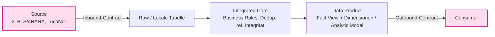
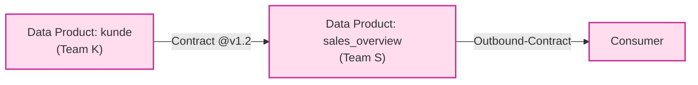

# Briefing — Vortrag „Datenprodukte & Data Contracts in SAP Datasphere / BDC"

**Zweck:** Übergabe-Dokument für die Erstellung eines theoretisch/praktischen Vortrags. Bündelt die erarbeiteten Erkenntnisse **eigenständig und selbsttragend** — ein anderer Chat (oder Kollege) kann allein hieraus eine Vortragsstruktur, Folien und Sprechtext ableiten.
**Adressat:** Vortragsersteller (Claude-Chat oder Mensch) · **Stand:** 2026-06-16
**Verhältnis zur Signal-Doku:** *Ergänzend.* Dieses Dokument liefert das **Konzept-/Argumentationsgerüst**; die technische Umsetzung steht in den Signal-Docs (Verweise in §7). Es ist so geschrieben, dass es **ohne** Repo-Zugriff verständlich ist.

> **Drei Bausteine speisen dieses Briefing:**
> 1. Das Konzeptpapier *„Data Contracts für ein Fact-View-Datenprodukt in SAP Datasphere / BDC"* (Grundprinzipien).
> 2. Die Architektur-Entscheidung `docs/ADR-0001_Quality-Gates_vs_Contracts.md` (Trennung interner Gates von Contracts, Komposition, Tiering).
> 3. Das Werkzeug **Signal** (DQ- & Observability-Cockpit) als praktische Operationalisierung.

---

## 0 — Die eine Kernbotschaft (der rote Faden)

> **Ein Contract entsteht nicht da, wo ein Schema ist, sondern da, wo Verantwortung den Owner wechselt — an einer Grenze zwischen zwei Parteien.**

Alles andere im Vortrag leitet sich daraus ab. Vier Konsequenzen, die als Leitmotive durch die Präsentation tragen:

- **Checks gibt es überall, Contracts nur an den zwei Parteigrenzen.**
- **Deklaration ≠ Enforcement** (Versprechen vs. Test).
- **Data Product = das Ganze (Eigentum); Contract = nur die Ränder (Versprechen).**
- **Layer ≠ Grenze, Objekt ≠ Produkt** — Produkt-/Vertragsstatus folgt der Grenze, nicht der DWH-Schicht oder dem Objekttyp.

---

## 1 — Theoretischer Kern (Teil A des Vortrags)

### 1.1 — Das Grundproblem in DSP/BDC

In SAP Datasphere gibt es **kein einzelnes „Contract"-Objekt**. Der Vertrag ist konzeptionell über **mehrere Schichten verteilt**. Die Fact View *implementiert* Teile des Contracts (das Schema), *deklariert* ihn aber nicht vollständig an einer Stelle. Wer einen expliziten, maschinenlesbaren Contract will, führt ihn **extern als YAML** (ODCS / datacontract.com) und mappt jede Sektion auf die zuständige DSP-/BDC-Schicht. **DSP ist die Implementierung des Vertrags, nicht sein Wohnort.**

### 1.2 — Das definierende Kriterium: Contract vs. Check

| Begriff | Definition | Existiert wo |
|---|---|---|
| **Contract** | Versprechen, dem eine Gegenpartei zugestimmt hat | nur an Parteigrenzen |
| **Check / Quality Gate** | Test, der ein Versprechen *erzwingt* | überall im Pipeline-Verlauf |

Ein Check kann eine Vertragsklausel prüfen — deshalb wirken beide verwandt — aber er ist **nie selbst der Vertrag**.

### 1.3 — Deklaration ≠ Enforcement

Dieselbe Qualitätsregel existiert als **zwei verschiedene Artefakte**:

| Aspekt | Deklaration | Enforcement |
|---|---|---|
| Artefakt | Vertragsklausel | Check / Assertion |
| Wohnort | `quality` / `slaProperties` im Contract-YAML | DQ-Logik im Core bzw. an der Consumption-Grenze |
| Frage | „Was verspreche ich?" | „Halte ich es ein?" |

### 1.4 — Die zwei Contracts pro Datenprodukt

- **Inbound-Contract (Source ↔ Raw):** Was die Quelle zu liefern verspricht (Schema, Typen, Frequenz, Null-Verhalten). Die Raw-Tabelle gehört zur **Inbound-Seite**.
  - S/4HANA via BDC → das gelieferte Data Product *ist* bereits der Inbound-Contract (ORD + Delta Share). **Nichts nachzubauen.**
  - Eigener CSV-Dump, selbst geownt → keine Gegenpartei → **kein** Contract, nur Schema-Validation.
- **Outbound-Contract (Data Product ↔ Consumer):** Was das Produkt seinen Konsumenten verspricht (Schema, Semantik, SLA, Qualität, Zugriff).

**Merksatz:** Die Raw-Tabelle gehört zur Inbound-, **nicht** zur Outbound-Seite.

### 1.5 — Die fünf Schichten & das ODCS-Mapping

| # | Schicht | Verankert in (DSP/BDC) | Vertragsrolle |
|---|---|---|---|
| 1 | Semantisch-technisch („Was") | Fact View, Measures, Key/Non-Key, Associations, Analytic Model | Schema-Kern |
| 2 | Data-Product/Katalog | „My Data Products"/Marketplace; BDC: **ORD-Descriptor** + Catalog | formalste Vertrags-Repräsentation |
| 3 | Sharing/Output („Wie") | BDC: **Delta Sharing**; klassisch: exponierte View / Remote Table | Output Port |
| 4 | Access/Security („Wer") | Data Access Controls, Scoped/Read Roles, Space-Privileges | Zugriffsklausel |
| 5 | Quality/SLA | DQ-Logik (`DQ_STATUS`), Freshness via Task Chains | **nur implementiert, kein deklarativer Ort in DSP** |

**ODCS-Mapping** (wenn der Output-Contract explizit als YAML geführt wird):

| ODCS-Sektion | DSP/BDC-Verankerung |
|---|---|
| `schema`/`models` | Fact View + Analytic Model + Associations |
| `servers`/outputPort | Delta Share bzw. exponierte Consumption-View |
| `roles` | Data Access Controls + Scoped Roles |
| `slaProperties`/`quality` | Task Chains / DQ-Logik (nur implementiert) |
| `info`/`terms` | Marketplace-Metadaten / ORD-Descriptor |

**1:1:1:1-Prinzip:** Data Contract → Output Port → Schema → Read Role. „Output Port" ist in DSP je nach Szenario der **Delta Share** oder die **exponierte Consumption-View**.

### 1.6 — Einordnung der DQ-Checks

| Ort des DQ-Checks | Klassifizierung |
|---|---|
| Inbound-Grenze (Source → Raw) | **Contract-Test** des Inbound-Contracts |
| Integrated Core (Business Rules, Ref-Integrität, Dedup) | **Interner Quality Gate — KEIN Contract** |
| Consumption-/Output-Grenze | **Contract-Test** des Output-Contracts |

Das `DQ_STATUS`-Pattern im Core ist ein **Enforcement-Mechanismus**, kein Contract-Artefakt. DQ-Checks im Core als „Contract" zu benennen wäre eine **Kategorienverwechslung**.

---

## 2 — Data Product vs. Contract: die Scope-Klärung (Teil B)

Häufigste Verständnislücke. **Zwei Achsen an demselben Gebilde:**

| Frage | Antwort | Umfang |
|---|---|---|
| „Was besitzen & liefern wir als Einheit?" | **Data Product** | das **Ganze**: Inbound-Raw, Core-Transformation, Views, Output — in *einer* Ownership |
| „Was versprechen wir über eine Grenze?" | **Contract** | nur die **Ränder**: Output-Port (+ ggf. Inbound) |

Das Data Product **umfasst** seine Herstellung (deshalb gehört die Raw-Seite dazu); der Outbound-Contract beschreibt **nur die exponierte Oberfläche**. Die Interna sind durch interne Gates abgesichert, nicht durch Verträge.

**Zwei zentrale Leitsätze:**

- **Layer ≠ Grenze.** Die DWH-Schicht (Staging/Core/Consumption) ist eine technische Tatsache; sie erzeugt keinen Contract.
- **Objekt ≠ Produkt.** Eine konforme Dimension wird nicht dadurch zum Produkt, dass sie im Core liegt.

**Wann wird z. B. eine Dimension `Kunde` ein Foundation Data Product?** Entscheidungstest:

| Test | „nein" | „ja" |
|---|---|---|
| Eigener rechenschaftspflichtiger Owner als *Liefergegenstand*? | interner Baustein | Produkt-Kandidat |
| Konsum über eine **Ownership-Grenze** (anderes Team/Domäne)? | interne konforme Dimension | **Foundation Data Product** |
| Zugestimmtes Versprechen (Schema/SLA) an Konsumenten? | nur internes Gate | Outbound-Contract |
| Eigenständig auffindbar/adressierbar (Katalog/SLA)? | nein | ja |

→ Die Erhebung zum Produkt ist eine **organisatorische Entscheidung** (lohnt der Governance-Aufwand?), keine technische Zwangsläufigkeit.

---

## 3 — Komposition über Produktgrenzen (Teil B, Fortsetzung)

### 3.1 — Fall A: Dimension & Fact im selben Team

Der Join ist eine **interne Komposition** — **kein** neuer Contract. `Kunde` bleibt interne Dimension (internes Gate); die in die exponierte View einfließenden Attribute werden Teil des **eigenen Outbound-Contracts** des Produkts — kein „Re-Export".

### 3.2 — Fall B: Dimension ist Foundation Product eines anderen Teams

Der Join **kreuzt eine Ownership-Grenze** → **gekettete Contracts**. Ein Produkt ist gleichzeitig **Consumer** (stromaufwärts) und **Producer** (stromabwärts).

Contracts **vererben/mergen nicht.** Bricht `kunde` sein Versprechen, *kann* `sales_overview` dadurch seinen eigenen brechen — aber es bleiben **zwei getrennte Verträge** mit getrennten Ampeln/Ownern (transitive Abhängigkeit).

### 3.3 — „Inbound des einen = Outbound des anderen"

Eine Kante = **eine Grenze = ein Contract**, aus zwei Blickrichtungen — **nicht** zwei zu synchronisierende Verträge.

| | Wohnort | Owner |
|---|---|---|
| **Deklaration** (Versprechen) | Outbound-Contract-YAML des Produzenten | **Produzent** |
| **Enforcement** (Test) | Inbound-Contract-*Test* am Einlesepunkt des Konsumenten | Konsument |

Regeln:

1. **Eine kanonische Deklaration, owned vom Produzenten.** Der Konsument baut nichts nach.
2. **Inbound = Enforcement, nicht Kopie.** Der Konsument verifiziert die **gepinnte Version** des Produzenten-Contracts.
3. **Mehr-Bedarf ⇒ Verhandlung.** Erweiterung des Outbound-Contracts anfordern; Produzent nimmt auf & re-versioniert (SemVer). Eine unilateral strengere „Inbound-Zusage" ohne Zustimmung ist **kein Contract**, nur ein interner Check.
4. **SemVer lebt beim Produzenten.** Konsument **pinnt** (`kunde@1.2`); Breaking Change = Pflicht des Produzenten (Major + Migration).

**Anti-Patterns:** zwei Verträge je Kante „synchron halten" (Drift); Layer als Produktgrenze (jede Core-Tabelle würde Produkt); konsumenten-seitige strengere „Inbound-Contracts" ohne Zustimmung.

---

## 4 — Praxis: Umgang mit dem Kunden-Status quo (Teil C — der „Aha"-Teil)

**Ausgangslage:** Der Kunde katalogisiert in DSP/BDC bereits **alle Dimensionen als „Foundation Product"**. Scheinbarer Widerspruch zur Theorie (Produkt-Status nur an Konsum-Grenze).

**Auflösung — nicht das Label bekämpfen, sondern entkoppeln:**

| Begriff | Frage | In DSP/BDC |
|---|---|---|
| **Katalog-Produkt** | „auffindbar & teilbar?" | Marketplace/ORD — tool-getrieben, quasi automatisch |
| **Governter Contract** | „hat eine Gegenpartei zugestimmt?" | nur bei echtem grenzüberschreitendem Konsum |

→ „Alles ist ein Produkt" ist eine **Werkzeug-Konvention** (BDC erzeugt ORD je Objekt), keine Aussage „alles braucht Full-Contract".

**Lösung: Contract-Aufwand tiern, Produkt-Label belassen.**

| Tier | Realität | Klassifikation | Modus | Aufwand |
|---|---|---|---|---|
| **0** | katalogisiert, nur intern genutzt | `internal` (Gate) | — | internes Quality Gate, keine Zeremonie |
| **1** | veröffentlicht, vereinzelte Konsumenten | `outbound` | **Lite** | Verbindlichkeit ohne SemVer/Approval |
| **2** | echtes Cross-Domain-Foundation | `outbound` | **Full** | SemVer, Approval, Breaking-Schutz |

**Tier datengetrieben bestimmen, nicht label-getrieben:** Lineage zeigt, welche „Produkte" real grenzüberschreitend konsumiert werden (oft nur 10–20 von vielen hundert). **Over-Governance** (Full-Contract für jede Dimension) ist der eigentliche Schaden — Governance erstickt und verwaist.

**Kunden-Framing:** „Wir behalten eure Foundation Products im Katalog (alle bleiben auffindbar/teilbar) und vergeben vertragliche Verbindlichkeit nur dort, wo sie jemand braucht." → Du nimmst Arbeit ab, statt zu widerlegen.

---

## 5 — Faustregeln (als Merksätze / Folien-Quotes)

1. Kein einzelnes Contract-Objekt in DSP — der Vertrag ist über fünf Schichten verteilt.
2. Contracts leben an Parteigrenzen, nicht überall, wo ein Schema ist.
3. Zwei Contracts pro Datenprodukt: Inbound (Source↔Raw) und Outbound (Product↔Consumer).
4. Die Raw-Tabelle gehört zur Inbound-, nicht zur Outbound-Seite.
5. Checks überall, Contracts nur an den zwei Grenzen.
6. Deklaration ≠ Enforcement: Versprechen ins YAML, Test in den Core.
7. DQ im Integrated Core = interner Quality Gate, kein Contract.
8. Für explizite Verträge: ODCS-YAML extern führen, DSP als Implementierung mappen.
9. **Data Product = was ich besitze (das Ganze); Contract = was ich verspreche (nur die Ränder).**
10. **Layer ≠ Grenze, Objekt ≠ Produkt.**
11. **Eine Grenze, ein Vertrag, ein Owner (der Produzent).** „Inbound" ist die Enforcement-Sicht auf das Outbound-Versprechen.
12. **Katalog-Produkt ≠ governter Contract.** Den Tier bestimmt die Lineage, nicht das Label.

---

## 6 — FAQ / typische Einwände (für Q&A-Vorbereitung)

- **„Ist nicht jede exponierte View ein Contract?"** — Nur wenn ein Konsument über eine Grenze einem Versprechen zustimmt. Sonst: interne Implementierung.
- **„Wir haben doch BDC-ORDs für alles — sind das nicht Contracts?"** — ORD beschreibt/discovered; es ist die *formalste Repräsentation*, aber Quality/SLA werden dort nur implementiert, nicht governt erzwungen. Produkt ≠ governter Contract.
- **„Muss der Konsument einen eigenen Inbound-Contract schreiben?"** — Nein. Er pinnt die Produzenten-Version und testet sie (Enforcement). Keine zweite Deklaration.
- **„Was, wenn der Konsument mehr braucht?"** — Verhandlung & Re-Versionierung beim Produzenten, kein einseitiger strengerer Vertrag.
- **„Sollen wir alle Foundation Products versionieren?"** — Nein, nur die Tier-2-Assets mit echtem Cross-Domain-Konsum. Sonst Over-Governance.
- **„Wo lebt die Qualität — im Contract oder im Check?"** — In beidem, als zwei Artefakte: Klausel (Deklaration) + Check (Enforcement).

---

## 7 — Bezug zu Signal (ergänzend zur Tech-Doku)

Signal **operationalisiert** die Theorie: es kompiliert **semantische, SQL-freie** Garantien (Schema, Keys, Freshness, Volume, Completeness, Ref-Integrität, SAP/BDC-Spezifika) deterministisch zu ausführbaren Checks, fährt sie **lesend** gegen HANA/Datasphere und macht das Ergebnis als **Status-Cockpit, Compliance-Ampel, Coverage-/Lineage-Map, Incidents und Proposals** sichtbar. Beobachtbarkeit: Rolling-Baselines + datengetriebene Garantie-Vorschläge (Miner).

**Die Brücke Theorie→Werkzeug** ist `ADR-0001`: ein `boundary`-Diskriminator (`internal` | `inbound` | `outbound`) trennt **interne Quality Gates** von **Contracts** auf geteilter Engine; **Lite/Full** regelt orthogonal die Prozess-Zeremonie. Das Tiering aus §4 dieses Briefings ist exakt `boundary` × Lite/Full.

**Vertiefende Signal-Docs (für den Praxis-/Demo-Teil):**

| Dokument | Inhalt |
|---|---|
| `ADR-0001_Quality-Gates_vs_Contracts.md` | Trennung Gate/Contract, Komposition (§10), DSP-Taxonomie-Tiering (§11) — **die direkte Vorlage für diesen Vortrag** |
| `Betriebsmodi_Lite_und_Full.md` | Lite vs. Full: Prozess, Personas, Tooling |
| `Zusatz_ContractLifecycle_ORDBDCIntegration.md` | ORD/ODCS-Seam, BDC-Catalog-Integration, Breaking-Diff |
| `Konzept_DQ_Observability_Cockpit.md` | fachliches Gesamtkonzept |
| `Tooldokumentation.md` | vollständige technische Referenz (Architektur, API, Security, Deployment) |

---

## 8 — Vorschlag Vortrags-Dramaturgie (45–60 Min.)

1. **Hook (5')** — „In Datasphere gibt es kein Contract-Objekt. Trotzdem habt ihr überall Verträge. Wo?" → Kernbotschaft §0.
2. **Theorie I (10')** — Contract vs. Check; Deklaration ≠ Enforcement; die zwei Contracts; fünf Schichten + ODCS-Mapping (§1).
3. **Theorie II (10')** — Data Product vs. Contract (zwei Achsen); Layer ≠ Grenze; wann wird eine Dimension ein Produkt (§2).
4. **Komposition (10')** — Fall A vs. Fall B; „Inbound = Outbound" als ein Vertrag/zwei Sichten; gekettete Contracts (§3). *Diagramme als Slides.*
5. **Praxis / der „Aha" (10')** — „Alle Dims sind Foundation Products" → Tiering statt Dogma; Over-Governance-Falle; Kunden-Framing (§4).
6. **Demo / Werkzeug (5–10')** — Signal: semantischer Contract → kompilierte Checks → Compliance-Ampel → Coverage-Map; `boundary` × Lite/Full (§7).
7. **Takeaways (5')** — Faustregeln §5 als Schluss-Slide; Q&A mit §6.

**Empfohlene Kern-Slides (Diagramme):** die Inbound/Outbound-Pipeline (§1.4), die Komposition Fall B (§3.2), die Tier-Tabelle (§4). Alle Mermaid-Quellen sind in diesem Dokument und in `ADR-0001` enthalten.

---

## 9 — Glossar (für eine Backup-Slide)

- **Data Product** — Eigentums-/Liefereinheit; das *Ganze* (Inbound bis Output) in einer Ownership.
- **Contract** — Versprechen, dem eine Gegenpartei zugestimmt hat; lebt nur an Parteigrenzen.
- **Inbound-Contract** — Versprechen der Quelle an das Produkt (Source ↔ Raw).
- **Outbound-Contract** — Versprechen des Produkts an den Consumer (Product ↔ Consumer).
- **Quality Gate / Check** — Test, der ein Versprechen erzwingt; existiert überall, ist nie selbst der Vertrag.
- **Deklaration vs. Enforcement** — Versprechen (Contract-Klausel) vs. Test (Check).
- **Foundation Data Product** — wiederverwendbares, grenzüberschreitend konsumiertes Produkt (z. B. konforme Dimension), *sofern* es eine echte Konsum-Grenze gibt.
- **ODCS** — Open Data Contract Standard (Bitol/LF AI & Data); maschinenlesbares Contract-YAML.
- **ORD** — Open Resource Discovery; BDC-Descriptor zur Beschreibung/Auffindbarkeit (≠ Qualitäts-Contract).
- **`boundary` (Signal)** — Klassifikator `internal | inbound | outbound`; trennt interne Gates von Contracts.
- **Lite / Full (Signal)** — Prozess-Zeremonie: Lite (verbindlich ohne SemVer/Approval) vs. Full (governt).
